# מסמך אפיון מערכת — NatID 360 Control (v4)
## מערכת ניהול קריאות שירות ונותני שירות — אפיון מלא למסירה

**תאריך:** 14/07/2026
**גרסה:** 4.0 — מסמך המסירה הרשמי (מחליף את v3 מפברואר 2026)
**מיועד ל:** הנהלת החברה + עדיאל (מקבל הפרויקט להמשך פיתוח)
**Repo:** `github.com/IFATEYTAN/natid-crm`

> **הערה על צילומי המסך:** המסמך מפנה לצילום מסך עבור כל מסך במערכת תחת `docs/screenshots/`.
> הצילומים מיוצרים אוטומטית בהרצה מקומית אחת (~5 דקות) של הסקריפט שהוכן לכך:
> ```bash
> npm install && npm run dev          # טרמינל 1
> node scripts/qa/capture-screenshots.mjs   # טרמינל 2 → docs/screenshots/*.png
> ```
> הסקריפט רץ ב"מצב דמו" (`?demo=true`) ולכן אינו דורש חיבור ל-Base44 או סיסמאות.
> (בסביבת העבודה שבה הוכן מסמך זה הגישה לרשת חיצונית חסומה, ולכן הצילומים לא צורפו מראש — הרצה אחת של הסקריפט משלימה אותם והם יופיעו אוטומטית בתוך המסמך.)

---

## תוכן עניינים

1. [סקירה כללית ותמצית מנהלים](#1-סקירה-כללית)
2. [ארכיטקטורה מלאה](#2-ארכיטקטורה)
3. [תפקידים והרשאות](#3-תפקידים-והרשאות)
4. [כל מסכי המערכת — כולל תהליך שימוש וצילום מסך](#4-מסכי-המערכת)
5. [תהליכים עסקיים — מחזור חיי קריאה ותהליך העבודה מול ספקים](#5-תהליכים-עסקיים)
6. [סנכרון מול נתי](#6-סנכרון-מול-נתי)
7. [פונקציות Backend (66)](#7-פונקציות-backend)
8. [מודל הנתונים (65 ישויות)](#8-מודל-הנתונים)
9. [כלי AI, אינטגרציות ומפתחות API](#9-כלי-ai-ואינטגרציות)
10. [האפליקציה הנייטיבית (Capacitor) ו-PWA](#10-אפליקציה-נייטיבית)
11. [בדיקות שבוצעו — היסטוריית QA מלאה](#11-בדיקות-qa)
12. [סטטוס בגרות פר-מודול — מה עובד מקצה לקצה ומה לא](#12-סטטוס-פר-מודול)
13. [אבטחה](#13-אבטחה)
14. [מסירה לעדיאל — פערים, סיכונים וצעדים מיידיים](#14-מסירה)

---

## 1. סקירה כללית

### מה המערכת עושה
**NatID 360 Control** היא מערכת CRM לניהול קריאות שירותי דרך (גרירה, ניידות שירות, שמשות, רכב חליפי) עבור קבוצת נתי. המערכת מקשרת בין ארבעה קהלים:

| קהל | מה הוא עושה במערכת |
|---|---|
| **מוקדנים (Operators)** | פותחים קריאות, משבצים ספקים, מנהלים סטטוסים, סוגרים קריאות |
| **ספקים (Vendors)** | מקבלים קריאות בנייד, מאשרים/דוחים, מעדכנים סטטוס, מעלים תמונות, מחתימים לקוח |
| **טכנאים/נציגי שטח (Agents)** | דשבורד ייעודי לקריאות המוקצות להם |
| **מנהלים (Admins)** | הגדרות, דוחות, ניהול משתמשים והרשאות, סנכרון נתי, ניקוי נתונים |

בנוסף — **לקוח קצה** עוקב אחרי הקריאה בפורטל ציבורי (ללא התחברות, לפי טלפון + מספר קריאה) ומקבל סקר משוב ב-SMS.

### עקרונות יסוד
- **עברית מלאה, RTL** בכל הממשק. קוד והערות באנגלית.
- **נתי היא מקור האמת** לקריאות, ספקים, לקוחות ותעריפים — ה-CRM מסתנכרן ממנה (חד-כיווני, קריאה בלבד).
- **Mobile-first לספקים** — הפורטל בנוי לנייד + PWA + מעטפת אפליקציה נייטיבית (Capacitor).

### מצב הפרויקט בשורה אחת
הליבה התפעולית (פתיחת קריאה → שיבוץ ספק → ניהול סטטוסים → סגירה, סנכרון נתי, הרשאות, דשבורד) **עובדת ואומתה בבדיקות חיות על פרודקשן** (יולי 2026, כולל אישורי דורית מנתי גרופ). הפערים המרכזיים למסירה: הפעלת SMS בפרודקשן (הקוד מוכן, נוסחים placeholder), הגדרת ה-Scheduler בלוח הבקרה של Base44, סגירת ממצא ההרשאות ברמת הישויות, ובניית האפליקציה הנייטיבית על מכשירים אמיתיים.

---

## 2. ארכיטקטורה

### 2.1 תרשים ארכיטקטורה כולל

```mermaid
flowchart TB
    subgraph Clients["שכבת לקוח"]
        WEB["דפדפן / PWA<br/>React 18 + Vite 6 + Tailwind"]
        NATIVE["אפליקציה נייטיבית<br/>Capacitor 6 (iOS + Android)<br/>GPS ברקע"]
        CUST["פורטל לקוח ציבורי<br/>(טלפון + מספר קריאה)"]
    end

    subgraph Base44["פלטפורמת Base44 (Backend)"]
        FN["66 פונקציות Deno/TypeScript<br/>base44/functions/"]
        ENT["65 ישויות נתונים + RLS<br/>base44/entities/"]
        LLM["Core.InvokeLLM<br/>(מודל AI מנוהל ע\"י Base44)"]
        KV["Deno KV<br/>(circuit breaker, cooldowns)"]
    end

    subgraph External["אינטגרציות חיצוניות"]
        TWILIO["Twilio<br/>SMS + WhatsApp"]
        GREEN["Green API<br/>WhatsApp (fallback)"]
        GMAPS["Google Maps<br/>Distance Matrix"]
        OSRM["OSRM<br/>ניתוב (חינמי)"]
        OSM["OpenStreetMap<br/>אריחי מפה"]
        GOV["data.gov.il<br/>נתוני רכב/טסט"]
        PUSH["Web Push (VAPID)"]
        BOT["בוט WhatsApp 99Digital<br/>(webhook נכנס)"]
        CTI["מרכזיה / CTI<br/>(webhook נכנס)"]
        EXTCRM["CRM חיצוני<br/>(webhook דו-כיווני)"]
    end

    subgraph Nati["נתי שירותים (מקור האמת)"]
        RDS[("MySQL - AWS RDS<br/>il-central-1")]
        DROPLET["DigitalOcean Droplet<br/>209.38.178.128 (IP מאושר)<br/>TCP tunnel + nati-db-service"]
    end

    WEB --> FN
    NATIVE --> FN
    CUST --> FN
    FN --> ENT
    FN --> LLM
    FN --> KV
    FN --> TWILIO
    FN --> GREEN
    FN --> GMAPS
    FN --> OSRM
    WEB --> OSM
    FN --> GOV
    FN --> PUSH
    BOT --> FN
    CTI --> FN
    EXTCRM <--> FN
    FN -->|"MySQL over TLS<br/>דרך ה-tunnel"| DROPLET
    DROPLET --> RDS
```

### 2.2 Stack טכנולוגי

| שכבה | טכנולוגיה |
|---|---|
| Frontend | React 18.2, Vite 6, Tailwind CSS 3.4, Radix UI (shadcn/ui), Lucide, Recharts, Framer Motion |
| State | React Context + TanStack React Query 5 (מפתחות ב-`src/lib/queryKeys.js`) |
| Routing | React Router DOM 6 — כל דף ב-`src/pages.config.js` הופך ל-route `/PageKey` עם lazy-loading |
| Backend | Base44 Platform — פונקציות serverless ב-Deno/TypeScript (`base44/functions/*/entry.ts`) |
| DB | ישויות Base44 (`base44/entities/*.jsonc`) + חוקי RLS |
| מפות | Leaflet + OpenStreetMap (תצוגה), OSRM (ניתוב/ETA), Google Maps (Distance Matrix) |
| הודעות | Twilio (SMS + WhatsApp), Green API (WhatsApp fallback), Web Push (VAPID) |
| נייטיב | Capacitor 6.2.1 (iOS 13+, Android minSdk 22) + `@capacitor-community/background-geolocation` |
| PWA | vite-plugin-pwa + Workbox (autoUpdate, NetworkFirst ל-API, CacheFirst למפות/פונטים) |
| בדיקות | Vitest (~271 בדיקות יחידה), Playwright (9 קבצי E2E, ~54 תרחישים), CI דו-שכבתי ב-GitHub Actions |

### 2.3 מבנה הריפו

```
src/                  Frontend (62 דפים, feature modules, hooks, config)
base44/functions/     66 פונקציות backend (Deno TS)
base44/entities/      65 סכמות ישויות + RLS
nati-db-service/      שירות Node עצמאי על droplet (ראו פרק 6)
android/ , ios/       פרויקטים נייטיביים (Capacitor)
e2e/                  בדיקות Playwright
scripts/qa/           סקריפטי QA + capture-screenshots.mjs
docs/                 ~35 מסמכי תיעוד בעברית (QA, אבטחה, מדריכי build ועוד)
```

> **שים לב:** `CLAUDE.md` הישן מפנה ל-`functions/` בשורש — המבנה הנוכחי הוא `base44/functions/`.

### 2.4 עקרונות ארכיטקטוניים חשובים (Lessons Learned)

1. **אין מודולים משותפים אמיתיים ב-Base44 functions** — מודול משותף חייב מבנה `_shared/<name>/entry.ts`; קובץ שטוח לא נפרס (תקלת PR #174/#177). בפועל קוד רוחבי (resolveAppRole, שכבת ה-DB של נתי, syncCallStatus) **משוכפל בתוך כל פונקציה** — זהו חוב תחזוקתי מודע.
2. **`Deno.openKv()` עצל (lazy)** — קריאה בזמן boot של ה-isolate נכשלת בפלטפורמה; כל שימוש ב-KV עטוף.
3. **חיבור MySQL אחד לכל ריצה + circuit breaker** — ה-RDS של נתי חוסם IP אחרי ריבוי כשלונות התחברות (`max_connect_errors`); שחרור דורש `FLUSH HOSTS` מצד נתי.
4. **אכיפת הרשאות לפי "תפקיד אפליקטיבי"** (`resolveAppRole`) ולא לפי תפקיד הפלטפורמה — משתמשים מוזמנים ב-Base44 הם תמיד `user` בפלטפורמה; התפקיד האמיתי נקבע מ-`UserPermission`/שם תפקיד בעברית.

---

## 3. תפקידים והרשאות

### 3.1 ארבעה תפקידים (`src/config/permissions.js`)

| תפקיד | קוד | דף בית | היקף גישה |
|---|---|---|---|
| מנהל מערכת | `admin` | Dashboard | הכל (עוקף RoleGuard תמיד) |
| מוקדן | `operator` | Dashboard | כל התפעול היומי; חסום ממסכי "מערכת", צי רכב, חשבוניות, KPI, חיבור ספקים |
| נציג שטח / טכנאי | `agent` | AgentDashboard | אזור טכנאי בלבד |
| ספק שירות | `vendor` | VendorPortal | פורטל ספק בלבד + בידוד נתונים (רואה רק קריאות שלו) |

### 3.2 שלוש שכבות אכיפה
1. **UI** — פריטי ניווט מסוננים ב-`canAccessPage()`; קבוצה ריקה נעלמת.
2. **Route** — `RoleGuard` עוטף כל דף לפי `PAGE_PERMISSIONS`; ניתוב fallback אוטומטי לדף מותר.
3. **Server** — כל פונקציית backend מריצה `resolveAppRole` ובודקת ownership (ספק ↔ הקריאה שלו); שליפת נתוני ספק דרך `getVendorScopedData` (סינון בצד שרת, אומת חי — 0 דליפה).
4. **RLS** — הוחל על 9 ישויות רגישות (Call, CallPhoto, Message, Reminder, Notification, PushSubscription, UserDisplayPreference, AuditLog, UserPermission). **יתר הישויות — ממצא פתוח** (ראו פרק 13).

זיהוי ספק ↔ משתמש: **לפי אימייל** (`vendor.email === user.email`) — קריטי בהקמת ספק חדש.

---

## 4. מסכי המערכת

62 דפים ב-`src/pages/`. לכל מסך: נתיב, הרשאות, אפיון ותהליך שימוש, וצילום מסך (`docs/screenshots/<PageKey>.png` — ראו הערת הפתיחה).

### 4.1 תפעול יומי (Admin + Operator)

#### לוח בקרה — `/Dashboard`
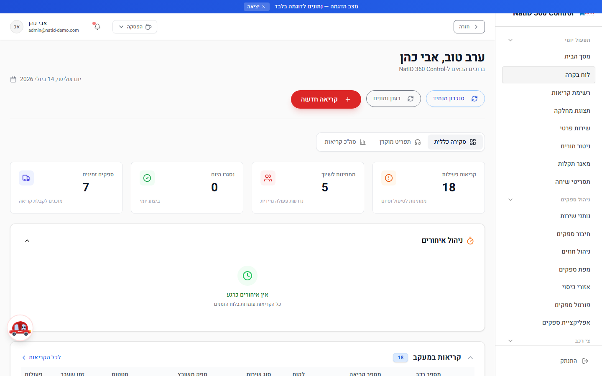
דף הבית של מוקדן/מנהל. כרטיסי KPI חיים (קריאות פעילות, ממתינות, נסגרו היום, ספקים זמינים), לשוניות (סקירה, התראות חכמות), גרפים, סינון תצוגה כללי/אישי, וברכה לפי שעה. **אומת חי מול המקור** (101 פעילות / 27 ממתינות / 54 ספקים זמינים — סבב 08/07). מכאן המוקדן קופץ לקריאה חדשה, לרשימת הקריאות ולניטור התורים.

#### רשימת קריאות — `/Calls`
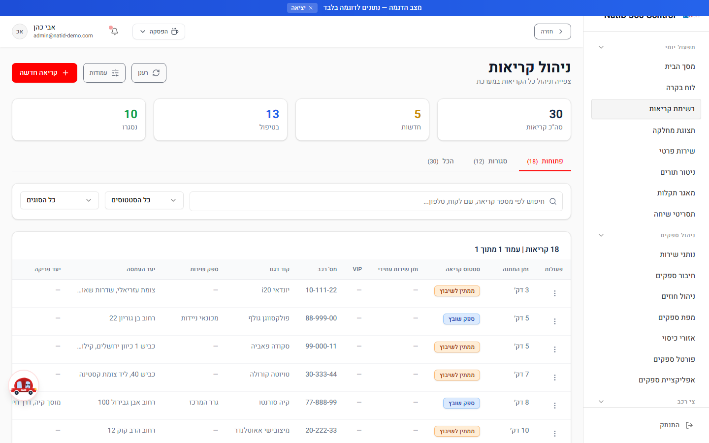
ניהול כל קריאות השירות: חיפוש (מספר/לקוח/טלפון), סינון סטטוס וסוג שירות, בחירת עמודות (ColumnSelector), שיבוץ ספק ישירות מהרשימה (AssignVendorDialog) ומעבר לפרטי קריאה.

#### פרטי קריאה — `/CallDetails`
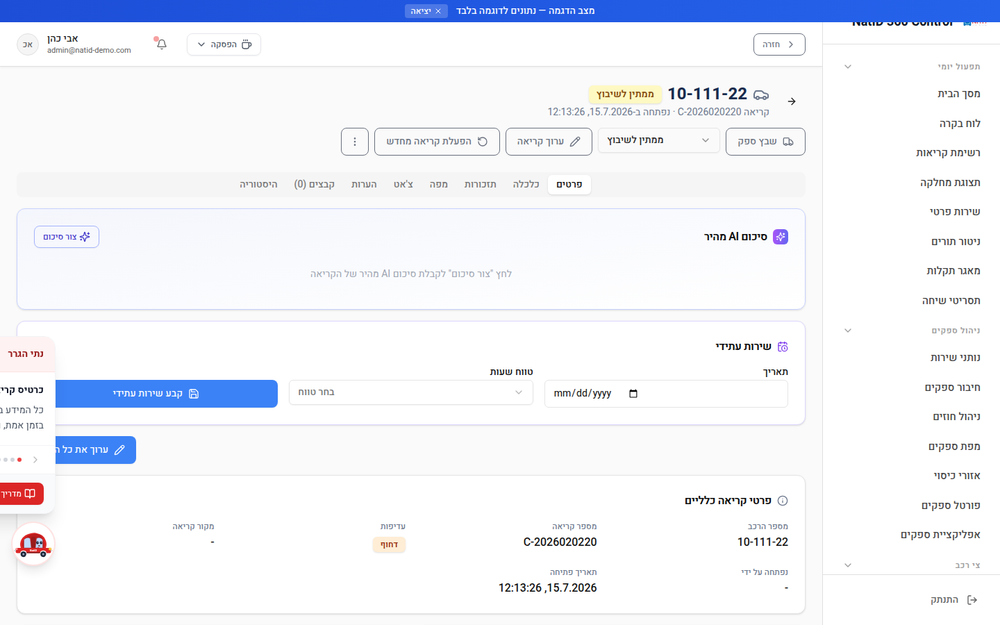
המסך המרכזי לניהול קריאה בודדת: עדכון סטטוס לפי **מפת המעברים המדורגת** (רק הצעדים הרלוונטיים לשלב — הפיצ'ר של דורית, פרק 5.3), סגירה עם סטטוס-סגירה, הפעלה מחדש, הערות מוקדן, חתימת לקוח, העלאת קבצים, שיבוץ ספק, קריאת המשך.

#### קריאה חדשה — `/NewCase`
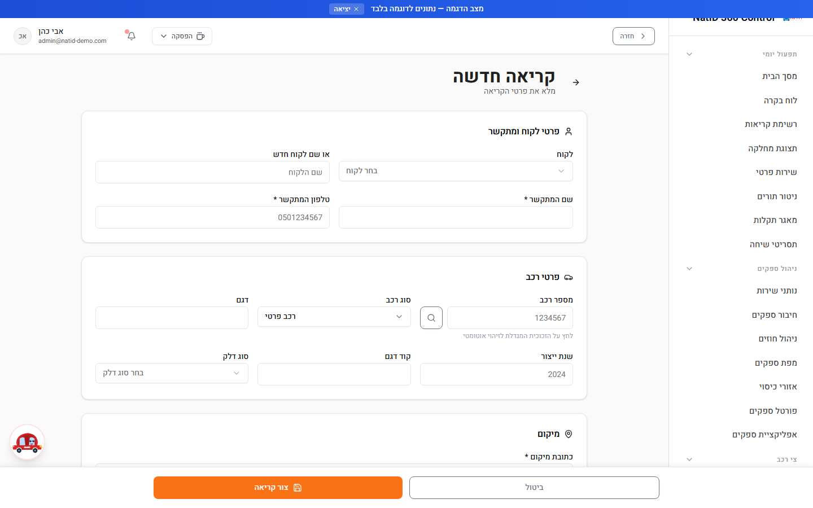
טופס פתיחת הקריאה המרכזי: בחירת/יצירת לקוח, פרטי רכב (סוג, דלק), כתובת מוצא + יעד (גרירה) עם השלמת ערים, סוג שיגור, **קטלוג AI של התקלה** (AICategorization — מסווג סוג תקלה/שירות/עדיפות), ויצירת הקריאה. עם היצירה נוצרת אוטומטית רשומת WorkQueue והמוקדנים מקבלים התראה (`onNewCase`).

#### תצוגת מחלקה — `/DepartmentView`
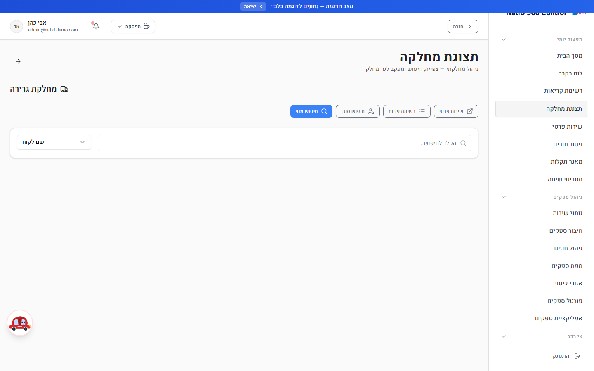
תצוגה לפי מחלקה/מנוי: פרטי מנוי מלאים והיסטוריית קריאות של הלקוח.

#### שירות פרטי — `/PrivateService`
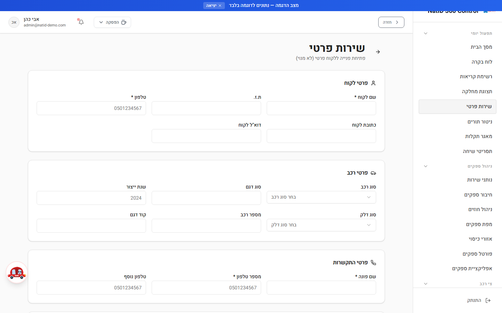
פתיחת פנייה ללקוח פרטי (לא מנוי) כולל חישוב תעריף ותשלום.

#### טופס אירוע מיוחד — `/SpecialCaseForm`
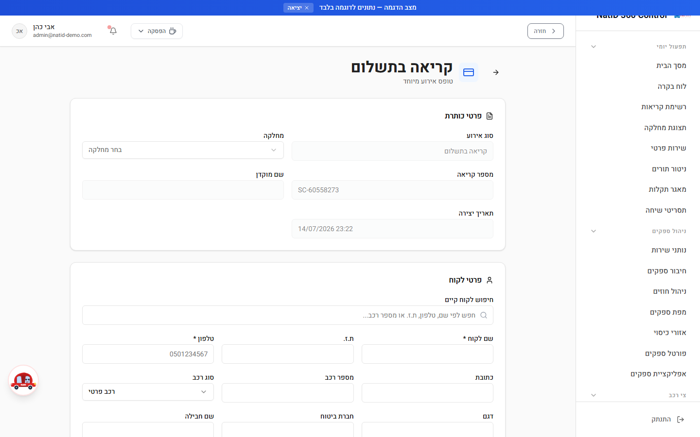
תיעוד אירוע חריג/תאונה: סיבת חיוב, נפגעים ועדים.

#### ניטור תורים — `/QueueMonitor` והתור שלי — `/MyQueue`
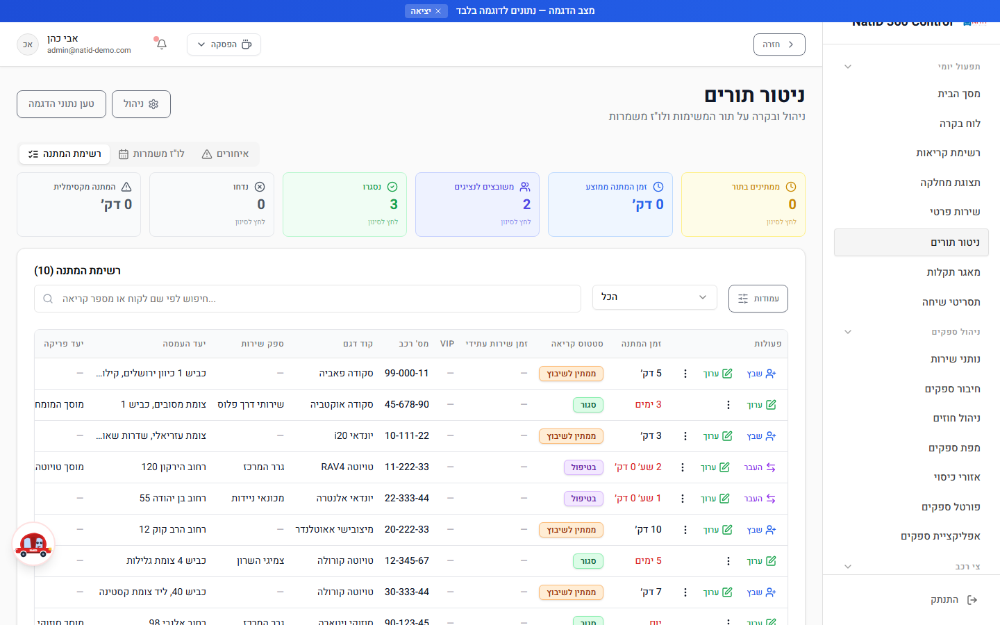
ניטור תור העבודה בזמן אמת (רענון 45 שניות, מיון לפי priority_score): סינון לפי סטטוס ונציג, עריכה, הסרה מהתור, שיבוץ. `/MyQueue` — אותו תור מסונן למשתמש הנוכחי.

#### מאגר תקלות — `/KnowledgeBase` · תסריטי שיחה — `/CallScripts`
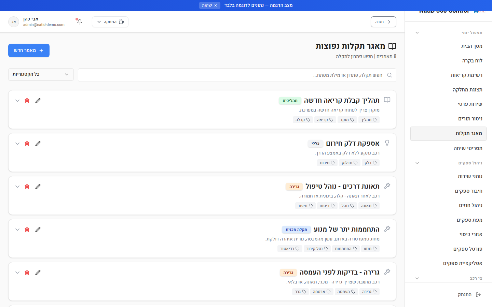
מאגר ידע תקלות/פתרונות עם חיפוש ותגיות, ותסריטי שיחה למוקדנים עם העתקה בלחיצה.

#### יומן — `/Calendar` · תזכורות — `/Reminders`
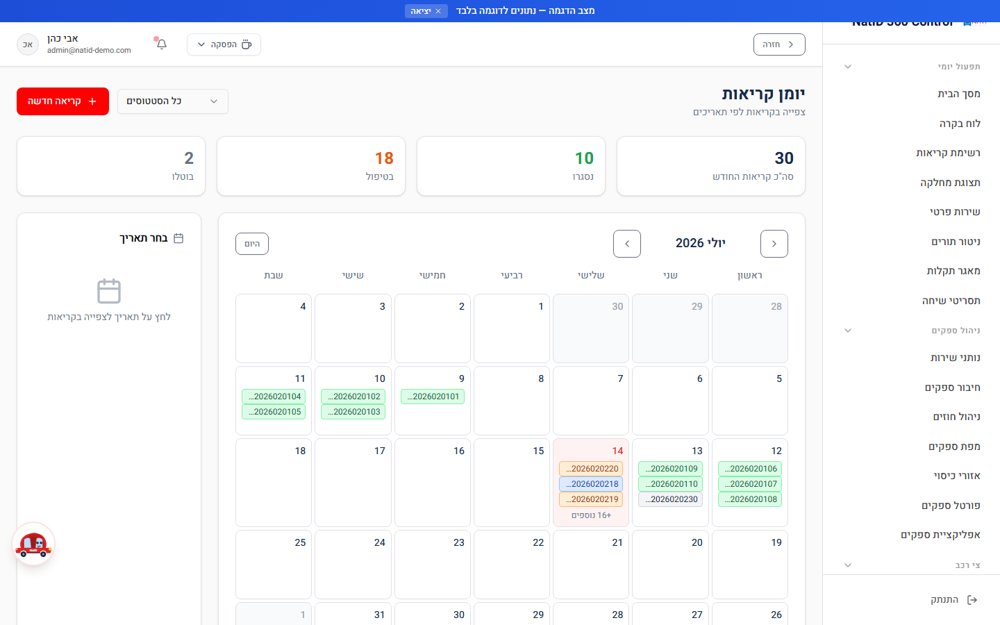
לוח שנה של קריאות ואירועים; רשימת כל התזכורות הפתוחות (תזכורת משויכת לקריאה ולמשתמש).

### 4.2 ניהול ספקים (Admin + Operator)

#### נותני שירות — `/ServiceProviders` · ספק חדש — `/NewVendor` · עריכה/פרטים — `/EditVendor`, `/VendorDetails`

רשימת הספקים עם חיפוש וסינון (סוג שירות, זמינות). טופס ספק: פרטים, איש קשר, ח.פ, אזורי כיסוי, סוגי שירות, תעריפים, חוזים מול מחלקות. **חשוב:** לספק שאמור להתחבר לפורטל חייבים להזין אימייל זהה לזה של חשבון המשתמש.

#### ניהול חוזים והסכמי תמחור — `/VendorContracts`

שלוש לשוניות: חוזי ספקים, הסכמי תמחור, **תעריפי ספקים-נתי** (מראה קריאה-בלבד של מחירון נתי, מסונכרן ע"י `importNatiPricing`).

#### מפת ספקים — `/AllVendorsMap` · אזורי כיסוי — `/CoverageAreas` · מעקב GPS — `/VendorTracking`

מפת מיקומי ספקים (Leaflet/OSM) עם חיפוש וסינון זמינות; ניהול אזורי כיסוי גאוגרפיים; מעקב GPS חי אחר ספקים בקריאות פעילות כולל מדד טריות מיקום (LocationFreshnessBadge).

#### חיבור ספקים — `/VendorOnboarding` (Admin בלבד)

ניהול תהליך צירוף ספקים חדשים וקישור חשבון משתמש לפרופיל ספק (`linkVendorEmail`/`linkVendorToUser`).

### 4.3 פורטל הספק (Vendor — מותאם נייד)

#### פורטל ספקים — `/VendorPortal`
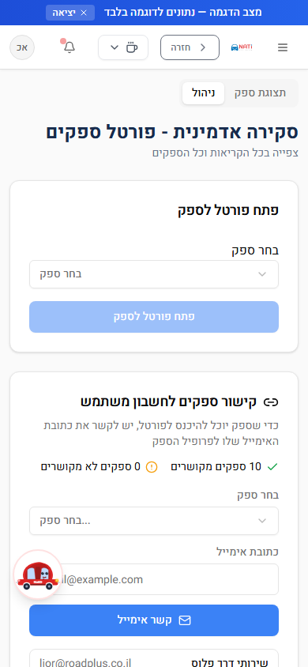
דף הבית של הספק בנייד: הצעות קריאה חדשות עם ספירה לאחור (VendorNewCallAlert), **קבלה/דחייה של קריאה**, הקריאות הפעילות שלו על מפה, מתג זמינות + הפסקות (15/30/60 דק'), מתג שיתוף מיקום GPS (VendorGPSTracker), אשף Onboarding, הורדת PDF פרופיל. רענון קריאות כל 30 שניות והצעות כל 10 שניות.

#### ניהול קריאה (ספק) — `/VendorCallManagement`
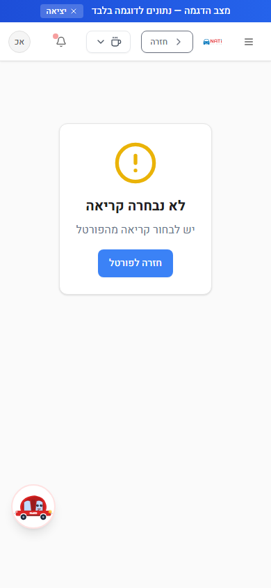
מסך העבודה של הספק בקריאה: התקדמות סטטוס ("יצאתי לדרך" → "הגעתי" → סיום), ניווט Waze, פרטי לקוח ורכב, העלאת תמונות לפני/אחרי, **חתימת לקוח דיגיטלית (חובה לסגירה)**, צ'אט ישיר עם המוקד (רענון 30 שניות), "לא ניתן להשלים", שחרור קריאה חזרה לתור.

#### הפרופיל שלי — `/MyVendorProfile` · מדריך לספק — `/VendorGuide`
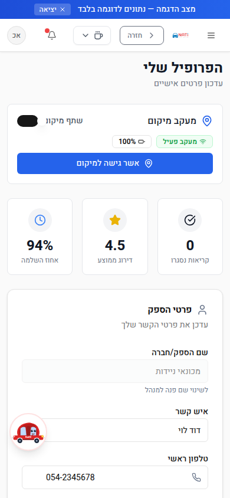
עריכת פרטי הספק, זמינות ואזורי כיסוי; מדריך שימוש מלא בעברית לספק.

`/VendorMobileApp` — redirect בלבד ל-VendorPortal (תאימות לאחור).

### 4.4 אזור טכנאי (Agent)

#### דשבורד טכנאי — `/AgentDashboard` · הקריאות שלי — `/AgentCallManagement`
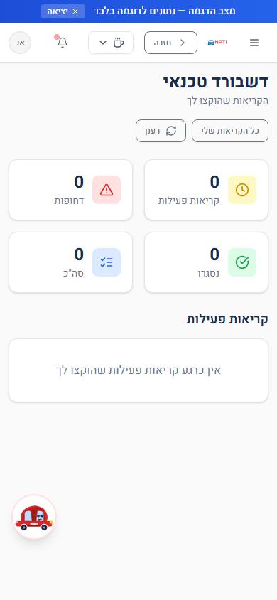
כרטיסי הקריאות המוקצות לטכנאי (AgentCallCard) עם עדכון סטטוס (`updateAgentCallStatus`). מצב הפסקה (AgentBreakMode) זמין מה-Layout; קריאות של טכנאי בהפסקה מועברות אוטומטית (`autoTransferAgentCalls`).

### 4.5 לקוחות, דוחות ונתונים (Admin + Operator)

#### לקוחות — `/Customers`, `/CustomerDetails`, `/EditCustomer`

רשימת לקוחות (כולל מנויים מסונכרנים מנתי), פרטי לקוח מלאים כולל אינטראקציות, ועריכה.

#### דוחות — `/Reports`

דוח שנתי לגרירה ושירותי דרך: KPI, מגמה חודשית, פילוח חברות ביטוח, מטריצת חברה×חודש, פארטו ספקים, פילוח יום/שעה, פירוט ספקים מובילים. דוחות פיננסיים — admin בלבד (`REPORT_PERMISSIONS`).

#### דוח שימושים — `/CallUsageReport` · ניתוח היסטורי — `/HistoricalDataAnalysis` · ייבוא — `/ImportHistoricalData` (A) · ייצוא מתקדם — `/AdvancedExport`

דוח שימוש בקריאות; חיפוש וניתוח בנתונים היסטוריים (כולל ניתוח דפוסים ב-AI — `analyzeHistoricalPatterns`); ייבוא דאטה היסטורי; ייצוא נתונים מתקדם.

#### משובי לקוחות — `/FeedbackManagement` · טופס משוב — `/CustomerFeedback`

ניהול כל המשובים; טופס המשוב שהלקוח ממלא מקישור SMS (token חד-פעמי עם תפוגה — `FeedbackToken`).

#### פורטל לקוח — `/CustomerPortal`

מעקב קריאה ציבורי ללקוח: הזדהות בטלפון + מספר קריאה (ללא סיסמה, `getCustomerPortalData`), צפייה בסטטוס חי ובהיסטוריה.

#### ניהול יעדים — `/KPIManagement` (Admin) · חשבוניות — `/Invoices` (Admin) · קטלוג מוצרים — `/ProductCatalog`

הגדרת יעדי KPI; מסך חשבוניות (מוטמע iframe ל-CRM חשבוניות חיצוני); קטלוג מוצרים למכירה בקריאות (מק"ט, מחיר, מלאי).

#### חבילות סוכני ביטוח — `/InsuranceAgentPackages`

הגדרת חבילות שירות משולבות לסוכני/חברות ביטוח (משימות 313+282).

### 4.6 מסכי מערכת (Admin בלבד)

| מסך | נתיב | אפיון |
|---|---|---|
| ניהול משתמשים | `/UserManagement` | יצירה/עריכה/מחיקה, הקצאת תפקידים (`getUsersList` בצד שרת) |
| ניהול הרשאות | `/RoleManagement` | תפקידים מותאמים + הרשאות פר-דף/דוח |
| יומן פעולות | `/AuditLog` | תיעוד כל הפעולות (ישות AuditLog, RLS admin-only) |
| שיבוץ אוטומטי | `/AutomationSettings` | מרחק מקסימלי, דירוג מינימלי, מעבר לספק הבא |
| אינטגרציות CRM | `/IntegrationSettings` | הגדרת webhooks ומפתחות (הסודות עצמם בצד שרת בלבד) |
| הגדרות CTI | `/CTISettings` | חיבור מרכזיה — זיהוי לקוח לפי טלפון נכנס |
| הגדרות התראות | `/NotificationSettings` | כללי אירוע→התראה (NotificationSetting) |
| הגדרות תצוגה | `/AdminDisplaySettings` | ברירות מחדל של כרטיסים/עמודות |
| הגדרות מערכת | `/Settings` | הגדרות כלליות |
| ניקוי וסנכרון נתונים | `/AdminDataCleanup` | פאנל סנכרון נתי (Dry Run + סנכרון), **"סגור קריאות רפאים"** (השוואה מול נתי + סגירה בטוחה ב-batches), מחיקות מבוקרות |
| ניהול צי רכב | `/FleetManagement` | גררים/ניידות פנימיים של הקבוצה |

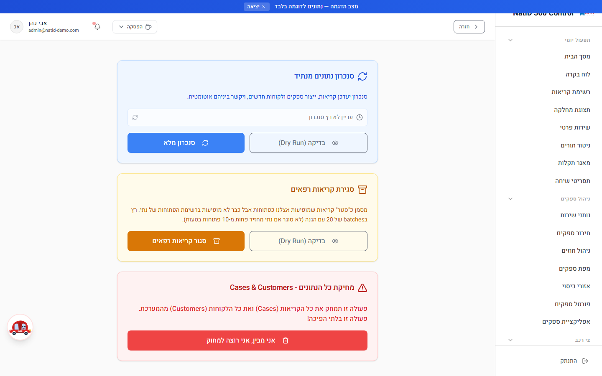

### 4.7 כלל-מערכתי

| מסך | נתיב | אפיון |
|---|---|---|
| דף נחיתה / התחברות | `/LandingPage` | נקודת הכניסה (ללא Layout); fallback לכל שגיאת auth |
| הפרופיל שלי | `/UserProfile` | פרופיל אישי לכל משתמש |
| העדפות התראות | `/MyNotificationSettings` | העדפות אישיות (כולל לספק/טכנאי) |
| מרכז הידע | `/UserGuide` | מדריך משתמש מלא בעברית |
| טופס עובד | `/FormView` | תצוגת טופס גנרי |
| מצב הדגמה | `/Demo` | הפעלת demo mode + זריעת נתוני דמו |

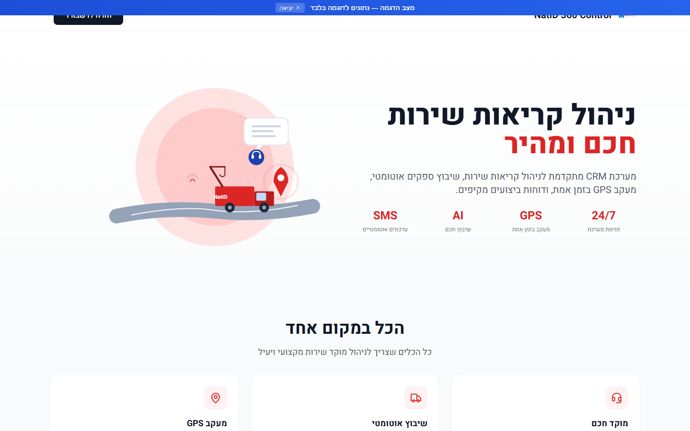

### 4.8 מסכים לא-שלמים (חשוב למסירה)

| מסך | מצב |
|---|---|
| `/Agents` ("סוכני AI") | **Stub מפורש — "בקרוב"**. אין פונקציונליות; מציג חזון (צ'אט אוטומטי, שיבוץ חכם) |
| `/VendorMobileApp` | Redirect בלבד ל-VendorPortal |
| `OperationalRates`, `VendorPricing` | קיימים ב-PAGE_PERMISSIONS אך **ללא דף** — ממומשים כטאבים בתוך VendorContracts (רשומות הרשאה מתות) |
| דף "מפה" בפורטל הספק | מסומן "בקרוב" |

---

## 5. תהליכים עסקיים

### 5.1 מחזור חיי קריאה — מקצה לקצה

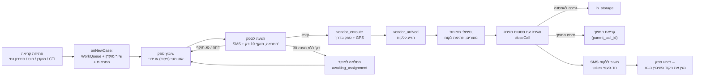

**מקורות פתיחת קריאה:** מוקדן (`NewCase`), סנכרון נתי, בוט WhatsApp (`99digitalBot`), CRM חיצוני (webhook), שירות פרטי, וזיהוי CTI משיחה נכנסת.

### 5.2 תהליך העבודה מול ספקים — פירוט

**שיבוץ אוטומטי (`autoAssignVendor`) — נוסחת ניקוד (מקס' ~110 נק'):**

| קריטריון | ניקוד |
|---|---|
| מרחק GPS (Haversine): עד 5 ק"מ = 40 … מעל 50 ק"מ = 5 | עד 40 |
| התאמת אזור כיסוי (fallback כשאין GPS) | 25 |
| התאמת סוג שירות (גרר/מכונאי/רב-שירות) | 20 |
| דירוג ספק (ממוצע/5 × 20) | עד 20 |
| זמן תגובה היסטורי | עד 10 |
| שיעור השלמה | עד 10 |
| תמיכה בסוג הרכב | 5 |
| איזון עומסים (פחות מ-3 קריאות פעילות: ‎+5; מעל 10: ‎−5) | ±5 |

ברירת המחדל **advisory** — מחזיר המלצה + ETA (דרך OSRM); `commit:true` יוצר הצעה בפועל.

**מנגנון הצעה-קבלה (offer/accept):**
- הצעה = `CallAssignmentAttempt` עם תפוגה של **10 דקות** (⚠️ המדריך לספק כותב 5 דקות — לתקן את התיעוד או את הקוד).
- הספק מקבל SMS ("נתיד - קריאה חדשה #… היכנס לפורטל לאישור") + התראה בפורטל עם ספירה לאחור.
- **קיבל** → הקריאה עוברת ל-vendor_enroute, הספק נהיה busy, המוקד מקבל התראה.
- **דחה / פג תוקף** → הצעה אוטומטית לספק הבא בניקוד (בהחרגת כל מי שכבר דחה).
- **30 דקות ללא קבלה** → הסלמה למוקד (`processStaleAssignments`, cron כל 1–2 דק') + התראת "🚨 קריאה דורשת שיבוץ ידני".
- הגנות מירוץ: בדיקת הצעה כפולה, ספק עסוק, קריאה שכבר שובצה (409).

**עבודת הספק בשטח:** עדכוני סטטוס מהנייד, GPS חי (כולל ברקע באפליקציה הנייטיבית — פרק 10), תמונות לפני/אחרי, חתימת לקוח חובה, צ'אט מול המוקד, "לא ניתן להשלים" או שחרור קריאה.

**תמחור:** מחירון הספקים מנוהל **בנתי** ומסונכרן לקריאה-בלבד (`VendorPricing`, `is_managed_externally=true`). ישויות חוזים/תשלומים קיימות אך **אין חיבור למערכת תשלומים** (חישוב בלבד).

### 5.3 מכונת הסטטוסים המדורגת ("הזרימה של דורית")

14 סטטוסים, אך בכל שלב מוצגים **רק המעברים הרלוונטיים** (`src/config/statusTransitions.js`, פורסם 14/07, מכוסה ב-21+ בדיקות יחידה, **אושר ע"י דורית**):

| מהסטטוס | מעברים מותרים |
|---|---|
| ממתין לטיפול | ממתין לשיבוץ, שירות עתידי, במעקב, ביטול |
| ממתין לשיבוץ | ממתין לטיפול, שירות עתידי, ביטול |
| שובץ ספק / ספק בדרך | ספק הגיע ללקוח, ביטול |
| ספק הגיע / בטיפול | הגיע לאחסנה, סגירת קריאה, ביטול |
| באחסנה | סגירה, ביטול |
| לא ניתן להשלים | חזרה לטיפול, סגירה, ביטול |
| המתנה לחיוב | סגירה, **ביטול** (הותר ב-PR #181) |
| הושלם / בוטל | — (סופי) |

בחירת "סגירת קריאה" פותחת דיאלוג **סטטוסי סגירה** (ניידת בוצע / גרר הגיע ליעד / גרירה לאחסנה / נכשל→קריאת המשך…). בחירת "ביטול" פותחת דיאלוג סיבת ביטול + כללי עירבון.
⚠️ כל נוסחי ה-SMS בסטטוסי הסגירה הם **placeholder** — ממתינים לנוסח סופי מהלקוח. הסטטוס `mobile_failed_evac` ("בוצע פינוי לפלטפורמה") מיועד להסרה (ממתין להחלטה בפגישה).

**מירור אוטומטי:** כל שינוי ב-`Call.call_status` מעדכן גם `WorkQueue.queue_status` ו-`Case.status` (`syncCallStatus`).

---

## 6. סנכרון מול נתי

### 6.1 עיקרון
נתי (MySQL על AWS RDS il-central-1) היא **מקור האמת**. הסנכרון **חד-כיווני: נתי → CRM, קריאה בלבד**. אין כתיבה חזרה לנתי (dual-write ממתין לאישור עדיאל). נכון ל-14/07/2026: **סנכרון מלא 155/155 קריאות פתוחות אחד-לאחד**, כולל קישור ספקים ולקוחות.

### 6.2 ארכיטקטורת החיבור — חשוב להבין שיש שני מסלולים

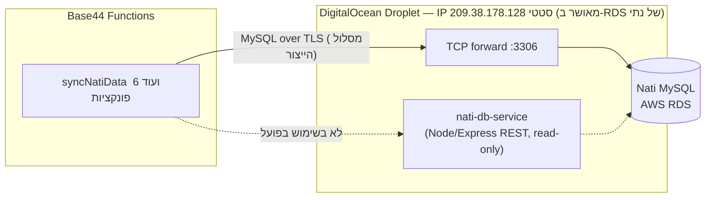

1. **המסלול הפעיל (ייצור):** פונקציות Base44 פותחות חיבור MySQL ישיר דרך tunnel ב-droplet. TLS מקצה-לקצה מול ה-RDS עם CA נעוץ של Amazon (טריק: `config.host` = hostname האמיתי לאימות TLS, `config.stream` מחייג ל-IP של ה-droplet).
2. **nati-db-service (REST relay):** שירות Node עצמאי על אותו droplet (Express + Docker + Caddy/HTTPS) עם endpoints לקריאה בלבד (`/query` SELECT בלבד עם denylist, `/schema/*`, `/health`), מפתח API והגבלת קצב. שימש בעיקר לגילוי סכמה. **התיעוד ב-NATI_DB_SERVICE.md צעד 7 לא עדכני** — הפונקציות לא נודדו אליו אלא למסלול הישיר.

### 6.3 מה מסתנכרן

| מקור בנתי | יעד ב-CRM | פונקציה |
|---|---|---|
| `call_open_appeals` + JOIN `suppliers` | `Call` + `Case` (מפתח: מספר הפנייה) | `syncNatiData` (עד 30 לריצה, קודם חדשות→מעודכנות→ותיקות) |
| ספקים מתוך הפניות | `Vendor` (dedup לפי supplier_id) | `syncNatiData` |
| לקוחות מתוך הפניות | `Customer` (מפתח client_id) | `syncNatiData` |
| `supplier_distance_price_list` | `VendorPricing` (קריאה-בלבד, `source='nati'`) | `importNatiPricing` |
| פניות שנעלמו מהפתוחות | סגירה אוטומטית מקומית | `closeStaleNatiCalls` (עם empty-guard: מסרב לסגור אם נתי מחזירה פחות מ-10) |

**מיפוי סטטוסים:** `{0:ממתין לטיפול, 1:בשיבוץ, 2/6/7:הושלם, 3:בוטל}`; מחלקות: `{3:גרירה, 4:ניידת שירות, 5:שמשות, 10:רכב חליפי}`; סוגי רכב `{1:פרטי, 2:אופנוע, 3:משאית, 4:מסחרי קל}`.

### 6.4 עמידות ותיקונים מרכזיים
- **Circuit breaker משותף** (Deno KV) + זיהוי `ER_HOST_IS_BLOCKED` → צינון 10 דקות והודעה בעברית ("נדרש FLUSH HOSTS אצל נתי"). חיבור יחיד לריצה.
- **Cooldown שרת 60 שניות** לסנכרון אמיתי (Dry Run פטור), batches של 20 עם השהיות, retry עם backoff מול rate-limit של Base44.
- **תיקון Timezone** — תאריכי נתי נאיביים; מוצמד offset ירושלים (+03/+02) למניעת סחיפה של 2–3 שעות.
- **תיקון 14/07 (PR #185):** פניות ללא שם מזמין הפילו יצירת Call (שדה חובה) — הוסף fallback `'לא צוין'` + trim. זה מה שאפשר את הסנכרון המלא 155/155.
- ממשק ההפעלה: פאנל בסניף `/AdminDataCleanup` — Dry Run, סנכרון, חיווי ריצה אחרונה; רענון אוטומטי של דשבורד/תורים/דוחות אחרי סנכרון (ללא F5).

### 6.5 מה עובד / מה ממתין

| נושא | סטטוס |
|---|---|
| סנכרון קריאות/ספקים/לקוחות/תעריפים | ✅ עובד ואומת (155/155) |
| Dry Run + cooldown + חיווי סטטוס | ✅ |
| טיפול בחסימות host + breaker | ✅ (הישענות על FLUSH HOSTS ידני אצל נתי בעת תקלה) |
| **תזמון אוטומטי (Scheduler)** | ⚠️ **לא מוגדר** — יש להגדיר בלוח Base44 (מומלץ כל 5–10 דק' + closeStale יומי) |
| כתיבה חזרה לנתי (דו-כיווני) | ❌ לא ממומש — ממתין לאישור עדיאל |
| כפילות ארכיטקטונית (REST relay לא בשימוש) | ⚠️ להחליט: לתחזק / להוציא משימוש |
| פערי "לקוחות ייחודיים: 0" ב-Dry Run וירידת צבר | 🔵 בבירור מול נתי |

---

## 7. פונקציות Backend

66 פונקציות ב-`base44/functions/*/entry.ts` (Deno/TypeScript). טבלה מרוכזת לפי תחום:

### קליטת קריאות ומחזור חיים (10)
`onNewCase` (אוטומציה ביצירת Case: תור+שיוך מוקדן+התראות) · `closeCall` (מסלול הסגירה העסקי היחיד) · `reactivateCall` · `updateCallStatus` · `updateAgentCallStatus` · `updateVendorCall` · `releaseVendorCall` · `categorizeCall` (AI) · `ctiWebhook` (זיהוי לקוח משיחה, secret + fail-closed) · `getCustomerPortalData` (ציבורי)

### שיבוץ ודיספוץ' (12)
`autoAssignVendor` · `assignVendorToCall` · `recommendVendor` (AI) · `handleAssignmentResponse` · `processStaleAssignments` (cron) · `autoTransferAgentCalls` (cron) · `calculateDistanceAndETA` · `updateVendorStatus` · `updateVendorLocation` · `nudgeStaleVendorLocations` (cron) · `getVendorScopedData` · `linkVendorEmail`/`linkVendorToUser`

### הודעות והתראות (13)
`sendSMS` · `sendCallStatusUpdate` · `sendFeedbackSMS` · `sendVendorAssignmentSMS` · `sendWhatsApp` (Twilio→Green API fallback) · `sendNotification` · `createNotification` · `checkAndSendNotifications` (cron) · `detectSmartAlerts` (cron) · `savePushSubscription` · `sendPushNotification` (VAPID) · `getVapidPublicKey` · `generateVapidKeys`

### משוב ושביעות רצון (4)
`createFeedbackToken` · `getFeedbackTokenInfo` (ציבורי) · `validateAndSubmitFeedback` (ציבורי) · `getCallSatisfaction`

### AI ואנליטיקה (7) — ראו פרק 9
`generateCallSummary` · `quickCallSummary` · `categorizeCall` · `recommendVendor` · `predictCallTimes` · `analyzeVendorPerformance` · `analyzeHistoricalPatterns` (+ `getUsageReport`)

### סנכרון נתי (7)
`syncNatiData` · `fetchLiveNatiData` · `fetchNatiAppeals` · `closeStaleNatiCalls` · `importNatiPricing` · `discoverNatiPricing` · `testNatiConnection`

### Webhooks, אדמין ותשתית (13)
`99digitalBot` (בוט WhatsApp → קריאה) · `externalCrmWebhook` · `lookupVehicleMOT` (data.gov.il) · `checkContractExpiry` (cron) · `checkDepositExpiry` (cron, ביטול עירבון אחרי 48ש') · `getTwilioConfig` · `getGoogleMapsKey` (מוגבל-תפקיד) · `getUsersList` · `inviteTestUsers` · `logAuditAction` · `seedDemoData` · `generateVendorPDF` · `analyzeVendorPerformance`

### פונקציות מתוזמנות (Cron) — ⚠️ דורש הגדרה בלוח Base44
| פונקציה | תדירות מומלצת | תפקיד |
|---|---|---|
| `syncNatiData` | כל 5–10 דק' | סנכרון מנתי |
| `processStaleAssignments` | כל 1–2 דק' | תפוגת הצעות + הסלמה |
| `detectSmartAlerts` | כל 2–5 דק' | התראות חכמות |
| `autoTransferAgentCalls` | כל 2–5 דק' | העברת קריאות מטכנאי בהפסקה |
| `nudgeStaleVendorLocations` | כל 5–10 דק' | דחיפת push לספק עם GPS מיושן |
| `checkContractExpiry` / `checkDepositExpiry` / `closeStaleNatiCalls` | יומי | חוזים / עירבונות / קריאות רפאים |

**רשת ביטחון קיימת:** poller בצד לקוח (`useStaleAssignmentPoller`, כל ~2 דק' כשטאב מוקדן פתוח) — אינו תחליף ל-Scheduler.

---

## 8. מודל הנתונים

65 ישויות ב-`base44/entities/*.jsonc`. ישויות שמקורן בנתי נושאות `mysql_id`. חלוקה:

| קבוצה | ישויות עיקריות |
|---|---|
| **ליבת תפעול** | `Call` (הישות המרכזית — פרטי לקוח/רכב/מיקומים/סטטוס/AI-summary), `Case`, `WorkQueue`, `CallHistory`, `CallAssignmentAttempt`, `CallEvent`, `CallPhoto` (כולל שדות חילוץ AI), `CallProduct`, `CallFeedback`, `Reminder`, `Message`, `EligibilityCheck` |
| **ספקים** | `Vendor`, `VendorPricing` (מראה נתי), `SupplierDistancePrice`, `VendorContract`, `VendorPayment`, `VendorRating`, `VendorLocation`, `VendorBreak` |
| **לקוחות ומנויים (מראה נתי)** | `Customer`, `CustomerInteraction`, `Subscription`, `SubscriptionCollective`, `SubCancelRequest`, `PaymentDetail`, `PaymentMethod`, `Deposit`, `AccountingDoc`, `AccountingOperation` |
| **כספים בקריאה** | `CallServePayment`, `CallDistance`, `CallRentCar` |
| **צוות וארגון** | `Agent`, `AgentPackage`, `AgentShift`, `Dispatcher`, `Inspector`, `Department`, `User`, `UserPermission`, `UserDisplayPreference`, `Role`, `AuditLog` |
| **התראות ומשוב** | `Notification`, `NotificationSetting`, `PushSubscription`, `FeedbackToken`, `SmsHistory` |
| **צי, רכב וקטלוגים** | `FleetVehicle`, `Car`, `CarManufacturer`, `CarType`, `Product`, `Package`, `OperationalRate`, `InsuranceCompany`, `Region`, `ZipCity`, `RouteDistance`, `Questionnaire`, `PredefinedNote`, `KnowledgeArticle`, `HistoricalCallData` |

**RLS** מוחל כיום על 9 ישויות (ראו פרק 13). קריאה של פנייה אחת מנתי מתפצלת ל-4 ישויות: Call + Case + Vendor + Customer.

---

## 9. כלי AI ואינטגרציות

### 9.1 כלי ה-AI הקיימים במערכת

כל יכולות ה-AI רצות דרך **`base44.integrations.Core.InvokeLLM`** — מודל שפה מנוהל על ידי פלטפורמת Base44. **אין מפתח API של ספק AI בריפו או בהגדרות שלנו** — הצריכה והחיוב דרך Base44. כל הפרומפטים בעברית, עם פלט מובנה (JSON Schema).

| # | יכולת | פונקציה | איפה בשימוש |
|---|---|---|---|
| 1 | **קטלוג קריאה אוטומטי** — סיווג סוג תקלה/שירות/עדיפות + רמת ביטחון | `categorizeCall` | טופס קריאה חדשה (AICategorization) |
| 2 | **סיכום קריאה בעברית** | `generateCallSummary` → `Call.summary_draft` | פרטי קריאה / סגירה |
| 3 | **סיכום מהיר** | `quickCallSummary` | תצוגות רשימה |
| 4 | **המלצת ספק חכמה** | `recommendVendor` | דיאלוג שיבוץ |
| 5 | **חיזוי זמני קריאה** | `predictCallTimes` | תפעול |
| 6 | **ניתוח ביצועי ספק** | `analyzeVendorPerformance` | ניהול ספקים |
| 7 | **ניתוח דפוסים היסטוריים** (3 מעברי LLM) | `analyzeHistoricalPatterns` | מסך ניתוח נתונים היסטוריים |
| 8 | **חילוץ נתונים מתמונות** (שדות מוכנים) | `CallPhoto.ai_extracted_data/status/summary` | העלאת תמונות בקריאה |
| 9 | **NatiAssistant** — עוזר צ'אט צף | קומפוננטת Layout | בכל המערכת |

⚠️ ממצא אבטחה פתוח: **Prompt Injection ב-`categorizeCall`** — קלט חופשי של משתמש נכנס לפרומפט ללא תיחום (ראו פרק 13).

### 9.2 אינטגרציות ומפתחות API — טבלה מלאה

**כל הסודות מוגדרים כ-Environment Variables בלוח הבקרה של Base44 (צד שרת בלבד) — אין ערכי סוד בקוד או בריפו** (אומת בסריקה; קובץ `.env.example` מכיל placeholders בלבד). להעברה לעדיאל נדרשת מסירת גישה ל: Base44 Builder, חשבון Twilio, מסוף Google Cloud, ה-droplet ב-DigitalOcean, ו-GitHub repo.

| שירות | משתני סביבה | משמש את | סטטוס |
|---|---|---|---|
| **Twilio SMS** | `TWILIO_ACCOUNT_SID`, `TWILIO_AUTH_TOKEN`, `TWILIO_PHONE_NUMBER` | sendSMS, sendCallStatusUpdate, sendFeedbackSMS, sendVendorAssignmentSMS, sendNotification | ⚠️ קוד מוכן ונבדק לוגית; **חשבון production וזיהוי SMS אמיתי טרם אומתו מקצה לקצה; נוסחי הודעות = placeholder** |
| **Twilio WhatsApp** | `TWILIO_WHATSAPP_NUMBER` / `TWILIO_WHATSAPP_FROM` | sendWhatsApp | כנ"ל |
| **Green API (WhatsApp fallback)** | `GREEN_API_INSTANCE_ID`, `GREEN_API_TOKEN`, `SUPPORT_PHONE` | sendWhatsApp | קוד מוכן |
| **Google Maps** | `GOOGLE_MAPS_API_KEY` | calculateDistanceAndETA, getGoogleMapsKey (מונפק רק לתפקידים מורשים) | ✅ עובד; ⚠️ נדרשת הגבלת referrer/APIs במסוף Google |
| **Web Push (VAPID)** | `VAPID_PUBLIC_KEY`, `VAPID_PRIVATE_KEY` | sendPushNotification, nudgeStaleVendorLocations | ✅ ב-PWA; לא מחובר ל-FCM/APNs נייטיבי |
| **בוט 99Digital** | `BOT_WEBHOOK_SECRET` | 99digitalBot | מאובטח (fail-closed) |
| **CRM חיצוני** | `WEBHOOK_SECRET` | externalCrmWebhook | מאובטח |
| **CTI / מרכזיה** | `CTI_WEBHOOK_SECRET` | ctiWebhook | ⚠️ **יש להגדיר את הסוד + כותרת בצד המרכזיה** |
| **ג'ובים פנימיים** | `INTERNAL_JOB_SECRET` | כל פונקציות ה-cron המוגנות | ⚠️ **יש להגדיר יחד עם ה-Scheduler** |
| **אוטומציית סנכרון** | `SYNC_AUTOMATION_KEY` | syncNatiData, detectSmartAlerts, importNatiPricing | כנ"ל |
| **MySQL נתי** | `NATID_DB_HOST/PORT/USER/PASSWORD/NAME`, `NATID_DB_TLS_SERVERNAME` | 7 פונקציות הנתי | ✅ עובד (דרך ה-droplet) |
| **nati-db-service (droplet)** | `NATI_DB_SERVICE_URL`, `NATI_DB_SERVICE_API_KEY` + קובץ `.env` על ה-droplet (`SERVICE_API_KEY`, `NATI_DB_*`) | גילוי סכמה | פרוס; לא במסלול הייצור |
| **Supabase** | `SUPABASE_URL`, `SUPABASE_SERVICE_ROLE_KEY` | autoTransferAgentCalls | בשימוש נקודתי |
| **Base44 (Frontend)** | `VITE_BASE44_APP_ID`, `VITE_BASE44_APP_BASE_URL`, `VITE_BASE44_FUNCTIONS_VERSION` | הלקוח | ✅ |
| **E2E (GitHub Secrets)** | `E2E_BASE_URL`, `E2E_ADMIN/OPERATOR/VENDOR_EMAIL/PASSWORD` (7 סודות) | CI full-e2e | ✅ הוגדרו (הרצה ראשונה 14/07) |
| **OSRM / OSM / data.gov.il** | — (ללא מפתח) | ניתוב, מפות, נתוני רכב | ✅ |

---

## 10. אפליקציה נייטיבית

### 10.1 למה נייטיב
דפדפן לא מסוגל לשדר GPS באופן אמין כשהמסך כבוי/האפליקציה ברקע (נחסם אחרי ~5 דק'). הפתרון: עטיפת ה-Web-App הקיים ב-**Capacitor** עם פלאגין `@capacitor-community/background-geolocation` (foreground service) — בלי לשכתב את המערכת ובלי לשנות את צד השרת (אותו endpoint — `updateVendorLocation`).

### 10.2 מה כבר בנוי (code-complete בריפו)

| רכיב | מצב |
|---|---|
| `capacitor.config.ts` — appId `co.natid.crm`, דגלי אמינות (`useLegacyBridge` ל-Android, `CapacitorHttp` נגד חניקת רשת ברקע) | ✅ |
| פרויקט `android/` (minSdk 22, target 34) + מחרוזת ערוץ התראה בעברית ("שיתוף מיקום"); הרשאות מיקום נמזגות אוטומטית מהפלאגין | ✅ |
| פרויקט `ios/` (iOS 13+) — `Info.plist` עם מחרוזות הרשאה בעברית + `UIBackgroundModes: location` | ✅ |
| גשר `src/services/backgroundLocation.js` — native-only, no-op בדפדפן (ה-build הרגיל לא נשבר); ‎distanceFilter 50m, המרת מהירות לקמ"ש | ✅ |
| `VendorGPSTracker` (v7) — זיהוי פלטפורמה: בנייטיב GPS ברקע, בדפדפן watchPosition + Wake Lock + מינימום 30 שניות בין שידורים | ✅ |
| **שכבת ביניים חיה (Level 1):** Wake Lock, מדדי טריות מיקום, push לספק עם GPS מיושן | ✅ פרוס ועובד |

### 10.3 מה נותר כדי לשחרר (דורש מחשב פיתוח — לא ניתן לביצוע מהריפו בלבד)

| צעד | פירוט |
|---|---|
| **Android** | Android Studio → `npm run cap:android` → הרצה על מכשיר USB → APK debug להפצה פנימית; ל-Play Store: AAB חתום + חשבון מפתח + הצדקת שימוש במיקום |
| **iOS** | macOS + Xcode + CocoaPods (`pod install`) + חשבון Apple Developer ($99/שנה) → TestFlight להפצה פנימית; הצדקת background-location ל-App Review ("שיתוף מיקום רק בזמן קריאה פעילה") |
| **אימות מכשיר** | מסך נעול + מעבר ל-Waze → לוודא שהמיקום ממשיך להישלח מעבר לסף 5 הדקות |
| **Push נייטיבי** | לא בנוי — קיים רק Web Push (VAPID). ל-FCM/APNs נדרש `@capacitor/push-notifications` + `google-services.json` |
| **החלטה פתוחה** | ערוץ הפצה: פנימי (APK/TestFlight/MDM) מול חנויות ציבוריות. אנדרואיד קודם (לא דורש Mac) |

**הערכת מאמץ (מהתכנית):** ~1–2 שבועות ל-MVP הפצה פנימית.

### 10.4 PWA (קיים ועובד)
`vite-plugin-pwa` + Workbox: התקנה למסך הבית, עדכון אוטומטי (skipWaiting + ניקוי cache ישן — מונע מסך לבן אחרי דיפלוי), NetworkOnly לנתיבי auth (מונע לולאת logout), NetworkFirst ל-API, CacheFirst לאריחי מפה/פונטים/תמונות, manifest בעברית RTL עם קיצורי דרך (קריאה חדשה, מפת ספקים, ניטור תורים). אין עדיין תור כתיבה offline (mutations דורשים רשת).

---

## 11. בדיקות QA

רק פעילות שבוצעה בפועל. תכניות שלא הורצו מצוינות ככאלה.

### 11.1 בדיקות אוטומטיות רצות (ירוקות ב-CI)

**Vitest — ~271 בדיקות יחידה ב-12 קבצים:**

| תחום | קבצים | מקרים |
|---|---|---|
| מטריצת הרשאות מלאה | 4 קבצים (userScenarios, permissionMatrix, navigationVisibility, resolveEffectiveRole) | ~180 |
| סכמות ולידציה (ספק/קריאה/לקוח) | 3 | 43 |
| **מעברי סטטוס מדורגים (הפיצ'ר של דורית)** | statusTransitions.test.js (נוסף 14/07) | 21 |
| תשתית (permissions, queryKeys, createPageUrl, demoMode) | 4 | ~27 |

**Playwright E2E — 9 קבצי spec (~54 תרחישים):** smoke + RTL, מסך לוגין, מטריצת הרשאות (admin/operator/vendor/אנונימי), מחזור קריאה (פתיחה→הצעה→קבלה→בדרך→הגיע→סגירה), סנכרון נתי (dry-run, cooldown 60ש', רענון), פורטל לקוח, GPS tracking, סגירת קריאות רפאים, בידוד ספק.
**CI דו-שכבתי:** `quick-tests` על כל PR (lint + vitest + E2E מבני), `full-e2e` על main + לילי 03:00 (עם משתמשי בדיקה אמיתיים מול preview-sandbox).

### 11.2 סבבי בדיקות חיים שבוצעו ועברו

| תאריך | סבב | תוצאה |
|---|---|---|
| 27/02 | Full system test (lint+build+סריקות) | ✅ עבר לאחר תיקונים |
| 01/05 | סבב רגרסיה | "עברו כל 400 הבדיקות האוטומטיות" + 12 באגים מסקירת קוד תוקנו |
| 08/07 | **דשבורד — 3 סבבים** (דמו 13/13, סימולציית תפקידים 5/5, **חי על פרודקשן עם 3 משתמשים 10/10** כולל אימות KPI מול המקור) | ✅ |
| 08/07 | אימות בידוד ספק אחרי Publish (צד שרת, 0 דליפה) | ✅ |
| 09/07 | **מסע E2E חי על פרודקשן** — יצירת קריאה C-81281883, ולידציות, Call→WorkQueue, הרשאות admin/operator/vendor, דוחות, ייצוא, התראות | ✅ 8/8 + סבב המשך |
| 09/07 | סנכרון נתי חי ("0 נוצרו, 30 עודכנו") | ✅ |
| 14/07 | **הפעלה ראשונה של מערך ה-full-E2E** מול preview-sandbox | ~36/54 עברו (הכשלים: חוסר seed בסביבה + חיתוך זמן — לא באגי מוצר) |
| 14/07 | סנכרון מלא 155/155 + ניקוי 101 קריאות בדיקה ישנות | ✅ |

### 11.3 באגים מרכזיים שנמצאו ותוקנו (מאומתים)

| באג | חומרה | תיקון |
|---|---|---|
| ~36 פונקציות backend בדקו תפקיד פלטפורמה במקום אפליקטיבי → כל משתמש מוזמן חסום (403) מ-SMS/שיבוץ/סגירה/סנכרון | קריטי | PR #174 + **תיקון שורש #177** (מבנה מודול משותף) — אומת חי |
| `getVendorScopedData` החזיר 403 לכל ספק אמיתי | קריטי | PR #171 |
| סנכרון נתי חסם admin מוזמן + שגיאות באנגלית | גבוה | PR #172 |
| רשומת הרשאה כפולה (vendor+admin) — סיכון תלוי-סדר | גבוה | תוקן ואומת |
| אימייל פרופיל ספק לא תואם → "פרופיל ספק לא נמצא" | גבוה | תוקן |
| פניות נתי ללא שם מזמין הפילו את כל יצירת הקריאות (errors=30) | גבוה | PR #185 (fallback "לא צוין") |
| ביטול נחסם בסטטוס "המתנה לחיוב" | בינוני | PR #181 |
| חסימות MySQL של נתי (SSL כושל נספר כ-failed connect) | קריטי (היסטורי) | PR #117 + circuit breaker |
| "קריאות רפאים" בדשבורד (229 מול 155 בנתי) | גבוה (היסטורי) | כלי "סגור קריאות רפאים" עם Dry Run |
| דורית: אי-אפשר לבחור ניידת/גרר לשיבוץ (ספקים ללא סיווג) | גבוה | תוקן 09/07 (סווגו 23 ספקים) |
| דורית §10: "מיליון סטטוסים" בבורר | UX | ✅ מפת מעברים מדורגת, פורסם 14/07, **אושר על ידה** |

### 11.4 מה לא נבדק עדיין (ידני / דורש חומרה)
GPS על מכשיר אמיתי (11 תרחישים) · כלי ה-AI ויזואלית (11) · SMS/WhatsApp אמיתיים · העלאת תמונות + חילוץ AI · חתימה במסך מגע · זרימות כספיות (עירבון/חיוב — ידני עם דורית) · בוט/CTI מול ספקים אמיתיים.
**מול 95 הבדיקות של צוות נתי:** בוצעו ~12, ~25 נפתחו לביצוע אחרי הפריסה, ~58 דורשים מכשיר/ידני.

---

## 12. סטטוס פר-מודול

| מודול / פיצ'ר | עובד מקצה לקצה? | הערות |
|---|---|---|
| לוח בקרה (KPI, גרפים, התראות) | ✅ מלא | אומת חי מול המקור |
| פתיחת קריאה + תור עבודה | ✅ מלא | אומת חי (A1.1/A1.2) |
| הרשאות ותפקידים (4 תפקידים, 3 שכבות) | ✅ ליבה | ~271 בדיקות; **פער: RLS על רוב הישויות** |
| סנכרון נתי | ✅ עובד | 155/155; **חסר Scheduler**; חד-כיווני בלבד |
| שיבוץ ספק (אוטומטי+ידני) + הצעה/קבלה/הסלמה | ✅ | אושר ע"י דורית; מנגנון מלא כולל הגנות מירוץ |
| מעברי סטטוס מדורגים + סטטוסי סגירה | ✅ פורסם | נוסחי SMS placeholder; סטטוס אחד להסרה |
| פורטל ספק + בידוד נתונים | ✅ | אומת חי בצד שרת |
| מסע ספק מלא במקביל למוקד (קבלה→GPS→חתימה→סגירה) | 🟡 | כל שלב עובד; המסע המשולב טרם אומת אוטומטית (סקריפט staging מוכן — `e2e-core-journey.mjs`) |
| דוחות וייצוא | ✅ ברובו | G6 (דוח שימושים) לא הורץ מחדש אחרי התיקון |
| התראות in-app (פעמון) | ✅ בסיסי | |
| SMS / WhatsApp ללקוח ולספק | 🔴 קוד מוכן, לא מופעל | דורש חשבון Twilio production + נוסחים סופיים |
| Web Push | 🟡 חלקי | עובד ב-PWA; לא אומת לכלל הספקים; אין push נייטיבי |
| GPS ומעקב חי | 🟡 | Level 1 (דפדפן+WakeLock) חי; נייטיב ברקע — קוד מוכן, ממתין לבנייה על מכשיר |
| כלי AI (7 פונקציות) | 🟡 | פועלים דרך Base44; לא עברו QA ויזואלי שיטתי; ממצא prompt-injection פתוח |
| תמונות + חתימה | 🟡 | ממומש; לא נבדק על מכשירים אמיתיים |
| פורטל לקוח ציבורי + משוב | ✅ ממומש ונבדק E2E | שליחת ה-SMS בפועל תלויה בהפעלת Twilio |
| כספים (עירבונות, חשבוניות, תשלומי ספקים) | 🔴 חלקי | חישוב בלבד; אין חיבור למערכת תשלומים; חשבוניות ב-iframe חיצוני |
| צי רכב, קטלוג מוצרים, מאגר ידע, תסריטים, KPI | ✅ ממומש | שימוש תפעולי שוטף טרם אומת לעומק |
| בוט WhatsApp / CTI / CRM חיצוני | 🟡 | ה-endpoints מאובטחים ומוכנים; אינטגרציה חיה מול הצד השני טרם חוברה |
| מסך "סוכני AI" (`/Agents`) | 🔴 Stub | "בקרוב" בלבד |

---

## 13. אבטחה

### 13.1 מה טופל (מאומת)
- **הקשחת 7 פונקציות חשופות** (PR #184, 14/07, אומת חי — 401 לאנונימי): ג'ובים מתוזמנים דורשים `x-internal-secret`; endpoints של אוטומציה (onNewCase, sendVendorAssignmentSMS) לא סומכים על payload — שולפים מחדש מה-DB + dedup SMS בחלון 10 דק'; `ctiWebhook` fail-closed.
- **RLS על 9 ישויות רגישות** (commit a11d30f, 14/07): Call (ספק רואה/מעדכן רק את שלו), CallPhoto, Message, Reminder, Notification, PushSubscription, UserDisplayPreference, AuditLog (admin בלבד), UserPermission.
- **בדיקות ownership** בפונקציות ספק (updateVendorLocation/Status, handleAssignmentResponse, submitVendorRating ועוד) — סגירת ממצאי הביקורת מפברואר.
- **אין סודות בריפו** (אומת בסריקה; ה-base64 בפונקציות נתי הוא CA ציבורי של Amazon RDS — לא סוד).
- rate-limiting בפונקציות רגישות; webhooks עם סוד משותף fail-closed.

### 13.2 ממצאים פתוחים — לפי עדיפות

| # | ממצא | חומרה | פעולה נדרשת |
|---|---|---|---|
| 1 | **~54 ישויות ללא חוקי גישה (RLS)** — סריקת Base44 מצביעה על 63; ל-9 כבר הוחל | 🔴 קריטי | הגדרת חוקים בממשק Base44 + בדיקת עשן; זהו הפער המרכזי |
| 2 | E2E חי אישר: משתמש אנונימי מגיע ל-/Calls ו-/Reports (נגזרת של #1) | 🔴 | נסגר עם #1 |
| 3 | Prompt Injection ב-`categorizeCall` | 🟠 | תיחום קלט המשתמש בפרומפט |
| 4 | מפתח Google Maps ללא הגבלות | 🟠 | הגבלת referrer + APIs במסוף Google Cloud |
| 5 | X-Frame-Options חסר (clickjacking) | 🟡 | הגדרת פלטפורמה ב-Base44 |
| 6 | קריאה שהגיעה ל-completed בלי closing_status (מסלול עוקף closeCall) | 🔵 | לחסום עדכון ידני ל-completed שלא דרך הדיאלוג |
| 7 | חתימת לקוח נשמרת כתמונת canvas לא מוצפנת | 🟡 | שיפור עתידי |

---

## 14. מסירה

### 14.1 צעדים מיידיים (שבוע ראשון של עדיאל)

1. **גישות:** GitHub repo, Base44 Builder, Twilio, Google Cloud Console, DigitalOcean droplet (SSH), חשבונות משתמשי הבדיקה. צ'קליסט מלא: `docs/HANDOFF.md` §9.
2. **הרצה מקומית:** `bash scripts/quick-start.sh` → `npm run dev` (נדרש `VITE_BASE44_APP_ID` ב-`.env.local`).
3. **צילומי מסך לאפיון:** `node scripts/qa/capture-screenshots.mjs` (ראו פתיחת המסמך).
4. **הגדרת Scheduler בלוח Base44** לכל פונקציות ה-cron (טבלה בפרק 7) + הגדרת `INTERNAL_JOB_SECRET`, `SYNC_AUTOMATION_KEY`, `CTI_WEBHOOK_SECRET`.
5. **סגירת ממצא ה-RLS** (פרק 13.2 #1) — בממשק Base44.
6. **הפעלת Twilio production** + קבלת נוסחי SMS סופיים מהלקוח (כרגע placeholder).

### 14.2 נושאים פתוחים מול דורית / נתי
- §1 הקשחת סינון ניידת/גרר (השלמת סיווג ספקים) · §8 מיקום כפתור "שיבוץ ספק נוסף" · §11 הסרת הסטטוס "בוצע פינוי לפלטפורמה" · נוסחי SMS · פערי Dry Run ("לקוחות ייחודיים: 0") · נוהל FLUSH HOSTS בעת חסימת IP.

### 14.3 מפת דרכים מוצעת להמשך
1. **שבועות 1–2:** גישות, Scheduler, RLS, Twilio, בניית APK אנדרואיד ראשון ואימות GPS ברקע על מכשיר.
2. **שבועות 3–4:** סבב 95 הבדיקות של צוות נתי (החלק הידני), iOS/TestFlight, הפעלת בוט/CTI מול הספקים בפועל.
3. **בהמשך:** כתיבה דו-כיוונית לנתי (באישור עדיאל), חיבור מערכת תשלומים, push נייטיבי (FCM/APNs), הוצאת nati-db-service משימוש או מיזוגו, מסך "סוכני AI".

### 14.4 מסמכי עומק לקריאה (לפי סדר)
1. `docs/HANDOFF.md` — מסמך המסירה התפעולי
2. `docs/LESSONS_LEARNED.md` — **חובה** — כל התקלות שנפתרו והקונבנציות של הפלטפורמה
3. `docs/QA_STATUS_SUMMARY_2026-07-14.md` + `docs/QA_DORIT_TRACKING.md` — תמונת המצב העדכנית
4. `docs/NATI_DB_SERVICE.md` + `docs/SCHEDULED_FUNCTIONS.md` — תשתית נתי ותזמונים
5. `docs/LIVE_TRACKING_CAPACITOR_PLAN.md` + `docs/BUILD_ANDROID_GUIDE.md` / `docs/BUILD_IOS_GUIDE.md` — הנייטיב
6. `docs/VENDOR_PORTAL_GUIDE.md` — תהליכי הספק

---

*מסמך זה הופק מתוך חקירה מלאה של הקוד, התיעוד והיסטוריית ה-QA בריפו נכון ל-14/07/2026, ומחליף את SYSTEM_SPECIFICATION_v3.md כמסמך האפיון הרשמי.*
