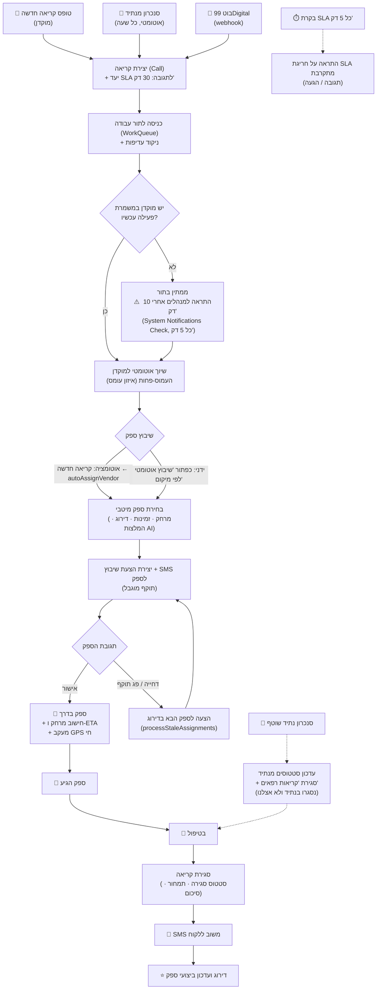

# תהליכי עבודה במערכת NatID CRM
## מבוסס על ניתוח הקוד בפועל

**תאריך:** 01/02/2026
**גרסה:** 1.0

---

## תוכן עניינים

1. [תהליך 1: מחזור חיי קריאה מלא](#תהליך-1-מחזור-חיי-קריאה)
2. [תהליך 2: קליטת קריאה מבוט 99Digital](#תהליך-2-קליטת-קריאה-מבוט)
3. [תהליך 3: שיבוץ ספק אוטומטי (אלגוריתם)](#תהליך-3-שיבוץ-ספק-אוטומטי)
4. [תהליך 4: תגובת ספק לשיבוץ](#תהליך-4-תגובת-ספק-לשיבוץ)
5. [תהליך 5: עבודת הספק בשטח](#תהליך-5-עבודת-הספק-בשטח)
6. [תהליך 6: ניהול תור עבודה ושיוך למוקדנים](#תהליך-6-ניהול-תור-עבודה)
7. [תהליך 7: מערכת התראות רב-ערוצית](#תהליך-7-מערכת-התראות)
8. [תהליך 8: מעקב GPS בזמן אמת](#תהליך-8-מעקב-gps)
9. [תהליך 9: משוב ודירוג](#תהליך-9-משוב-ודירוג)
10. [תהליך 10: צ'אט בתוך קריאה](#תהליך-10-צאט-בקריאה)
11. [תהליך 11: דשבורד ומדדי KPI](#תהליך-11-דשבורד-ומדדי-kpi)
12. [תהליך 12: ניהול לקוחות](#תהליך-12-ניהול-לקוחות)
13. [מרווחי רענון (Polling Intervals)](#מרווחי-רענון)
14. [תרשים זרימה מקצה לקצה](#תרשים-זרימה-מקצה-לקצה)

---

## תרשים זרימה מקצה לקצה

זרימת קריאה מלאה — מהפתיחה ועד המשוב — כולל המנגנונים האוטומטיים (עדכון 15/07/2026:
שיוך אוטומטי לתור העבודה ולמוקדן חל גם על קריאות מסונכרנות מנתיד, שיבוץ ספק אוטומטי
ניתן להפעלה כאוטומציה, ומנוע ההתראות עובד על ישות Call).



**נקודות הפעלה שחובה להגדיר כדי שהכול יעבוד אוטומטית:**

| מנגנון | איפה מגדירים | הערות |
|--------|---------------|--------|
| שיוך מוקדן אוטומטי | לוח משמרות (AgentShift) | חייבת להיות משמרת פעילה להיום, אחרת הקריאה נשארת "ממתין בתור" |
| שיבוץ ספק אוטומטי | Base44 ← Automations ← New Automation: `Call → Created` ← הפעלת `autoAssignVendor` | הפונקציה מדלגת בשקט על קריאות שכבר שובצו |
| התראות SLA וללא-שיבוץ | הפעלת האוטומציה "System Notifications Check" (כל 5 דק') | דורש כללים פעילים במסך הגדרות התראות |
| סנכרון מנתיד | האוטומציה הקיימת של `syncNatiData` | קריאות חדשות נכנסות אוטומטית לתור ומשויכות למוקדן |

---

## תהליך 1: מחזור חיי קריאה

### סטטוסים וזרימה

```
┌──────────────────────────────────────────────────────────────────────────┐
│                        מחזור חיי קריאה                                   │
├──────────────────────────────────────────────────────────────────────────┤
│                                                                          │
│  ┌─────────────────┐                                                     │
│  │  יצירת קריאה     │  ← מוקדן (NewCase) / בוט (99digitalBot)           │
│  │  status: 'new'  │                                                     │
│  └────────┬────────┘                                                     │
│           │                                                              │
│           ▼                                                              │
│  ┌─────────────────────────┐                                             │
│  │  waiting_treatment      │  ← ממתין לטיפול מוקדן                       │
│  │  "ממתין לטיפול"          │                                             │
│  └────────┬────────────────┘                                             │
│           │  מוקדן בוחר ספק ידנית / שיבוץ אוטומטי                        │
│           ▼                                                              │
│  ┌─────────────────────────┐                                             │
│  │  awaiting_assignment    │  ← ממתין לשיבוץ ספק                         │
│  │  "ממתין לשיבוץ"          │                                             │
│  └────────┬────────────────┘                                             │
│           │  אלגוריתם שיבוץ רץ / מוקדן בוחר ספק                          │
│           ▼                                                              │
│  ┌─────────────────────────┐     ┌─────────────────────────┐             │
│  │  assigning              │────▶│  CallAssignmentAttempt   │             │
│  │  "בתהליך שיבוץ"         │     │  status: 'pending'      │             │
│  └────────┬────────────────┘     │  expires: 5 דקות        │             │
│           │                      └─────────────────────────┘             │
│           │  ספק מאשר                                                    │
│           ▼                                                              │
│  ┌─────────────────────────┐                                             │
│  │  vendor_enroute         │  ← ספק יצא לדרך + GPS פעיל                  │
│  │  "ספק בדרך"             │  → הודעת מערכת: "הספק יצא לדרך"             │
│  └────────┬────────────────┘                                             │
│           │  ספק לוחץ "הגעתי"                                            │
│           ▼                                                              │
│  ┌─────────────────────────┐                                             │
│  │  in_progress            │  ← ספק מטפל + vendor_arrival_time_actual    │
│  │  "בטיפול"               │  → הודעת מערכת: "הספק הגיע ומתחיל בטיפול"   │
│  └────────┬────────────────┘                                             │
│           │  ספק לוחץ "סיים" + חתימת לקוח                                │
│           ▼                                                              │
│  ┌─────────────────────────┐                                             │
│  │  completed              │  ← closed_at + generateCallSummary          │
│  │  "הושלם"                │  → הודעת מערכת: "הטיפול הושלם בהצלחה!"      │
│  │                         │  → טופס משוב נפתח                            │
│  └─────────────────────────┘                                             │
│                                                                          │
│  ┌─────────────────────────┐                                             │
│  │  cancelled              │  ← ניתן לבטל מכל שלב                        │
│  │  "בוטל"                 │                                             │
│  └─────────────────────────┘                                             │
│                                                                          │
└──────────────────────────────────────────────────────────────────────────┘
```

### שדות שנוצרים בעת יצירת קריאה

| שדה | מקור | חישוב |
|-----|------|--------|
| call_number | אוטומטי | `C-${Date.now().toString().slice(-8)}` |
| status | אוטומטי | `'new'` או `'waiting_treatment'` |
| sla_response_deadline | חישוב | `now + customer.sla_response_minutes` (ברירת מחדל: 30 דק') |
| sla_arrival_deadline | חישוב | `now + customer.sla_arrival_minutes` (ברירת מחדל: 60 דק') |
| call_priority | משתמש/בוט | `normal` / `urgent` / `critical` |
| customer_response_code | אוטומטי (בוט) | קוד 4 ספרות אקראי |

### שדות חובה ליצירת קריאה

| שדה | שם בעברית | חובה |
|-----|-----------|------|
| caller_name | שם הפונה | כן |
| caller_phone | טלפון הפונה | כן |
| location_address | כתובת איסוף | כן |
| service_type | סוג שירות | כן |

### Side Effects בכל שינוי סטטוס

| מעבר סטטוס | פעולות אוטומטיות |
|-------------|-----------------|
| כל שינוי | CallHistory record נוצר עם change_type, old_value, new_value |
| → vendor_enroute | הודעת מערכת בצ'אט: "הספק יצא לדרך ובקרוב יגיע אליך" |
| → in_progress | הודעת מערכת בצ'אט: "הספק הגיע ומתחיל בטיפול" |
| → completed | הודעת מערכת: "הטיפול הושלם בהצלחה!" |
| → completed | `closed_at` timestamp נשמר |
| → completed | `generateCallSummary` Function מופעלת (AI) |
| → completed | טופס משוב נפתח למוקדן |

---

## תהליך 2: קליטת קריאה מבוט

### זרימה מלאה

```
┌──────────────┐
│  בוט 99Digital│
│  (WhatsApp)  │
└──────┬───────┘
       │ HTTP POST (Webhook)
       ▼
┌──────────────────────────────────────────────────────────────┐
│  botWebhook.ts / 99digitalBot.ts                             │
│                                                              │
│  1. ולידציה: customer_name, customer_phone, pickup_address   │
│                                                              │
│  2. מיפוי שדות:                                              │
│     Bot → Call Entity                                        │
│     customer.*     → customer_name, phone, email             │
│     vehicle.*      → vehicle_plate, model, year, type        │
│     incident.*     → issue_type, description                 │
│     pickup.*       → pickup_location_address/lat/lon         │
│     dropoff.*      → dropoff_location_address/lat/lon        │
│     questionnaire  → is_road_accessible, is_underground...   │
│                                                              │
│  3. הסקת אזור מעיר (אם לא סופק):                            │
│     תל אביב/רמת גן/חולון → center                           │
│     חיפה/נהריה/עכו       → north                            │
│     באר שבע/אילת/אשדוד   → south                            │
│     ירושלים/בית שמש       → jerusalem                        │
│                                                              │
│  4. חישוב עדיפות:                                            │
│     בסיס: 50 נקודות                                          │
│     + 30  אם VIP                                             │
│     + 25  אם דחוף                                            │
│     + 5   אם אזור מרכז                                      │
│     + 20  אם תאונה                                           │
│                                                              │
│  5. יצירת Call Entity:                                       │
│     call_status = 'waiting_treatment'                        │
│     created_by_source = 'bot'                                │
│                                                              │
│  6. איזון עומסים - שיוך למוקדן:                              │
│     ספירת קריאות פעילות לכל מוקדן                             │
│     בחירת מוקדן עם עומס מינימלי (מקסימום 5 קריאות)          │
│     יצירת WorkQueue item                                     │
│                                                              │
│  7. ניסיון שיבוץ אוטומטי:                                    │
│     invoke('autoAssignVendor', { call_id })                  │
│                                                              │
│  8. אימייל ללקוח:                                            │
│     מספר קריאה + קוד תגובה                                   │
└──────────────────────────────────────────────────────────────┘
       │
       ▼
┌──────────────────────────────────────┐
│  תגובה לבוט:                         │
│  {                                   │
│    call_id, call_number,             │
│    assigned_to_agent: "שם מוקדן",    │
│    estimated_time: "5-10 דקות",      │
│    customer_response_code: "1234"    │
│  }                                   │
└──────────────────────────────────────┘
```

---

## תהליך 3: שיבוץ ספק אוטומטי

### אלגוריתם הניקוד (מקסימום 105 נקודות)

```
┌──────────────────────────────────────────────────────────────┐
│  autoAssignVendor.ts                                         │
│                                                              │
│  Input: call_id, exclude_vendor_ids[] (אופציונלי)           │
│                                                              │
│  שלב 1: שליפת ספקים                                         │
│  ├─ availability_status = 'available'                        │
│  ├─ is_active = true                                         │
│  └─ לא ברשימת exclude                                       │
│                                                              │
│  שלב 2: ניקוד כל ספק                                        │
│                                                              │
│  ┌──────────────────────────────────────────────────────┐    │
│  │  מרחק (40 נקודות מקסימום)                             │    │
│  │  ≤5 ק"מ   = 40 נק'                                   │    │
│  │  5-10 ק"מ  = 35 נק'                                   │    │
│  │  10-20 ק"מ = 25 נק'                                   │    │
│  │  20-30 ק"מ = 15 נק'                                   │    │
│  │  30-50 ק"מ = 10 נק'                                   │    │
│  │  >50 ק"מ   = 5 נק'                                    │    │
│  │  ללא קואורדינטות + אזור תואם = 25 נק'                 │    │
│  └──────────────────────────────────────────────────────┘    │
│                                                              │
│  ┌──────────────────────────────────────────────────────┐    │
│  │  סוג שירות (20 נקודות)                                │    │
│  │  ספק מספק את סוג השירות הנדרש = 20 נק'               │    │
│  │                                                       │    │
│  │  מיפוי סוגי שירות:                                    │    │
│  │  mechanical    → mechanic, multi_service              │    │
│  │  stopped       → tow_truck, multi_service             │    │
│  │  flat_tire     → tire_service, tow_truck              │    │
│  │  accident      → tow_truck, multi_service             │    │
│  │  no_fuel       → fuel_delivery, multi_service         │    │
│  │  dead_battery  → mechanic, multi_service              │    │
│  │  locked_keys   → locksmith, multi_service             │    │
│  └──────────────────────────────────────────────────────┘    │
│                                                              │
│  ┌──────────────────────────────────────────────────────┐    │
│  │  דירוג (20 נקודות מקסימום)                            │    │
│  │  נוסחה: (average_rating / 5) × 20                    │    │
│  │  דוגמה: דירוג 4.5 = 18 נקודות                        │    │
│  └──────────────────────────────────────────────────────┘    │
│                                                              │
│  ┌──────────────────────────────────────────────────────┐    │
│  │  זמן תגובה (10 נקודות מקסימום)                        │    │
│  │  ≤10 שניות = 10 נק'                                   │    │
│  │  10-20 שניות = 8 נק'                                  │    │
│  │  20-30 שניות = 6 נק'                                  │    │
│  │  30-45 שניות = 4 נק'                                  │    │
│  │  >45 שניות = 2 נק'                                    │    │
│  └──────────────────────────────────────────────────────┘    │
│                                                              │
│  ┌──────────────────────────────────────────────────────┐    │
│  │  אחוז השלמה (10 נקודות מקסימום)                       │    │
│  │  נוסחה: (completion_rate / 100) × 10                  │    │
│  └──────────────────────────────────────────────────────┘    │
│                                                              │
│  ┌──────────────────────────────────────────────────────┐    │
│  │  בונוסים/קנסות                                       │    │
│  │  תמיכה בסוג רכב = +5 נק'                             │    │
│  │  <3 קריאות היום = +5 נק'                              │    │
│  │  3-5 קריאות = +2 נק'                                  │    │
│  │  >10 קריאות = -5 נק'                                  │    │
│  └──────────────────────────────────────────────────────┘    │
│                                                              │
│  שלב 3: בחירת ספק עם ניקוד גבוה ביותר                      │
│                                                              │
│  שלב 4: חישוב ETA                                           │
│  נוסחה: (distance_km × 2) + 10 דקות buffer                 │
│                                                              │
│  שלב 5: יצירת CallAssignmentAttempt                         │
│  status: 'pending'                                           │
│  expires_at: now + 5 דקות                                    │
│                                                              │
│  Output: המלצה ראשית + 3 חלופות                              │
└──────────────────────────────────────────────────────────────┘
```

---

## תהליך 4: תגובת ספק לשיבוץ

### זרימת אישור/דחייה

```
┌──────────────────────────────────────────────────────────────┐
│  handleAssignmentResponse.ts                                  │
│                                                              │
│  Input: attempt_id, action ('accept'/'decline'), reason      │
│                                                              │
│  ┌────────────────────────────────┐                          │
│  │      ולידציות:                  │                          │
│  │  ✓ attempt קיים                │                          │
│  │  ✓ status === 'pending'        │                          │
│  │  ✓ לא פג תוקף (5 דק')        │                          │
│  └──────────┬─────────────────────┘                          │
│             │                                                │
│     ┌───────┴───────┐                                        │
│     │               │                                        │
│     ▼               ▼                                        │
│  ┌──────┐     ┌──────────┐                                   │
│  │ ACCEPT│     │ DECLINE  │                                   │
│  └──┬───┘     └────┬─────┘                                   │
│     │              │                                         │
│     ▼              ▼                                         │
│  ┌──────────────────────────────┐  ┌─────────────────────┐   │
│  │ 1. Attempt → 'accepted'      │  │ 1. Attempt →        │   │
│  │    + response_time_seconds   │  │    'declined'        │   │
│  │                              │  │    + decline_reason  │   │
│  │ 2. Call →                    │  │                      │   │
│  │    status: 'vendor_enroute'  │  │ 2. CallHistory:      │   │
│  │    assigned_vendor_id        │  │    "ספק דחה. סיבה:X" │   │
│  │    assigned_at               │  │                      │   │
│  │                              │  │ 3. שיבוץ מחדש:       │   │
│  │ 3. Vendor →                  │  │    autoAssignVendor   │   │
│  │    availability: 'busy'      │  │    + exclude ספקים    │   │
│  │    total_calls_assigned +1   │  │    שדחו              │   │
│  │                              │  │                      │   │
│  │ 4. CallHistory:              │  │ 4. אם אין ספקים:     │   │
│  │    "ספק X אישר את הקריאה"   │  │    status →           │   │
│  │                              │  │    'awaiting_         │   │
│  └──────────────────────────────┘  │    assignment'        │   │
│                                    └─────────────────────┘   │
│                                                              │
│  TIMEOUT (120 שניות ב-UI / 5 דקות ב-Backend):               │
│  → attempt.status = 'expired'                                │
│  → אותה זרימה כמו DECLINE (שיבוץ מחדש)                      │
│                                                              │
└──────────────────────────────────────────────────────────────┘
```

---

## תהליך 5: עבודת הספק בשטח

### מסע הספק המלא

```
┌──────────────────────────────────────────────────────────────┐
│                   תהליך הספק בשטח                             │
│                                                              │
│  ═══ שלב 1: התחלת משמרת ═══                                  │
│                                                              │
│  [ספק לוחץ "התחל משמרת"]                                     │
│  ├─ is_available_now = true                                   │
│  ├─ availability_status = 'available'                         │
│  ├─ GPS מופעל: watchPosition כל 5 שניות                      │
│  └─ עדכון שרת כל 30 שניות                                    │
│                                                              │
│  ═══ שלב 2: קבלת קריאה ═══                                   │
│                                                              │
│  [התראה VendorNewCallAlert - ספירה לאחור 120 שניות]          │
│  מציג: סוג תקלה, שם לקוח, כתובת, מרחק, ETA, פרטי רכב       │
│  ├─ "קבל קריאה" → status: 'vendor_enroute'                  │
│  ├─ "דחה" → סיבה + שיבוץ מחדש                                │
│  └─ [timeout] → דחייה אוטומטית                                │
│                                                              │
│  ═══ שלב 3: בדרך (vendor_enroute) ═══                        │
│                                                              │
│  [ספק בדרך ללקוח]                                            │
│  ├─ GPS: שולח מיקום כל 30 שניות                               │
│  ├─ Backend: מחשב ETA מעודכן (מרחק ÷ 40 קמ"ש)               │
│  ├─ Backend: מעדכן estimated_distance_km, estimated_arrival   │
│  ├─ פעולות זמינות: "הגעתי למקום"                              │
│  └─ צפייה: פרטי לקוח, ניווט Waze, צ'אט                       │
│                                                              │
│  [ספק לוחץ "הגעתי למקום"]                                    │
│  ├─ status = 'in_progress'                                    │
│  └─ vendor_arrival_time_actual = now                          │
│                                                              │
│  ═══ שלב 4: בטיפול (in_progress) ═══                         │
│                                                              │
│  [ספק מטפל ברכב]                                             │
│  פעולות זמינות:                                               │
│  ├─ צילום תמונות (5 קטגוריות):                               │
│  │   ├─ "לפני טיפול"                                         │
│  │   ├─ "אחרי טיפול"                                         │
│  │   ├─ "נזק"                                                │
│  │   ├─ "מסמך לקוח"                                          │
│  │   └─ "אחר"                                                │
│  ├─ כתיבת הערות (vendor_notes)                                │
│  ├─ שליחת הודעות בצ'אט                                       │
│  └─ צפייה בפרטי קריאה מלאים                                  │
│                                                              │
│  ═══ שלב 5: סיום קריאה ═══                                   │
│                                                              │
│  [ספק מסיים טיפול]                                           │
│  ├─ 1. חתימת לקוח (חובה!) → SignaturePad                     │
│  │     נשמרת כ-CallPhoto עם category: 'customer_signature'   │
│  ├─ 2. "סיים קריאה" →                                        │
│  │     status = 'completed'                                   │
│  │     closed_at = now                                        │
│  │     closed_by = vendor_name                                │
│  └─ 3. CallHistory record נוצר                                │
│                                                              │
│  ═══ שלב 6: סיום משמרת ═══                                   │
│                                                              │
│  [ספק לוחץ "סיים משמרת"]                                     │
│  ├─ is_available_now = false                                   │
│  ├─ availability_status = 'offline'                            │
│  └─ GPS נעצר מיידית                                           │
│                                                              │
└──────────────────────────────────────────────────────────────┘
```

### מה הספק רואה בממשק

| דף | מידע מוצג | פעולות |
|----|-----------|--------|
| **VendorPortal** | דשבורד + קריאות פעילות + טאבים (כל/פעילות/הושלמו) | Toggle זמינות, קבלת/דחיית קריאה, ניהול |
| **VendorCallManagement** | פרטי קריאה + תמונות + הערות + צ'אט | צילום, הערות, חתימה, סיום |
| **MyVendorProfile** | פרופיל אישי + שירותים + תעריפים + סטטיסטיקות | עדכון פרטים, GPS toggle |

### שדות שהספק **לא יכול** לערוך

- `vendor_name` → "לשינוי שם פנה למנהל"
- `email` → "האימייל משמש להתחברות ולא ניתן לשינוי"

---

## תהליך 6: ניהול תור עבודה

### כניסה לתור

```
┌──────────────────────────────────────────────────────────────┐
│  ניהול תור עבודה - WorkQueue                                  │
│                                                              │
│  ═══ כניסה לתור ═══                                          │
│                                                              │
│  קריאה נוצרת (בוט/מוקדן)                                    │
│       │                                                      │
│       ▼                                                      │
│  חישוב priority_score:                                       │
│  בסיס: 50                                                    │
│  + 30 VIP                                                    │
│  + 25 דחוף                                                   │
│  + 5  מרכז                                                   │
│  + 20 תאונה                                                  │
│       │                                                      │
│       ▼                                                      │
│  איזון עומסים:                                               │
│  לכל מוקדן → ספירת קריאות פעילות                              │
│  בחירת מוקדן עם מינימום (max 5 קריאות)                       │
│       │                                                      │
│  ┌────┴────┐                                                 │
│  │         │                                                 │
│  ▼         ▼                                                 │
│  יש מוקדן    אין מוקדן פנוי                                  │
│  פנוי                                                        │
│  │         │                                                 │
│  ▼         ▼                                                 │
│  assigned   waiting_in_queue                                  │
│  _to_agent                                                   │
│                                                              │
│  ═══ סטטוסים בתור ═══                                        │
│                                                              │
│  waiting_in_queue → assigned_to_agent → in_progress          │
│                                         → completed          │
│                                                              │
│  ═══ ניטור (QueueMonitor) ═══                                │
│                                                              │
│  רענון: כל 15 שניות                                          │
│  מדדים:                                                      │
│  ├─ כמות בתור לפי סטטוס                                      │
│  ├─ priority_score (>80 = badge אדום)                        │
│  ├─ שיוך למוקדנים                                            │
│  ├─ זמן המתנה בתור                                           │
│  └─ סינון: לפי סטטוס, חיפוש לפי שם/מספר                     │
│                                                              │
│  ═══ תור אישי (MyQueue) ═══                                  │
│                                                              │
│  רענון: כל 30 שניות                                          │
│  סינון: created_by === currentUser.email                     │
│  הפרדה: פעילות | הושלמו/בוטלו                                │
│  מדדים: סה"כ, פעילות, הושלמו, דחופות                         │
│                                                              │
└──────────────────────────────────────────────────────────────┘
```

---

## תהליך 7: מערכת התראות

### זרימה רב-ערוצית

```
┌──────────────────────────────────────────────────────────────┐
│  מערכת התראות - 3 ערוצים                                      │
│                                                              │
│  ═══ טריגרים ═══                                             │
│                                                              │
│  1. קריאה לא שובצה (checkAndSendNotifications.ts):           │
│     תנאי: אין assigned_provider_id + status='new'            │
│     סף: 10 דקות המתנה (ברירת מחדל)                           │
│     נמענים: כל המנהלים                                       │
│                                                              │
│  2. SLA קרוב לחריגה:                                         │
│     תנאי: sla_response_deadline - now ≤ 15 דקות              │
│     או: sla_arrival_deadline - now ≤ 15 דקות                 │
│     נמענים: כל המנהלים                                       │
│     סוג: 'warning'                                           │
│                                                              │
│  3. שינוי סטטוס קריאה (sendCallStatusUpdate.ts):             │
│     הודעות מתורגמות:                                         │
│     ├─ awaiting_assignment: "הקריאה התקבלה ואנחנו מחפשים ספק" │
│     ├─ assigning: "מצאנו ספק מתאים ומחכים לאישורו"           │
│     ├─ vendor_enroute: "הספק בדרך אליך! צפי הגעה: {eta}"    │
│     ├─ in_progress: "הספק הגיע ומתחיל בטיפול"               │
│     └─ completed: "הטיפול הושלם. תודה שבחרת בנו!"           │
│                                                              │
│  ═══ ערוצי שליחה (sendNotification.ts) ═══                   │
│                                                              │
│  ┌───────────────┐                                           │
│  │   In-App      │  Notification entity נוצר                 │
│  │   ✅ פעיל     │  + subscribe() לעדכון בזמן אמת            │
│  │               │  + toast notification + צליל               │
│  │               │  + link: /CallDetails?id={call_id}        │
│  └───────────────┘                                           │
│                                                              │
│  ┌───────────────┐                                           │
│  │   Email       │  Base44 SendEmail integration             │
│  │   ⚠️ קוד מוכן│  HTML template עם RTL                     │
│  │               │  Subject: כותרת ההתראה                     │
│  └───────────────┘                                           │
│                                                              │
│  ┌───────────────┐                                           │
│  │   SMS         │  Twilio API                               │
│  │   ⚠️ קוד מוכן│  פורמט טלפון ישראלי:                      │
│  │               │  050-XXX → +972-50-XXX                    │
│  │               │  Body: "נתיב: {title}\n{body}"            │
│  └───────────────┘                                           │
│                                                              │
│  ═══ Push Notifications ═══                                  │
│                                                              │
│  סוגי Push (PushNotifications.jsx):                          │
│  ├─ NEW_CALL: "קריאה חדשה!" (requireInteraction: true)       │
│  ├─ CALL_ASSIGNED: "קריאה שובצה אליך"                        │
│  ├─ CALL_STATUS_CHANGE: "עדכון סטטוס קריאה"                  │
│  ├─ VENDOR_ARRIVED: "ספק הגיע ליעד"                          │
│  ├─ CALL_COMPLETED: "קריאה הושלמה"                           │
│  ├─ SLA_WARNING: "⚠️ אזהרת SLA"                             │
│  └─ SYSTEM_ALERT: "התראת מערכת"                              │
│                                                              │
│  ═══ קריאת התראות (RealtimeNotifications.jsx) ═══            │
│                                                              │
│  subscribe() → event.type === 'create'                       │
│  → Toast notification עם icon לפי type                       │
│  → צליל (אם sound_enabled)                                   │
│  → כפתור "צפה" עם link                                       │
│  → invalidateQueries(['notifications'])                      │
│                                                              │
└──────────────────────────────────────────────────────────────┘
```

---

## תהליך 8: מעקב GPS

### מנגנון מעקב

```
┌──────────────────────────────────────────────────────────────┐
│  GPS Tracking - VendorGPSTracker.jsx + updateVendorLocation  │
│                                                              │
│  ═══ הפעלה ═══                                               │
│  ספק מתחיל משמרת / מפעיל "שתף מיקום"                         │
│       │                                                      │
│       ▼                                                      │
│  navigator.geolocation.watchPosition()                       │
│  ├─ enableHighAccuracy: true                                 │
│  ├─ timeout: 10,000ms                                        │
│  ├─ maximumAge: 5,000ms                                      │
│  └─ + setInterval כל 30,000ms (fallback)                     │
│                                                              │
│  ═══ נתונים נשלחים כל עדכון ═══                               │
│  {                                                           │
│    vendor_id,                                                │
│    latitude, longitude,                                      │
│    accuracy (מטרים),                                         │
│    speed (km/h - מומר מ-m/s),                                │
│    heading (כיוון),                                          │
│    battery_level (%),                                        │
│    call_id (אם בקריאה פעילה),                                │
│    call_number                                               │
│  }                                                           │
│       │                                                      │
│       ▼  invoke('updateVendorLocation')                      │
│                                                              │
│  ═══ עיבוד בשרת (updateVendorLocation.ts) ═══                │
│                                                              │
│  1. עדכון Vendor entity:                                     │
│     current_latitude, current_longitude,                     │
│     last_location_update                                     │
│                                                              │
│  2. יצירת VendorLocation (היסטוריה):                         │
│     lat, lon, accuracy, speed, heading,                      │
│     battery_level, call_id, is_available                     │
│                                                              │
│  3. אם בקריאה פעילה - חישוב ETA:                             │
│     מרחק = Haversine(ספק, לקוח)                              │
│     מהירות = speed > 5 ? speed : 40 km/h                    │
│     ETA = (מרחק ÷ מהירות) × 60 דקות                         │
│     → עדכון Call:                                            │
│       estimated_distance_km                                  │
│       estimated_arrival_time                                 │
│                                                              │
│  ═══ עצירה ═══                                               │
│  ספק מסיים משמרת / מכבה "שתף מיקום"                          │
│  → clearWatch + clearInterval                                │
│                                                              │
└──────────────────────────────────────────────────────────────┘
```

### תדירויות עדכון

| רכיב | תדירות | מקור |
|------|---------|------|
| watchPosition (שינוי מיקום) | עד כל 5 שניות | VendorGPSTracker |
| Interval (backup) | כל 30 שניות | VendorGPSTracker |
| עדכון שרת | כל שינוי מיקום + כל 30 שניות | updateVendorLocation |
| חישוב ETA | כל עדכון מיקום (רק אם בקריאה) | updateVendorLocation |

---

## תהליך 9: משוב ודירוג

### זרימת משוב

```
┌──────────────────────────────────────────────────────────────┐
│  Feedback & Rating Flow                                       │
│                                                              │
│  ═══ טריגר ═══                                               │
│  קריאה מגיעה ל-status: 'completed'                           │
│  → טופס משוב נפתח אוטומטית (CallFeedbackForm)               │
│                                                              │
│  ═══ דירוגים (1-5 כוכבים) ═══                                │
│  ├─ overall_rating (חובה!)                                   │
│  ├─ service_quality_rating                                   │
│  ├─ response_time_rating                                     │
│  ├─ professionalism_rating                                   │
│  ├─ would_recommend (כן/לא)                                  │
│  └─ feedback_text (טקסט חופשי)                               │
│                                                              │
│  ═══ 3 Records נוצרים ═══                                    │
│                                                              │
│  1. CallFeedback entity:                                     │
│     כל הדירוגים + פרטי קריאה + feedback_source               │
│                                                              │
│  2. Call entity מתעדכן:                                       │
│     customer_rating = overall_rating                         │
│     customer_feedback = feedback_text                        │
│                                                              │
│  3. VendorRating entity:                                     │
│     כל הדירוגים + vendor_id + call_id                        │
│                                                              │
│  ═══ חישוב ממוצע (submitVendorRating.ts) ═══                 │
│                                                              │
│  שליפת כל VendorRatings לספק                                 │
│  avgRating = sum(overall_rating) / count                     │
│  → עדכון Vendor:                                             │
│    average_rating = avgRating                                │
│    total_ratings = count                                     │
│                                                              │
└──────────────────────────────────────────────────────────────┘
```

---

## תהליך 10: צ'אט בקריאה

### מנגנון הצ'אט

```
┌──────────────────────────────────────────────────────────────┐
│  EnhancedCallChat - צ'אט בזמן אמת בתוך קריאה                 │
│                                                              │
│  ═══ סוגי הודעות ═══                                         │
│  text           - הודעת טקסט רגילה                            │
│  image          - תמונה (מקסימום 10MB)                       │
│  file           - קובץ (PDF, Word, Excel)                    │
│  status_update  - הודעת מערכת אוטומטית                       │
│                                                              │
│  ═══ תפקידים (roles) ═══                                     │
│  operator  - מוקדן (כחול, אייקון אוזנייה)                    │
│  vendor    - ספק (ירוק, אייקון משאית)                        │
│  customer  - לקוח (סגול, אייקון אדם)                         │
│  system    - מערכת (אפור, אייקון בוט)                        │
│                                                              │
│  ═══ מנגנון עדכון ═══                                        │
│  1. subscribe() - בזמן אמת לכל Message חדש בקריאה           │
│  2. refetchInterval: 3000ms - polling כל 3 שניות (backup)    │
│                                                              │
│  ═══ שליחת הודעה ═══                                         │
│  ├─ טקסט: messageText → Message.create()                     │
│  ├─ קובץ: UploadFile → file_url → Message.create()          │
│  │   ├─ בדיקת גודל: max 10MB                                │
│  │   ├─ סוגים: image/*, .pdf, .doc, .docx, .xls, .xlsx     │
│  │   └─ סוג הודעה: image אם תמונה, file אם מסמך             │
│  └─ מערכת: sendStatusMessage() → status_update               │
│                                                              │
│  ═══ הודעות מערכת אוטומטיות ═══                               │
│  vendor_enroute  → "הספק יצא לדרך ובקרוב יגיע אליך"        │
│  in_progress     → "הספק הגיע ומתחיל בטיפול"                │
│  completed       → "הטיפול הושלם בהצלחה!"                   │
│                                                              │
└──────────────────────────────────────────────────────────────┘
```

---

## תהליך 11: דשבורד ומדדי KPI

### מדדים שמוצגים

```
┌──────────────────────────────────────────────────────────────┐
│  Dashboard KPIs                                               │
│                                                              │
│  ┌──────────────────────────────────────────────────────┐    │
│  │  KPI ראשיים (שורה עליונה)                             │    │
│  │                                                       │    │
│  │  [קריאות פתוחות]    = calls.filter(active statuses)   │    │
│  │  [ממתינות לשיבוץ]    = status === 'waiting_treatment' │    │
│  │  [הושלמו היום]       = status === 'completed' + today │    │
│  │  [ספקים זמינים]      = availability_status='available'│    │
│  └──────────────────────────────────────────────────────┘    │
│                                                              │
│  ┌──────────────────────────────────────────────────────┐    │
│  │  KPI נוספים                                           │    │
│  │                                                       │    │
│  │  [CSAT]  = ממוצע customer_rating (7 ימים אחרונים)   │    │
│  │            מוצג כ-X.X/5.0 עם progress bar            │    │
│  │                                                       │    │
│  │  [ETA]   = 32 דקות (hardcoded כרגע)                  │    │
│  │  [פתרון] = 68% (hardcoded כרגע)                      │    │
│  └──────────────────────────────────────────────────────┘    │
│                                                              │
│  ┌──────────────────────────────────────────────────────┐    │
│  │  סקירת תור עבודה                                      │    │
│  │                                                       │    │
│  │  [ממתינים בתור]  = queue.waiting_in_queue             │    │
│  │  [שובצו למוקדן]   = queue.assigned_to_agent           │    │
│  │  [בטיפול]        = queue.in_progress                  │    │
│  │  [זמן ממוצע]     = avg(time_to_complete)              │    │
│  │  [עומס לפי מוקדן] = bar chart צבעוני                  │    │
│  └──────────────────────────────────────────────────────┘    │
│                                                              │
│  ┌──────────────────────────────────────────────────────┐    │
│  │  גרפים                                               │    │
│  │                                                       │    │
│  │  [מגמת קריאות]   = AreaChart - 7 ימים אחרונים        │    │
│  │  [חלוקת סטטוסים] = BarChart - קריאות לפי סטטוס       │    │
│  └──────────────────────────────────────────────────────┘    │
│                                                              │
│  ┌──────────────────────────────────────────────────────┐    │
│  │  דשבורד מוקדן אישי                                    │    │
│  │                                                       │    │
│  │  [הקריאות שלי]     = assigned_to me + active          │    │
│  │  [הושלמו היום שלי] = completed by me today            │    │
│  │  [דחופות שלי]      = priority urgent/critical + mine  │    │
│  │  [פעולות מהירות]   = גריד כפתורים                     │    │
│  │  [קריאות דחופות]   = עד 5 קריאות דחופות              │    │
│  └──────────────────────────────────────────────────────┘    │
│                                                              │
│  רענון: כל 15 שניות (תור) + 30 שניות (קריאות)              │
│                                                              │
└──────────────────────────────────────────────────────────────┘
```

---

## תהליך 12: ניהול לקוחות

### סוגי לקוחות

| קוד | תיאור | אייקון |
|-----|--------|--------|
| insurance_company | חברת ביטוח | - |
| fleet | ציי רכב | - |
| individual | פרטי | - |
| garage | מוסך | - |
| other | אחר | - |

### סטטוסים

| קוד | תיאור | צבע |
|-----|--------|-----|
| active | פעיל | ירוק |
| inactive | לא פעיל | אפור |
| suspended | מושהה | אדום |

### זרימת עבודה

```
יצירת לקוח → הגדרת SLA אישי → קישור לקריאות
                                    │
                                    ▼
                              SLA מחושב אוטומטית בכל קריאה חדשה:
                              sla_response_deadline = now + customer.sla_response_minutes
                              sla_arrival_deadline = now + customer.sla_arrival_minutes
```

---

## מרווחי רענון

### טבלת Polling Intervals

| רכיב | מרווח | קובץ |
|-------|--------|------|
| רשימת קריאות (Calls) | 30 שניות | Calls.jsx |
| ניטור תור (QueueMonitor) | 15 שניות | QueueMonitor/useWorkQueue |
| תור אישי (MyQueue) | 30 שניות | MyQueue.jsx |
| דשבורד - תור | 15 שניות | Dashboard.jsx |
| בדיקת שיבוץ חדש לספק | 10 שניות | VendorPortal.jsx |
| רשימת קריאות ספק | 30 שניות | VendorPortal.jsx |
| צ'אט בקריאה | 3 שניות + subscribe | EnhancedCallChat.jsx |
| GPS ספק (watchPosition) | כל 5 שניות max age | VendorGPSTracker.jsx |
| GPS ספק (interval backup) | 30 שניות | VendorGPSTracker.jsx |
| התראות בזמן אמת | subscribe (מיידי) | RealtimeNotifications.jsx |

### Realtime Subscriptions (מיידי, לא polling)

| Entity | שימוש |
|--------|-------|
| Notification | התראות חדשות → toast + צליל |
| Message | הודעות צ'אט חדשות → invalidate query |

---

*מסמך זה נוצר מניתוח הקוד בפועל ב-01/02/2026*
*כל הזרימות, ערכים, ונוסחאות מבוססים על הקוד הקיים ב-repository*
