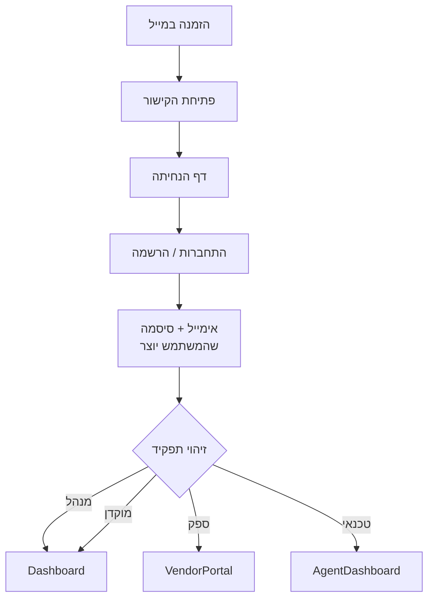
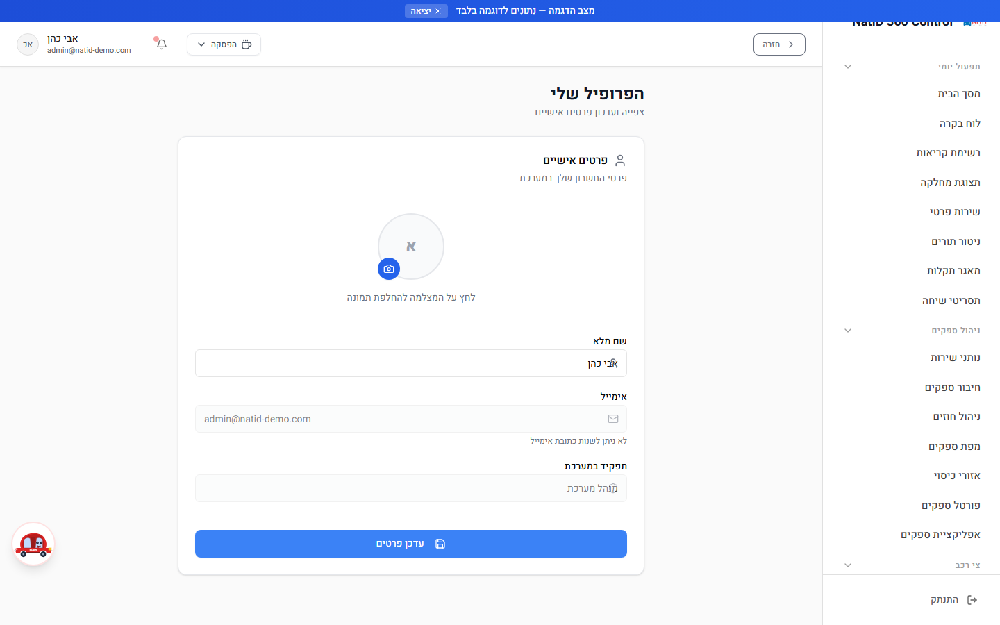
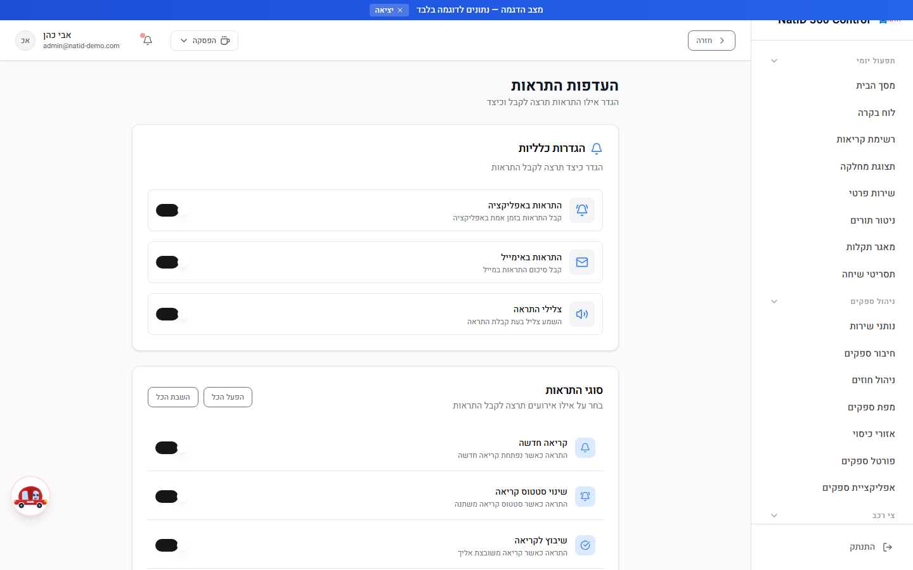
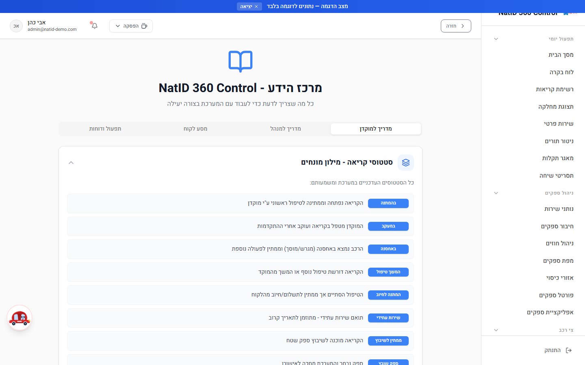
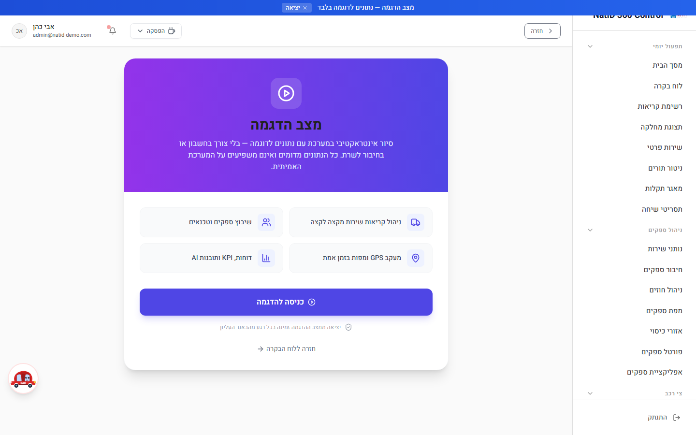

# מדריך למשתמש — התחלת עבודה במערכת

**NatID 360 Control — מערכת ניהול קריאות שירות**
מיועד לכל המשתמשים: מנהל · מוקדן · טכנאי · ספק
עודכן: יולי 2026

---

## תוכן עניינים

1. [סקירה כללית — מה המערכת ולמי היא מיועדת](#סקירה-כללית)
2. [כניסה למערכת — מההזמנה ועד המסך הראשון](#כניסה-למערכת)
   - [שלב 1: קבלת הזמנה למערכת במייל](#שלב-1-קבלת-הזמנה)
   - [שלב 2: פתיחת קישור האפליקציה](#שלב-2-פתיחת-הקישור)
   - [שלב 3: הרשמה וכניסה ראשונה](#שלב-3-הרשמה-וכניסה)
   - [שלב 4: זיהוי תפקיד והפניה לדף הבית](#שלב-4-זיהוי-תפקיד)
   - [שלב 5: שכחתם סיסמה?](#שלב-5-שכחתם-סיסמה)
   - [שלב 6: התחברות מהנייד והוספה למסך הבית](#שלב-6-התחברות-מהנייד)
3. [תפקידים והרשאות](#תפקידים-והרשאות)
4. [ניווט כללי במערכת](#ניווט-כללי)
5. [הפרופיל האישי שלי](#פרופיל-אישי)
6. [העדפות התראות](#התראות)
7. [מרכז הידע — עזרה בתוך המערכת](#מרכז-הידע)
8. [מצב הדגמה](#מצב-הדגמה)
9. [תקלות נפוצות](#תקלות-נפוצות)

---

## 1. סקירה כללית — מה המערכת ולמי היא מיועדת

**NatID 360 Control** היא מערכת לניהול קריאות שירותי דרך — גרירה, ניידות שירות, שמשות ורכב חליפי — עבור קבוצת נתי. המערכת מלווה כל קריאת שירות מהרגע שהלקוח מתקשר ועד לסגירה ומשוב, ומחברת בין כל הגורמים המעורבים בתהליך.

המערכת כולה בעברית ובנויה לעבודה מימין לשמאל, גם במחשב וגם בנייד.

### ארבעת התפקידים במערכת

| קהל | מה הוא עושה במערכת |
|---|---|
| **מנהל (Admin)** | הגדרות מערכת, דוחות, ניהול משתמשים והרשאות, נתונים כספיים |
| **מוקדן (Operator)** | פותח קריאות, משבץ ספקים, מנהל סטטוסים, סוגר קריאות |
| **טכנאי / נציג שטח (Agent)** | דשבורד ייעודי לקריאות המוקצות לו |
| **ספק (Vendor)** | מקבל קריאות בנייד, מאשר או דוחה, מעדכן סטטוס, מעלה תמונות ומחתים לקוח |

בנוסף, **לקוח הקצה** יכול לעקוב אחרי הקריאה שלו בפורטל ציבורי (`/CustomerPortal`) — ללא התחברות, לפי מספר טלפון ומספר קריאה — ולקבל סקר משוב ב-SMS לאחר הסגירה.

---

## 2. כניסה למערכת — מההזמנה ועד המסך הראשון

זהו הפרק החשוב ביותר למשתמש חדש. עברו על השלבים לפי הסדר — בסיום תהיו מחוברים למערכת בדף הבית המתאים לתפקידכם.

### תרשים זרימה: התחברות והפניה לפי תפקיד

### שלב 1: קבלת הזמנה למערכת במייל

הכניסה למערכת נעשית **בהזמנה בלבד**. מנהל המערכת מזמין אתכם דרך מסך ניהול המשתמשים (או, במקרה של ספק חדש, כחלק מתהליך הקמת הספק), וההזמנה נשלחת אליכם באימייל.

1. בדקו את תיבת הדואר האלקטרוני שמסרתם למנהל המערכת.
2. חפשו הודעת הזמנה למערכת (אם אינה מופיעה — בדקו גם בתיקיית **דואר זבל / Spam**).
3. ההודעה מכילה קישור לכניסה לאפליקציה.

> **טיפ חשוב:** ההזמנה נשלחת לכתובת אימייל מסוימת — התחברו תמיד **עם אותה כתובת בדיוק**. עבור ספקים, כתובת האימייל היא שמקשרת בין המשתמש לבין פרופיל הספק שלו במערכת; התחברות עם כתובת אחרת תגרום לכך שלא תראו את הקריאות שלכם.

### שלב 2: פתיחת קישור האפליקציה

**נתיב במערכת:** `/LandingPage` (דף הנחיתה — נקודת הכניסה למערכת)

1. לחצו על הקישור שקיבלתם במייל (או הקלידו את כתובת המערכת בדפדפן).
2. ייפתח **דף הנחיתה** של NatID 360 Control, עם הסבר קצר על המערכת.
3. בפינת המסך העליונה לחצו על **"כניסה למערכת"** — הדף יגלול אתכם לאזור ההתחברות.

> **טיפ:** מומלץ לשמור את כתובת המערכת בסימניות (Favorites) של הדפדפן כבר בכניסה הראשונה.

### שלב 3: הרשמה וכניסה ראשונה

הכניסה למערכת מתבצעת באמצעות **אימייל + סיסמה שאתם יוצרים בעצמכם**:

1. באזור ההתחברות בדף הנחיתה לחצו על הכפתור **"התחברות / הרשמה"**.
2. תועברו למסך התחברות מאובטח. בכניסה הראשונה בחרו **הרשמה (Sign Up)**.
3. הזינו את **כתובת האימייל שנמסרה למנהל המערכת** (זו שאליה נשלחה ההזמנה) וצרו **סיסמה אישית**.
4. אם נשלח אליכם מייל אימות — אשרו אותו.
5. מהכניסה הבאה ואילך: הזינו אימייל + הסיסמה שיצרתם ולחצו **"התחברות"**.

> **טיפים:**
> - בחרו סיסמה חזקה שאינה משמשת אתכם באתרים אחרים, ושמרו אותה במקום בטוח.
> - חובה להירשם עם **אותה כתובת אימייל בדיוק** שהוגדרה עבורכם במערכת — כתובת אחרת לא תזוהה.
> - ההתחברות מאובטחת ומנוהלת על ידי הפלטפורמה — המערכת אינה שומרת את הסיסמה שלכם.

### שלב 4: זיהוי אוטומטי של התפקיד והפניה לדף הבית

אין צורך לבחור תפקיד — המערכת מזהה אוטומטית את התפקיד שהוגדר לכם בהזמנה, ומפנה אתכם לדף הבית המתאים:

| התפקיד שלכם | לאן תגיעו | הנתיב |
|---|---|---|
| מנהל | לוח הבקרה הראשי | `/Dashboard` |
| מוקדן | לוח הבקרה הראשי | `/Dashboard` |
| ספק | פורטל הספקים | `/VendorPortal` |
| טכנאי | דשבורד הטכנאי | `/AgentDashboard` |

גם אם תנסו להיכנס לדף שאינו מיועד לתפקידכם, המערכת תפנה אתכם אוטומטית בחזרה לדף מותר — כך שאי אפשר "ללכת לאיבוד".

> **טיפ:** אם התחברתם ואתם רואים דף שלא מתאים לתפקידכם (למשל ספק שלא רואה את פורטל הספקים) — פנו למנהל המערכת לבדיקת הגדרת התפקיד שלכם. ראו גם [תקלות נפוצות](#תקלות-נפוצות).

### שלב 5: שכחתם סיסמה?

1. בדף הנחיתה לחצו על **"התחברות / הרשמה"** כרגיל.
2. במסך ההתחברות המאובטח בחרו באפשרות **שחזור סיסמה / שכחתי סיסמה**.
3. הזינו את כתובת האימייל שאיתה נרשמתם — יישלח אליכם מייל עם קישור לקביעת סיסמה חדשה.
4. קבעו סיסמה חדשה והתחברו איתה.

> **טיפים:**
> - אם המייל לא הגיע תוך מספר דקות — בדקו בתיקיית דואר זבל.
> - אם עדיין אין גישה — פנו למנהל המערכת.

### שלב 6: התחברות מהנייד והוספת האפליקציה למסך הבית

המערכת בנויה לעבודה מלאה מהנייד — במיוחד עבור ספקים וטכנאים בשטח. אפשר להוסיף אותה למסך הבית של הטלפון והיא תיפתח כמו אפליקציה רגילה (מסך מלא, ללא שורת דפדפן).

**באייפון (Safari):**
1. פתחו את כתובת המערכת ב-Safari והתחברו.
2. לחצו על כפתור **השיתוף** (ריבוע עם חץ למעלה) בתחתית המסך.
3. גללו ובחרו **"הוסף למסך הבית" (Add to Home Screen)**.
4. אשרו — אייקון **NATID CRM** יופיע במסך הבית.

**באנדרואיד (Chrome):**
1. פתחו את כתובת המערכת ב-Chrome והתחברו.
2. לחצו על תפריט שלוש הנקודות בפינת המסך.
3. בחרו **"הוספה למסך הבית"** (או **"התקנת אפליקציה"** אם מוצע).
4. אשרו — האייקון יופיע במסך הבית.

> **טיפים:**
> - לאחר ההוספה, פתיחה מהאייקון שומרת אתכם מחוברים — אין צורך להתחבר מחדש בכל פעם.
> - ספקים: הקפידו לאשר לדפדפן **הרשאות מיקום** כדי ששיתוף המיקום בקריאות יעבוד.
> - מומלץ לאשר גם **התראות** כדי לקבל עדכונים על קריאות חדשות בזמן אמת.

---

## 3. תפקידים והרשאות

לכל משתמש מוגדר תפקיד אחד, והוא קובע אילו מסכים ופעולות זמינים לו. התפריט שאתם רואים מציג **רק** את מה שמותר לתפקידכם — לכן ייתכן שעמית לעבודה רואה תפריט שונה משלכם, וזה תקין.

### מה כל תפקיד רואה ויכול לעשות

| | מנהל (Admin) | מוקדן (Operator) | טכנאי (Agent) | ספק (Vendor) |
|---|---|---|---|---|
| **דף הבית** | Dashboard | Dashboard | AgentDashboard | VendorPortal |
| **לוח בקרה, קריאות, לקוחות** (Dashboard, Calls, Customers) | ✅ | ✅ | ❌ | ❌ |
| **תפעול יומי** — קריאה חדשה, יומן, תזכורות, תורים, מאגר תקלות (NewCase, Calendar, MyQueue…) | ✅ | ✅ | ❌ | ❌ |
| **ניהול ספקים** — נותני שירות, חוזים, מפה, אזורי כיסוי (ServiceProviders, VendorContracts…) | ✅ | ✅ | ❌ | ❌ |
| **דוחות תפעוליים** — עיכובים, דירוגים, ביצועים (Reports) | ✅ | ✅ | ❌ | ❌ |
| **דוחות כספיים** — חשבוניות, תמחור, סיכום כספי (Invoices…) | ✅ | ❌ | ❌ | ❌ |
| **מסכי מערכת** — הגדרות, ניהול משתמשים ותפקידים, אינטגרציות, יומן ביקורת, צי רכב, יעדי KPI, חיבור ספקים (Settings, UserManagement…) | ✅ | ❌ | ❌ | ❌ |
| **אזור טכנאי** (AgentDashboard, AgentCallManagement) | ✅ | ❌ | ✅ | ❌ |
| **פורטל ספק** — הקריאות שלי, הפרופיל שלי, מדריך לספק (VendorPortal, MyVendorProfile…) | ✅ (לצפייה) | ✅ (לצפייה) | ❌ | ✅ |
| **כלל-מערכתי** — פרופיל אישי, העדפות התראות, מרכז הידע (UserProfile, MyNotificationSettings, UserGuide) | ✅ | ✅ | ✅ | ✅ |

נקודות חשובות:

- **מנהל** — גישה מלאה לכל מסך במערכת, תמיד.
- **מוקדן** — כל התפעול היומי, אך חסום ממסכי מערכת, צי רכב, חשבוניות, יעדי KPI וחיבור ספקים.
- **טכנאי** — אזור טכנאי בלבד, עם הקריאות המוקצות לו.
- **ספק** — פורטל הספק בלבד, ורואה **אך ורק את הקריאות שלו** (בידוד נתונים מלא — הזיהוי נעשה לפי כתובת האימייל).

ההרשאות נאכפות בכמה שכבות — בתפריט, במעבר בין דפים ובשרת — כך שגם ניסיון להגיע ישירות לכתובת של מסך חסום יוביל להפניה אוטומטית לדף מותר.

---

## 4. ניווט כללי במערכת

**מטרה:** להכיר את מבנה המסך ואת דרכי המעבר בין האזורים השונים.

**נתיב במערכת:** דף הבית לפי תפקיד — `/Dashboard`, `/VendorPortal` או `/AgentDashboard`

1. **תפריט הניווט הראשי** — מציג את כל המסכים הזמינים לתפקידכם, מקובצים לפי נושאים (תפעול, ספקים, לקוחות, דוחות, מערכת). לחיצה על פריט מעבירה למסך.
2. **לוח הבקרה** (למנהל ולמוקדן) — כרטיסי מדדים בזמן אמת: קריאות פתוחות, בטיפול, סגורות היום וזמן תגובה ממוצע. לחיצה על כרטיס מובילה לרשימה המסוננת המתאימה.
3. **מעבר לקריאה ספציפית** — מרשימת הקריאות (`/Calls`) לוחצים על שורת קריאה כדי לפתוח את פרטי הקריאה המלאים.
4. **חזרה לדף הבית** — בכל שלב אפשר לחזור ללוח הבקרה דרך התפריט הראשי או הלוגו.
5. **גישה לאזור האישי** — הפרופיל שלי, העדפות התראות ומרכז הידע זמינים לכל התפקידים דרך התפריט.

> **טיפים:**
> - המערכת עובדת מימין לשמאל, בדיוק כמו שקוראים עברית — התפריט הראשי בצד ימין.
> - בנייד התפריט מתקפל לכפתור — לחצו עליו כדי לפתוח את הניווט.
> - אם אינכם מוצאים מסך מסוים — ייתכן שהוא אינו זמין לתפקידכם (ראו טבלת ההרשאות למעלה).

---

## 5. הפרופיל האישי שלי

**מטרה:** צפייה ועדכון של הפרטים האישיים שלכם במערכת.

**נתיב במערכת:** `/UserProfile` (זמין לכל התפקידים)

1. פתחו את **"הפרופיל שלי"** מהתפריט.
2. עדכנו את **השם המלא** שלכם — כך תופיעו בפני שאר המשתמשים במערכת.
3. צפו בכתובת **האימייל** שלכם — זו הכתובת שאיתה אתם מתחברים (אינה ניתנת לשינוי עצמאי).
4. צפו ב**תפקיד שלכם במערכת** — התפקיד נקבע על ידי מנהל המערכת בלבד.
5. **תמונת פרופיל** — לחצו על אייקון המצלמה שעל התמונה כדי להעלות או להחליף תמונה.
6. שמרו את השינויים.

> **טיפים:**
> - תמונת פרופיל עוזרת לעמיתים לזהות אתכם בצ'אט ובהיסטוריית הקריאות — מומלץ להעלות.
> - אם נדרש שינוי בכתובת האימייל או בתפקיד — פנו למנהל המערכת.

---

## 6. העדפות התראות

**מטרה:** לקבוע אילו התראות תקבלו ובאילו ערוצים — כדי לקבל את מה שחשוב, בלי רעש מיותר.

**נתיב במערכת:** `/MyNotificationSettings` (זמין לכל התפקידים, כולל ספק וטכנאי)

1. פתחו את **"העדפות התראות"** מהתפריט.
2. באזור **ערוצי ההתראות** הפעילו או כבו:
   - **התראות באפליקציה** — עדכונים בזמן אמת בתוך המערכת.
   - **התראות באימייל** — סיכום התראות לתיבת המייל.
   - **צלילי התראה** — השמעת צליל בעת קבלת התראה.
3. באזור **סוגי ההתראות** בחרו על אילו אירועים תרצו לקבל עדכון:
   - קריאה חדשה
   - שינוי סטטוס קריאה
   - שיבוץ לקריאה
   - הגעת ספק
   - קריאה הושלמה
   - ביטול קריאה
   - אזהרת SLA וחריגת SLA (חריגה מזמני היעד)
   - הודעה חדשה (צ'אט)
4. לחצו **שמירה** — תופיע הודעת אישור "העדפות ההתראות נשמרו".

> **טיפים:**
> - **ספקים וטכנאים:** מומלץ מאוד להשאיר את "שיבוץ לקריאה" ו"קריאה חדשה" פעילים — כך לא תפספסו עבודה.
> - **מוקדנים:** התראות SLA עוזרות לזהות קריאות שמתעכבות לפני שהלקוח מרגיש בכך.
> - בנייד, ודאו שאישרתם לדפדפן לשלוח התראות (בהגדרות האתר בדפדפן).

---

## 7. מרכז הידע — עזרה בתוך המערכת

**מטרה:** מדריך משתמש מלא בעברית, זמין בכל רגע מתוך המערכת — בלי לצאת ממנה.

**נתיב במערכת:** `/UserGuide` (זמין לכל התפקידים)

1. פתחו את **"מרכז הידע"** מהתפריט.
2. עיינו בנושאים לפי תחום — קריאות, ספקים, דוחות ועוד.
3. חזרו למסך שממנו הגעתם דרך התפריט הראשי.

> **טיפ:** נתקלתם במסך לא מוכר? בדקו קודם במרכז הידע — סביר שיש שם הסבר, לפני שפונים למנהל המערכת. לספקים קיים גם מדריך ייעודי בפורטל הספק (`/VendorGuide`).

---

## 8. מצב הדגמה

**מטרה:** להכיר את המערכת, להתאמן ולהציג אותה — על **נתוני דמה** בלבד, בלי לגעת בנתונים אמיתיים ובלי חשש לקלקל משהו.

**נתיב במערכת:** `/Demo`, או הוספת `?demo=true` לכתובת

### כניסה למצב הדגמה

יש שתי דרכים:

1. **מתוך לוח הבקרה (מומלץ):** לחצו על כפתור **"מצב הדגמה"** (אייקון ▶) בשורת הפעולות העליונה בדשבורד. ייפתח מסך הדגמה ייעודי (`/Demo`) — לחצו בו על **"כניסה להדגמה"** ותיכנסו לדשבורד עם נתוני דמה.
2. **דרך הכתובת:** היכנסו ישירות ל-`/Demo`, או הוסיפו `?demo=true` לכתובת — למשל `/Dashboard?demo=true`.

### מה כולל מצב ההדגמה

- **באנר כחול עליון** — "מצב הדגמה — נתונים לדוגמה בלבד" — כך תמיד יודעים שאתם בדמו.
- **משתמש הדמו** — "אבי כהן", בתפקיד מנהל, עם גישה מלאה לכל המסכים (כולל פורטל הספקים) — אין צורך להחליף משתמש.
- **נתוני דמה מלאים בעברית** — 30 קריאות בכל הסטטוסים, 8 ספקים, לקוחות, היסטוריה, דירוגים, משובים, תשלומים, חוזים והתראות.
- **עבודה ללא רשת** — מצב הדמו פועל גם ללא חיבור אינטרנט — אידיאלי לפגישות והדרכות.

### יציאה ממצב הדגמה

1. לחצו על **"יציאה"** בבאנר הכחול העליון.
2. מצב הדמו מתנקה ואתם חוזרים לנתונים האמיתיים.

> **טיפים:**
> - שינויים שתעשו בדמו נשמרים בזיכרון הדפדפן בלבד ונמחקים ביציאה או ברענון — אפשר "להתעסק" בחופשיות בלי חשש.
> - אם משהו השתבש במהלך הדגמה — רעננו את הדף עם `?demo=true` והנתונים ייטענו מחדש נקיים.
> - מצב ההדגמה מצוין להדרכת עובדים חדשים לפני שמתחילים לעבוד על קריאות אמיתיות.

---

## 9. תקלות נפוצות

| בעיה | סיבה | פתרון |
|---|---|---|
| מייל ההזמנה לא הגיע | ההודעה סוננה, או שהכתובת שנמסרה שגויה | בדקו בתיקיית דואר זבל; אם אינה שם — בקשו מהמנהל לוודא את הכתובת ולשלוח הזמנה חדשה |
| לא מצליחים להתחבר | כתובת אימייל שונה מזו שהוזמנה, או סיסמה שגויה | ודאו שאתם מתחברים עם **אותה כתובת אימייל** של ההזמנה; אם הסיסמה שגויה — השתמשו בשחזור סיסמה (ראו שלב 5) |
| התחברתם והגעתם לדף לא מתאים לתפקידכם | התפקיד שהוגדר בהזמנה אינו נכון | פנו למנהל המערכת לעדכון התפקיד במסך ניהול המשתמשים |
| ספק שאינו רואה את הקריאות שלו | כתובת האימייל של המשתמש שונה מהכתובת בפרופיל הספק | פנו למנהל — הקישור בין ספק למשתמש נעשה לפי כתובת אימייל זהה |
| מסך מסוים לא מופיע בתפריט | המסך אינו זמין לתפקידכם | זה תקין — התפריט מציג רק מסכים מותרים; אם נדרשת גישה, פנו למנהל |
| ניסיתם להיכנס לכתובת של מסך והועברתם למסך אחר | הרשאות — המסך חסום לתפקידכם | המערכת מפנה אוטומטית לדף מותר; בקשו הרשאה מהמנהל במידת הצורך |
| לא מגיעות התראות | הערוץ כבוי בהעדפות, או שהדפדפן חוסם התראות | פתחו את `/MyNotificationSettings` והפעילו את הערוצים והאירועים הרצויים; ודאו שהדפדפן מאשר התראות לאתר |
| מייל שחזור סיסמה לא הגיע | סינון דואר זבל או כתובת שגויה | בדקו בדואר זבל; ודאו שהזנתם את הכתובת שאיתה נרשמתם; אם עדיין אין גישה — פנו למנהל המערכת |
| רואים באנר כחול "מצב הדגמה" והנתונים נראים מוזרים | אתם במצב הדגמה על נתוני דמה | לחצו "יציאה" בבאנר כדי לחזור לנתונים האמיתיים |
| האפליקציה בנייד לא נפתחת במסך מלא | המערכת נפתחה בדפדפן ולא מהאייקון במסך הבית | הוסיפו את המערכת למסך הבית (ראו שלב 6) ופתחו אותה מהאייקון |

---

*מדריך זה הוא חלק מסדרת המדריכים למשתמש של NatID 360 Control. לשאלות נוספות — פנו למנהל המערכת או היכנסו למרכז הידע (`/UserGuide`).*
