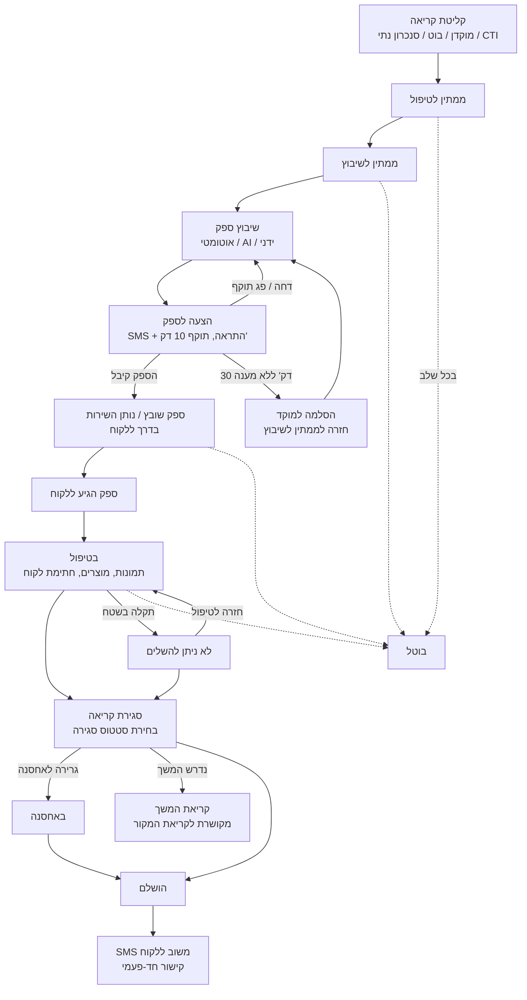
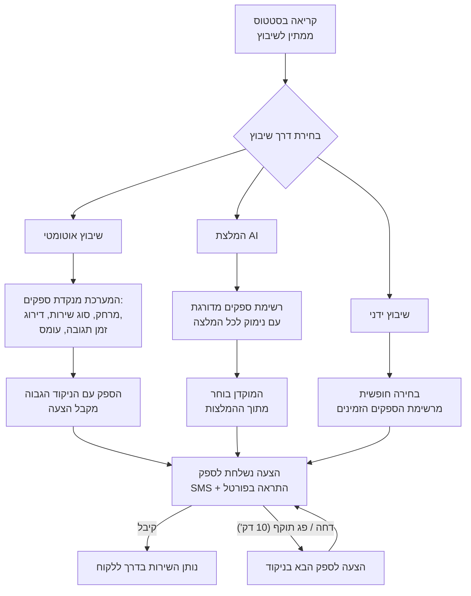
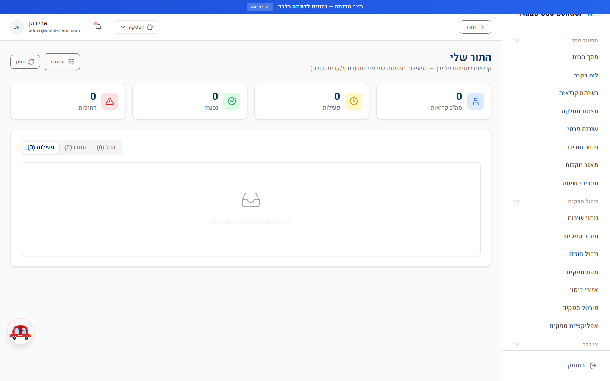
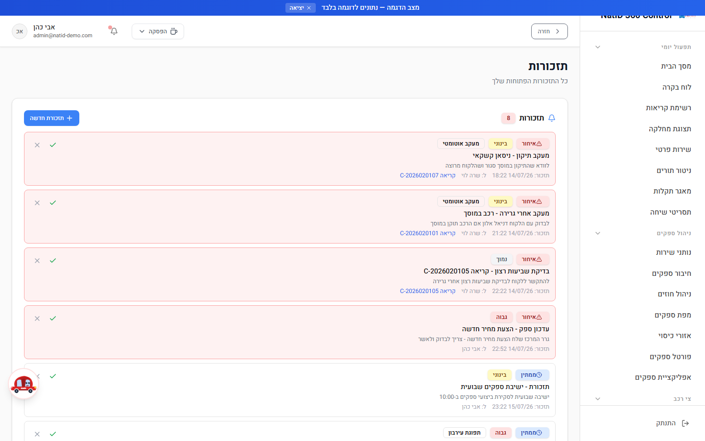
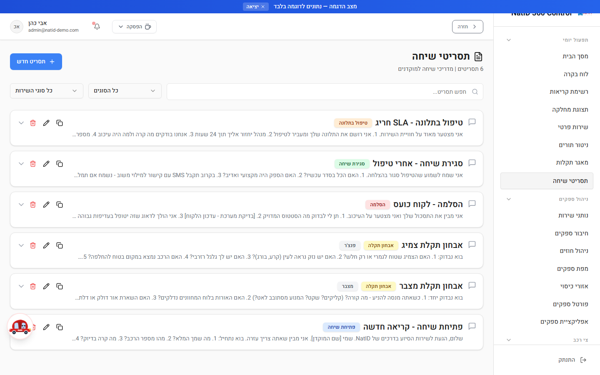

# מדריך למשתמש — ניהול קריאות שירות (מוקדן ומנהל)

**מיועד לתפקידים:** מוקדן (Operator) · מנהל מערכת (Admin)
**עודכן: יולי 2026**

מדריך זה מלווה את המוקדן והמנהל בכל שלבי הטיפול בקריאת שירות במערכת NatID 360 Control — מרגע קליטת הפנייה, דרך שיבוץ ספק וניהול הסטטוסים, ועד סגירת הקריאה ומשוב הלקוח.

---

## תוכן עניינים

1. [מחזור חיי קריאה — תרשים זרימה](#מחזור-חיי-קריאה)
2. [שלוש דרכי שיבוץ ספק — תרשים](#דרכי-שיבוץ-ספק)
3. [לוח בקרה (Dashboard)](#לוח-בקרה)
4. [רשימת קריאות (Calls)](#רשימת-קריאות)
5. [קריאה חדשה (NewCase) — שלב אחר שלב](#קריאה-חדשה)
6. [פרטי קריאה (CallDetails)](#פרטי-קריאה)
7. [שיבוץ ספק — מדריך מפורט](#שיבוץ-ספק)
8. [קידום סטטוסים — מכונת הסטטוסים המדורגת](#קידום-סטטוסים)
9. [סגירת קריאה ומשוב לקוח](#סגירת-קריאה-ומשוב)
10. [ניטור תורים (QueueMonitor) והתור שלי (MyQueue)](#ניטור-תורים)
11. [יומן (Calendar)](#יומן)
12. [תזכורות (Reminders)](#תזכורות)
13. [מאגר תקלות (KnowledgeBase)](#מאגר-תקלות)
14. [תסריטי שיחה (CallScripts)](#תסריטי-שיחה)
15. [תצוגת מחלקה (DepartmentView)](#תצוגת-מחלקה)
16. [שירות פרטי (PrivateService)](#שירות-פרטי)
17. [טופס אירוע מיוחד (SpecialCaseForm)](#טופס-אירוע-מיוחד)
18. [מפת ספקים (AllVendorsMap)](#מפת-ספקים)
19. [טבלת סטטוסים מלאה](#טבלת-סטטוסים)
20. [תקלות נפוצות](#תקלות-נפוצות)

---

## 1. מחזור חיי קריאה — תרשים זרימה

התרשים הבא מציג את מסלול הקריאה המלא במערכת, לפי שמות הסטטוסים בפועל. שימו לב לענף הדחייה: כאשר ספק דוחה הצעה או שההצעה פגה — המערכת חוזרת אוטומטית לשיבוץ מחדש (בהחרגת הספקים שכבר דחו).

📌 **טיפ:** בכל שינוי סטטוס נוצרת רשומת היסטוריה (CallHistory), והסטטוס משתקף אוטומטית גם בתור העבודה (WorkQueue) ובתיק (Case) — אין צורך לעדכן בכמה מקומות. הסטטוסים והעדכונים נדחפים גם אוטומטית חזרה למערכת נתי (סנכרון דו-כיווני, כל כ-5 דקות).

---

## 2. שלוש דרכי שיבוץ ספק — תרשים

---

## 3. לוח בקרה (Dashboard)

**מטרה:** דף הבית של המוקדן והמנהל — תמונת מצב תפעולית חיה ונקודת הזינוק לכל הפעולות היומיות.
**נתיב:** `/Dashboard`
**הרשאות:** מוקדן, מנהל

**מה יש במסך:**
- כרטיסי KPI חיים: קריאות פעילות, ממתינות, נסגרו היום, ספקים זמינים.
- לשוניות: סקירה כללית והתראות חכמות (AI).
- גרפים: מגמת קריאות (7 ימים אחרונים) וחלוקת קריאות לפי סטטוס.
- סקירת תור עבודה: ממתינים בתור, שובצו למוקדן, בטיפול, עומס לפי מוקדן.
- מתג תצוגה כללי/אישי — במצב אישי רואים את "הקריאות שלי", "הושלמו היום שלי" ו"דחופות שלי".

**פעולות עיקריות:**
1. סקרו את כרטיסי ה-KPI בתחילת המשמרת — במיוחד "ממתינות" ו"ספקים זמינים".
2. פתחו את לשונית **התראות חכמות** לזיהוי חריגות SLA וספקים עמוסים.
3. מהדשבורד קפצו ישירות ל**קריאה חדשה**, ל**רשימת הקריאות** ול**ניטור התורים**.

📌 **טיפ:** נתוני התור מתרעננים כל 15 שניות והקריאות כל 30 שניות — אין צורך לרענן את הדף ידנית.

---

## 4. רשימת קריאות (Calls)

**מטרה:** ניהול כל קריאות השירות במקום אחד — חיפוש, סינון, שיבוץ ומעבר לפרטי קריאה.
**נתיב:** `/Calls`
**הרשאות:** מוקדן, מנהל

**פעולות עיקריות:**
1. **חיפוש** — לפי מספר קריאה, שם לקוח או טלפון.
2. **סינון** — לפי סטטוס ולפי סוג שירות.
3. **בחירת עמודות** — התאימו את התצוגה לצרכים שלכם באמצעות בורר העמודות (ColumnSelector).
4. **שיבוץ ספק מהרשימה** — פתיחת דיאלוג השיבוץ (AssignVendorDialog) ישירות מהשורה, בלי להיכנס לפרטי הקריאה.
5. **מעבר לפרטי קריאה** — לחיצה על שורה פותחת את מסך `/CallDetails`.

📌 **טיפ:** הרשימה מתרעננת אוטומטית כל 30 שניות. שילוב של סינון סטטוס "ממתין לשיבוץ" + מיון לפי זמן הוא הדרך המהירה לאתר קריאות שדורשות טיפול מיידי.

---

## 5. קריאה חדשה (NewCase) — שלב אחר שלב

**מטרה:** טופס פתיחת הקריאה המרכזי של המוקד.
**נתיב:** `/NewCase`
**הרשאות:** מוקדן, מנהל

### חלקי הטופס וסדר המילוי

1. **פרטי לקוח** — בחרו לקוח קיים (כולל מנויים מסונכרנים מנתי) או צרו לקוח חדש.
   שדות חובה: **שם הפונה** ו**טלפון הפונה**.
2. **פרטי רכב** — סוג רכב (פרטי / אופנוע / משאית / מסחרי קל), סוג דלק ופרטי הרכב.
3. **מיקום** — **כתובת מוצא** (שדה חובה) עם השלמה אוטומטית של ערים; בקריאת גרירה מלאו גם **כתובת יעד**.
4. **סוג שיגור** — בחרו את סוג השיגור המתאים לקריאה.
5. **תיאור התקלה + קטלוג AI** — הקלידו את תיאור התקלה; רכיב הקטלוג האוטומטי (AICategorization) מסווג עבורכם **סוג תקלה, סוג שירות ועדיפות**. ודאו שהסיווג נכון ותקנו במידת הצורך. סוג שירות הוא שדה חובה.
6. **שמירה** — לחצו על יצירת הקריאה.

### מה קורה אוטומטית עם היצירה

- הקריאה נוצרת בסטטוס **"ממתין לטיפול"** ומקבלת מספר קריאה.
- נוצרת רשומת **תור עבודה (WorkQueue)** עם ניקוד עדיפות, והקריאה משויכת למוקדן לפי איזון עומסים.
- המוקדנים מקבלים **התראה** על הקריאה החדשה (`onNewCase`).
- מחושבים יעדי SLA לתגובה ולהגעה לפי הגדרות הלקוח.

📌 **טיפ:** ככל שתיאור התקלה מפורט יותר — סיווג ה-AI מדויק יותר, וכך גם ההתאמה בשיבוץ הספק (סוג שירות תואם מזכה את הספק בנקודות בשיבוץ האוטומטי).

---

## 6. פרטי קריאה (CallDetails)

**מטרה:** המסך המרכזי לניהול קריאה בודדת לאורך כל חייה.
**נתיב:** `/CallDetails` (נפתח מרשימת הקריאות, מהתור או מהתראה)
**הרשאות:** מוקדן, מנהל

**מה עושים במסך:**
1. **עדכון סטטוס** — לפי מפת המעברים המדורגת: בכל שלב מוצגים **רק המעברים הרלוונטיים** לשלב הנוכחי (ראו סעיף 8).
2. **שיבוץ ספק** — פתיחת דיאלוג השיבוץ (ראו סעיף 7).
3. **סגירת קריאה** — עם בחירת סטטוס סגירה (ראו סעיף 9).
4. **הפעלה מחדש** — החזרת קריאה סגורה לטיפול במידת הצורך.
5. **הערות מוקדן** — תיעוד פנימי של הטיפול.
6. **צ'אט בקריאה** — הודעות דו-כיווניות בזמן אמת מול הספק בשטח; עדכוני הסטטוס של הספק מתועדים בצ'אט אוטומטית.
7. **צפייה בקבצים ותמונות** — תמונות לפני/אחרי שהעלה הספק, חתימת הלקוח ומסמכים; העלאת קבצים גם מצד המוקד.
8. **קריאת המשך** — יצירת קריאה חדשה המקושרת לקריאה הנוכחית (למשל: ניידת לא צלחה — יש לשלוח גרר).
9. **היסטוריה (Timeline)** — כל שינוי בקריאה מתועד ברשומת CallHistory.

📌 **טיפ:** כאשר הספק בדרך, המערכת מציגה מרחק וצפי הגעה (ETA) המתעדכנים לפי מיקום ה-GPS של הספק.

---

## 7. שיבוץ ספק — מדריך מפורט

שיבוץ ספק זמין מרשימת הקריאות, מפרטי הקריאה ומניטור התורים. שלוש דרכים:

### 7.1 שיבוץ אוטומטי

1. בקריאה בסטטוס "ממתין לשיבוץ" בחרו **שיבוץ אוטומטי**.
2. המערכת (`autoAssignVendor`) מנקדת את כל הספקים הזמינים והפעילים לפי הנוסחה (מקסימום ~110 נקודות):

   | קריטריון | ניקוד |
   |---|---|
   | מרחק GPS: עד 5 ק"מ = 40 … מעל 50 ק"מ = 5 | עד 40 |
   | התאמת אזור כיסוי (כשאין נתוני GPS) | 25 |
   | התאמת סוג שירות (גרר / מכונאי / רב-שירות) | 20 |
   | דירוג ספק (ממוצע מתוך 5 × 20) | עד 20 |
   | זמן תגובה היסטורי | עד 10 |
   | שיעור השלמת קריאות | עד 10 |
   | תמיכה בסוג הרכב | 5 |
   | איזון עומסים (פחות מ-3 קריאות פעילות: ‎+5; מעל 10: ‎−5) | ±5 |

3. ברירת המחדל היא **מצב ייעוץ (advisory)** — המערכת מחזירה המלצה + צפי הגעה; אישור המוקדן יוצר את ההצעה בפועל לספק.

### 7.2 המלצת AI

1. בחרו **המלצת AI** (`recommendVendor`).
2. תוצג רשימת ספקים מדורגת **עם נימוק** לכל המלצה (למשל: "הכי קרוב, זמין, דירוג גבוה").
3. בחרו את הספק המועדף — ההצעה נשלחת אליו.

### 7.3 שיבוץ ידני

1. בחרו **שיבוץ ידני** ופתחו את רשימת הספקים הזמינים.
2. סננו לפי סוג שירות וזמינות ובחרו ספק.
3. אשרו — ההצעה נשלחת לספק שבחרתם.

### מה קורה אחרי השיבוץ — מנגנון הצעה/קבלה

- נוצרת **הצעת שיבוץ** (CallAssignmentAttempt) עם תוקף של **10 דקות**.
- הספק מקבל **SMS** ("נתיד - קריאה חדשה #… היכנס לפורטל לאישור") + התראה בפורטל עם ספירה לאחור.
- **קיבל** → הקריאה עוברת ל"נותן השירות בדרך ללקוח", הספק מסומן עסוק, והמוקד מקבל התראה.
- **דחה / פג תוקף** → המערכת מציעה אוטומטית לספק הבא בניקוד, בהחרגת כל מי שכבר דחה.
- **30 דקות ללא קבלה** → הסלמה למוקד: הקריאה חוזרת ל"ממתין לשיבוץ" ומתקבלת התראת "🚨 קריאה דורשת שיבוץ ידני".

📌 **טיפ:** המערכת מגינה מפני מצבי מירוץ — הצעה כפולה, ספק עסוק או קריאה שכבר שובצה ייחסמו אוטומטית. אם קיבלתם שגיאת התנגשות, רעננו את הקריאה ובדקו את מצבה הנוכחי.

---

## 8. קידום סטטוסים — מכונת הסטטוסים המדורגת

במערכת 15 סטטוסים, אך במסך פרטי הקריאה מוצגים בכל רגע **רק המעברים המותרים מהשלב הנוכחי** — כך נמנעות טעויות ודילוגים לא חוקיים.

| מהסטטוס | מעברים מותרים |
|---|---|
| ממתין לטיפול | ממתין לשיבוץ, שירות עתידי, במעקב, ביטול |
| ממתין לשיבוץ | ממתין לטיפול, שירות עתידי, ביטול |
| ספק שובץ / נותן השירות בדרך ללקוח | נותן השירות הגיע ליעד, ביטול |
| נותן השירות הגיע ליעד / בטיפול | הגיע לאחסנה, ממתין לשיחת סגירה, סגירת קריאה, ביטול |
| ממתין לשיחת סגירה | סגירת קריאה, ביטול |
| באחסנה | סגירה, ביטול |
| לא ניתן להשלים | חזרה לטיפול, סגירה, ביטול |
| המתנה לחיוב | סגירה, ביטול |
| הושלם / בוטל | — (סטטוס סופי) |

**איך מקדמים סטטוס:**
1. פתחו את הקריאה ב-`/CallDetails`.
2. בחרו את המעבר הרצוי מבין האפשרויות המוצגות.
3. **"ביטול"** פותח דיאלוג סיבת ביטול + כללי עירבון. **"סגירת קריאה"** פותח דיאלוג סטטוסי סגירה (ראו סעיף 9).
4. השינוי מתועד בהיסטוריה, משתקף בתור העבודה ובתיק, ובמקרים הרלוונטיים נשלחת ללקוח הודעה אוטומטית (ראו טבלת הסטטוסים בסעיף 19).

📌 **טיפ:** את המעברים "נותן השירות בדרך ללקוח" → "הגיע ליעד" → סיום מבצע בדרך כלל **הספק מהנייד**; המוקדן רואה את העדכונים בזמן אמת ויכול לעדכן במקומו במקרה הצורך (למשל ספק שמדווח בטלפון).

---

## 9. סגירת קריאה ומשוב לקוח

### שלבי הסגירה

1. פתחו קריאה בסטטוס "בטיפול" (או "באחסנה" / "לא ניתן להשלים" / "המתנה לחיוב") ובחרו **"סגירת קריאה"**.
2. בדיאלוג שנפתח בחרו **סטטוס סגירה** מתאים, למשל: ניידת בוצע, גרר הגיע ליעד, גרירה לאחסנה, או נכשל → קריאת המשך.
3. אם נבחר סטטוס סגירה שמחייב המשך (למשל "ניידת לא צלחה — יש לשלוח גרר") — נוצרת אוטומטית **קריאת המשך** מקושרת לקריאת המקור.
4. אשרו — הקריאה נסגרת דרך מסלול הסגירה העסקי (`closeCall`), נשמרת שעת סגירה ונרשם מי סגר.

### מה קורה אוטומטית לאחר הסגירה

- ברוב סטטוסי הסגירה (6 מתוך 7) נשלח **SMS סיום ללקוח**; "גרר לאחסנה" אינו שולח. (שימו לב: נוסחי ה-SMS בסטטוסי הסגירה הם כרגע placeholder עד לקבלת נוסח סופי מהלקוח.)
- נשלח ללקוח **סקר משוב ב-SMS**: "שלום {שם פרטי}, תודה שבחרת בנתי! נשמח אם תדרג את השירות שקיבלת: {קישור}" — הקישור הוא token חד-פעמי עם תפוגה לטופס `/CustomerFeedback`.
- הלקוח מדרג (דירוג כללי חובה, 1–5 כוכבים, ועוד מדדים) — הדירוג נשמר בקריאה ומצטבר ל**דירוג הממוצע של הספק**, שמזין את ניקוד השיבוץ בקריאות הבאות.
- מופק **סיכום קריאה ב-AI** (`generateCallSummary`).
- הספק חוזר לסטטוס זמין.

📌 **טיפ:** ספק אינו יכול לסיים קריאה **ללא חתימת לקוח דיגיטלית** — אם ספק מדווח שכפתור הסיום חסום אצלו, בקשו ממנו להחתים את הלקוח על מסך המכשיר.

📌 **טיפ:** נסגרה קריאה בטעות? השתמשו ב**"הפעלה מחדש"** במסך פרטי הקריאה.

---

## 10. ניטור תורים (QueueMonitor) והתור שלי (MyQueue)

**מטרה:** ניהול תור העבודה של המוקד בזמן אמת — עומסים, עדיפויות ושיוך למוקדנים.
**נתיבים:** `/QueueMonitor` (כלל-מוקדי) · `/MyQueue` (אישי)
**הרשאות:** מוקדן, מנהל

**ניטור תורים — פעולות עיקריות:**
1. עקבו אחר התור בזמן אמת — התצוגה מתרעננת אוטומטית וממוינת לפי **ניקוד עדיפות** (priority_score); ניקוד גבוה מסומן בולט.
2. סננו לפי **סטטוס** ולפי **נציג/מוקדן**.
3. **ערכו** פריט בתור, **הסירו** מהתור או בצעו **שיבוץ ספק** ישירות.
4. זהו קריאות שממתינות זמן רב — זמן ההמתנה מוצג לכל פריט.

**התור שלי (MyQueue):**

אותו תור, מסונן אוטומטית לקריאות של המשתמש הנוכחי, עם הפרדה בין פעילות לבין הושלמו/בוטלו ומדדים אישיים (סה"כ, פעילות, הושלמו, דחופות).

📌 **טיפ:** קריאה חדשה משויכת אוטומטית למוקדן העמוס פחות (עד 5 קריאות פעילות למוקדן). אם כל המוקדנים עמוסים — הקריאה ממתינה בתור; ניטור התורים הוא המקום לאתר אותה.

---

## 11. יומן (Calendar)

**מטרה:** תצוגת לוח שנה של קריאות ואירועים — שימושי במיוחד לקריאות בסטטוס "שירות עתידי".
**נתיב:** `/Calendar`
**הרשאות:** מוקדן, מנהל

**פעולות עיקריות:**
1. עברו בין תצוגות התקופה וסקרו את הקריאות והאירועים המתוזמנים.
2. לחצו על אירוע כדי לעבור לקריאה המשויכת.

📌 **טיפ:** קריאה שסומנה כ"שירות עתידי" בשלב הטיפול תופיע ביומן — בדקו את היומן בתחילת כל משמרת.

---

## 12. תזכורות (Reminders)

**מטרה:** ריכוז כל התזכורות הפתוחות של המוקד.
**נתיב:** `/Reminders`
**הרשאות:** מוקדן, מנהל

**פעולות עיקריות:**
1. סקרו את רשימת התזכורות הפתוחות — כל תזכורת משויכת **לקריאה ולמשתמש**.
2. לחצו על תזכורת כדי לעבור לקריאה הרלוונטית וטפלו בה.
3. סגרו תזכורות שטופלו כדי לשמור על רשימה נקייה.

📌 **טיפ:** צרו תזכורת לכל קריאה שדורשת מעקב עתידי (למשל "במעקב" או "המתנה לחיוב") — כך שום קריאה לא תישכח.

---

## 13. מאגר תקלות (KnowledgeBase)

**מטרה:** מאגר ידע של תקלות ופתרונות לשימוש המוקדנים בזמן שיחה.
**נתיב:** `/KnowledgeBase`
**הרשאות:** מוקדן, מנהל

**פעולות עיקריות:**
1. **חפשו** תקלה לפי מילות מפתח או **סננו לפי תגיות**.
2. פתחו את הפריט וקראו את הפתרון המומלץ — עוד לפני פתיחת קריאה, ייתכן שאפשר לפתור את הבעיה טלפונית.

📌 **טיפ:** מצאתם פתרון שחוזר על עצמו ואינו במאגר? בקשו מהמנהל להוסיף אותו — המאגר טוב כמו העדכונים שלו.

---

## 14. תסריטי שיחה (CallScripts)

**מטרה:** תסריטי שיחה מוכנים למוקדנים — פתיחה אחידה ומקצועית לכל סוג פנייה.
**נתיב:** `/CallScripts`
**הרשאות:** מוקדן, מנהל

**פעולות עיקריות:**
1. אתרו את התסריט המתאים לסוג השיחה.
2. **העתיקו בלחיצה אחת** את הנוסח והשתמשו בו בשיחה.

📌 **טיפ:** שלבו את התסריט עם מאגר התקלות — תסריט לפתיחת השיחה, מאגר לפתרון עצמו.

---

## 15. תצוגת מחלקה (DepartmentView)

**מטרה:** תצוגה ממוקדת לפי מחלקה/מנוי — כל המידע על מנוי ספציפי במקום אחד.
**נתיב:** `/DepartmentView`
**הרשאות:** מוקדן, מנהל

**פעולות עיקריות:**
1. בחרו מחלקה/מנוי.
2. עיינו ב**פרטי המנוי המלאים** — תנאי הזכאות והכיסוי.
3. סקרו את **היסטוריית הקריאות של הלקוח** — שימושי לזיהוי תקלות חוזרות.

📌 **טיפ:** לפני פתיחת קריאה למנוי — בדקו כאן את פרטי המנוי כדי לוודא זכאות לשירות המבוקש.

---

## 16. שירות פרטי (PrivateService)

**מטרה:** פתיחת פנייה ללקוח פרטי שאינו מנוי, כולל תמחור ותשלום.
**נתיב:** `/PrivateService`
**הרשאות:** מוקדן, מנהל

**פעולות עיקריות:**
1. הזינו את פרטי הלקוח הפרטי ואת פרטי הפנייה.
2. המערכת מבצעת **חישוב תעריף** לשירות המבוקש.
3. הסדירו את **התשלום** מול הלקוח והמשיכו לפתיחת הקריאה.

📌 **טיפ:** לקוח שמתקשר ואינו מזוהה כמנוי — זה המסלול עבורו. אל תפתחו לו קריאה רגילה דרך `/NewCase` ללא הסדרת תמחור.

---

## 17. טופס אירוע מיוחד (SpecialCaseForm)

**מטרה:** תיעוד מסודר של אירוע חריג או תאונה.
**נתיב:** `/SpecialCaseForm`
**הרשאות:** מוקדן, מנהל

**פעולות עיקריות:**
1. מלאו את **סיבת החיוב** של האירוע.
2. תעדו **נפגעים** ככל שיש.
3. תעדו **עדים** — שם ופרטי התקשרות.
4. שמרו — התיעוד מצטרף לתיק האירוע.

📌 **טיפ:** בתאונות — הקפידו על תיעוד מלא ומדויק בזמן אמת; הטופס משמש אסמכתא בהמשך הטיפול מול חברות הביטוח.

---

## 18. מפת ספקים (AllVendorsMap)

**מטרה:** תצוגת מפה של מיקומי כל הספקים — כלי עזר חשוב להחלטות שיבוץ.
**נתיב:** `/AllVendorsMap`
**הרשאות:** מוקדן, מנהל

**פעולות עיקריות:**
1. סקרו את פריסת הספקים על המפה.
2. **חפשו** ספק ספציפי או **סננו לפי זמינות**.
3. לפני שיבוץ ידני — בדקו במפה מי הספק הקרוב ביותר לכתובת האירוע.

📌 **טיפ:** מיקומי הספקים מבוססים על שידור GPS מהנייד שלהם; ספק שמיקומו מיושן יקבל אוטומטית התראת "נדרש עדכון מיקום".

---

## 19. טבלת סטטוסים מלאה

| סטטוס | משמעות | מי מעדכן | מה קורה אוטומטית |
|---|---|---|---|
| ממתין לטיפול | קריאה חדשה נקלטה וממתינה לטיפול מוקדן | המערכת (עם היצירה) | רשומת תור עבודה + שיוך מוקדן לפי עומס + התראות למוקדנים |
| ממתין לשיבוץ | הקריאה ממתינה לשיבוץ ספק | מוקדן | SMS ללקוח: "הקריאה התקבלה ואנחנו מחפשים ספק זמין" |
| שובץ ספק | הצעה נשלחה לספק וממתינה לאישורו | מוקדן / שיבוץ אוטומטי | SMS ללקוח: "מצאנו ספק מתאים ומחכים לאישורו"; SMS + התראה לספק (תוקף הצעה 10 דק') |
| נותן השירות בדרך ללקוח | הספק אישר ויצא לדרך | הספק (בקבלת ההצעה) | SMS ללקוח: "הספק בדרך אליך! צפי הגעה: {eta}"; הספק מסומן עסוק; התראה למוקד; מעקב GPS + עדכון ETA |
| ספק הגיע ללקוח | הספק הגיע לכתובת האירוע | הספק ("הגעתי למקום") / מוקדן | הודעת מערכת בצ'אט; נשמרת שעת הגעה בפועל |
| בטיפול | הספק מטפל באירוע | הספק / מוקדן | SMS ללקוח: "הספק הגיע ומתחיל בטיפול" |
| ממתין לשיחת סגירה | הוזנו שעות ותוצאת הטיפול — ממתינים לשיחת הסגירה עם הלקוח | מוקדן | הקריאה נשארת פתוחה (תג לבן); נסגרת סופית רק לאחר שיחת הסגירה |
| באחסנה | הרכב נגרר לאחסנה | מוקדן / ספק | — (סטטוס הסגירה "גרר לאחסנה" אינו שולח SMS) |
| לא ניתן להשלים | הספק לא הצליח להשלים את הטיפול | הספק | התראה למוקד לטיפול; הקריאה נשארת אצל הספק עד החלטה |
| המתנה לחיוב | הטיפול הסתיים וממתינים לחיוב | מוקדן | — |
| שירות עתידי | קריאה מתוזמנת למועד עתידי | מוקדן | מופיעה ביומן |
| במעקב | הקריאה במעקב מוקדן | מוקדן | — |
| הושלם | הקריאה נסגרה בהצלחה | מוקדן / ספק (דרך מסלול הסגירה) | SMS סיום ללקוח (ברוב סטטוסי הסגירה); SMS סקר משוב עם קישור חד-פעמי; סיכום AI; הספק חוזר לזמין; הדירוג מזין את השיבוץ הבא |
| בוטל | הקריאה בוטלה | מוקדן | דיאלוג סיבת ביטול + כללי עירבון; תיעוד בהיסטוריה |

**הערות:**
- כל שינוי סטטוס יוצר רשומת היסטוריה (CallHistory) ומעדכן אוטומטית את תור העבודה ואת התיק (מירור `syncCallStatus`).
- ההודעות נשלחות **אוטומטית על ידי המערכת** בערוצי SMS / WhatsApp / התראת מערכת / אימייל — הספק אינו שולח SMS ללקוח ידנית. משלוח בפועל מותנה בהפעלת חשבון Twilio בפרודקשן.
- הסטטוס "בוצע פינוי לפלטפורמה" (mobile_failed_evac) מיועד להסרה — אין להשתמש בו.

---

## 20. תקלות נפוצות

| תופעה | סיבה אפשרית | פתרון |
|---|---|---|
| הספק לא הגיב להצעת שיבוץ | ההצעה תקפה 10 דקות בלבד | המערכת מעבירה אוטומטית לספק הבא בניקוד; לאחר 30 דקות ללא קבלה — הקריאה מוסלמת למוקד עם התראת "קריאה דורשת שיבוץ ידני". בצעו שיבוץ ידני |
| שגיאת התנגשות בשיבוץ (409) | הצעה כפולה, ספק עסוק או קריאה שכבר שובצה | רעננו את הקריאה ובדקו את מצבה הנוכחי לפני ניסיון חוזר |
| הספק לא מצליח לסיים קריאה | חסרה חתימת לקוח דיגיטלית (חובה לסגירה) | בקשו מהספק להחתים את הלקוח במסך המכשיר ואז ללחוץ "סיום קריאה" |
| הסטטוס הרצוי לא מופיע ברשימת המעברים | מפת המעברים המדורגת מציגה רק מעברים חוקיים מהשלב הנוכחי | קדמו את הקריאה דרך שלבי הביניים לפי הטבלה בסעיף 8 |
| הלקוח לא קיבל SMS | חשבון Twilio בפרודקשן טרם הופעל, או שנוסח סטטוס הסגירה עדיין placeholder | ודאו מול המנהל שה-SMS מופעל; היסטוריית הניסיונות מתועדת במערכת (CallHistory/SmsHistory) |
| ספק לא רואה את הקריאות שלו בפורטל | האימייל בכרטיס הספק אינו זהה לאימייל חשבון המשתמש שלו | מנהל: ודאו התאמת אימייל מדויקת בין כרטיס הספק לחשבון המשתמש |
| קריאה "תקועה" ללא מוקדן מטפל | כל המוקדנים בעומס מלא (מעל 5 קריאות פעילות) | אתרו את הקריאה בניטור התורים (`/QueueMonitor`) ושייכו ידנית |
| מיקום ספק מיושן במפה | הספק לא משדר GPS | הספק מקבל אוטומטית התראת "נדרש עדכון מיקום"; אפשר גם לפנות אליו בצ'אט הקריאה |
| קריאה נסגרה בטעות | — | פתחו את הקריאה ב-`/CallDetails` ולחצו "הפעלה מחדש" |
| שינוי במערכת לא מופיע במסך | מרווח הרענון טרם חלף | ההמתנה קצרה: רשימת קריאות — 30 שניות; תורים — 15 שניות; צ'אט — מיידי |

---

*מדריך זה מבוסס על אפיון המערכת (SYSTEM_SPECIFICATION_v4) ותיעוד תהליכי העבודה (WORKFLOWS). לשאלות ותוספות — פנו למנהל המערכת.*
