# מדריך למשתמש — ניהול נותני שירות (ספקים)

**מערכת:** NatID 360 Control
**מיועד לתפקידים:** מנהל (Admin), מוקדן (Operator) — חלק מהמסכים למנהל בלבד (מסומן בהתאם)
**עודכן:** יולי 2026

---

## תוכן עניינים

1. [מבוא — מי הם נותני השירות ולמה זה חשוב](#מבוא)
2. [תהליך קליטת ספק חדש — מבט-על](#תהליך-קליטת-ספק-חדש--מבט-על)
3. [רשימת נותני השירות](#רשימת-נותני-השירות)
4. [הוספת ספק חדש](#הוספת-ספק-חדש)
5. [עריכת ספק ופרטי ספק](#עריכת-ספק-ופרטי-ספק)
6. [חיבור ספקים (Onboarding) — מנהל בלבד](#חיבור-ספקים-onboarding--מנהל-בלבד)
7. [חוזים והסכמי תמחור](#חוזים-והסכמי-תמחור)
8. [מפת ספקים](#מפת-ספקים)
9. [אזורי כיסוי](#אזורי-כיסוי)
10. [מעקב GPS](#מעקב-gps)
11. [ניהול צי רכב — מנהל בלבד](#ניהול-צי-רכב--מנהל-בלבד)
12. [שדות פרופיל הספק והשפעתם על השיבוץ האוטומטי](#שדות-פרופיל-הספק-והשפעתם-על-השיבוץ-האוטומטי)
13. [תקלות נפוצות](#תקלות-נפוצות)

---

## מבוא

נותני השירות (ספקים) הם הגררים, המכונאים והניידות שמבצעים את הקריאות בשטח. מודול ניהול הספקים מאפשר למנהל ולמוקדן להקים ספקים, לחבר אותם לפורטל הספקים, לנהל חוזים ותעריפים, ולעקוב אחריהם על המפה ובזמן אמת.

איכות הנתונים בפרופיל הספק משפיעה ישירות על **השיבוץ האוטומטי**: המערכת מדרגת ספקים לפי מרחק, אזור כיסוי, סוג שירות, דירוג, זמן תגובה ועומס — ומציעה את הקריאה לספק המתאים ביותר. פרופיל חסר או לא מעודכן = ספק שלא ייכנס לשיבוץ.

> **כלל הזהב — האימייל הוא המפתח:** האימייל שמוזן בפרופיל הספק **חייב להיות זהה** לאימייל שאיתו הספק מתחבר למערכת. זיהוי הספק בפורטל נעשה לפי התאמת אימייל (vendor email = user email). אי-התאמה = הספק לא יזוהה והפורטל שלו לא יעבוד.

---

## תהליך קליטת ספק חדש — מבט-על

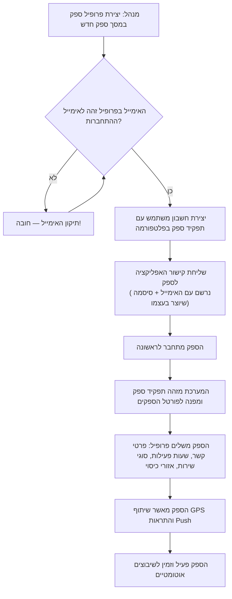

---

## רשימת נותני השירות

**מטרה:** מסך הבית של ניהול הספקים — צפייה בכל הספקים, חיפוש, סינון וכניסה לפעולות (הוספה, עריכה, פרטים).

- **נתיב:** `/ServiceProviders` (תפריט: "נותני שירות")
- **הרשאות:** מנהל, מוקדן

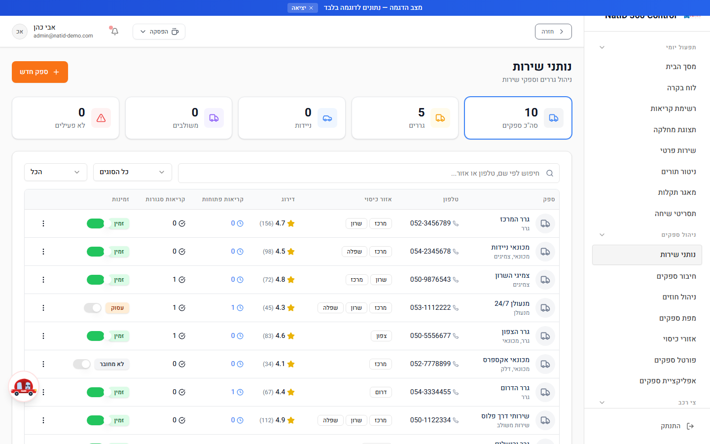

### שלבי עבודה

1. היכנסו לעמוד **"נותני שירות"** מהתפריט הראשי.
2. השתמשו בשדה **החיפוש** לאיתור ספק לפי שם.
3. סננו את הרשימה לפי **סוג שירות** (גרר, מכונאי, רב-שירות) או לפי **זמינות**.
4. לחצו על ספק כדי לעבור לפרטים המלאים שלו, או השתמשו בפעולות עריכה מהרשימה.
5. להוספת ספק חדש — לחצו **"הוסף ספק חדש"** (מעביר למסך ספק חדש).

### טיפים

- מומלץ לסנן לפי זמינות לפני שיבוץ ידני — כך תראו רק ספקים שיכולים לקבל קריאה כרגע.
- ספק שלא מופיע בסינון לפי סוג שירות — ככל הנראה שדה סוג השירות שלו ריק. תקנו בעריכת הספק.

---

## הוספת ספק חדש

**מטרה:** יצירת פרופיל ספק חדש במערכת — השלב הראשון בתהליך הקליטה.

- **נתיב:** `/NewVendor` (כפתור "הוסף ספק חדש" במסך נותני שירות)
- **הרשאות:** מנהל, מוקדן

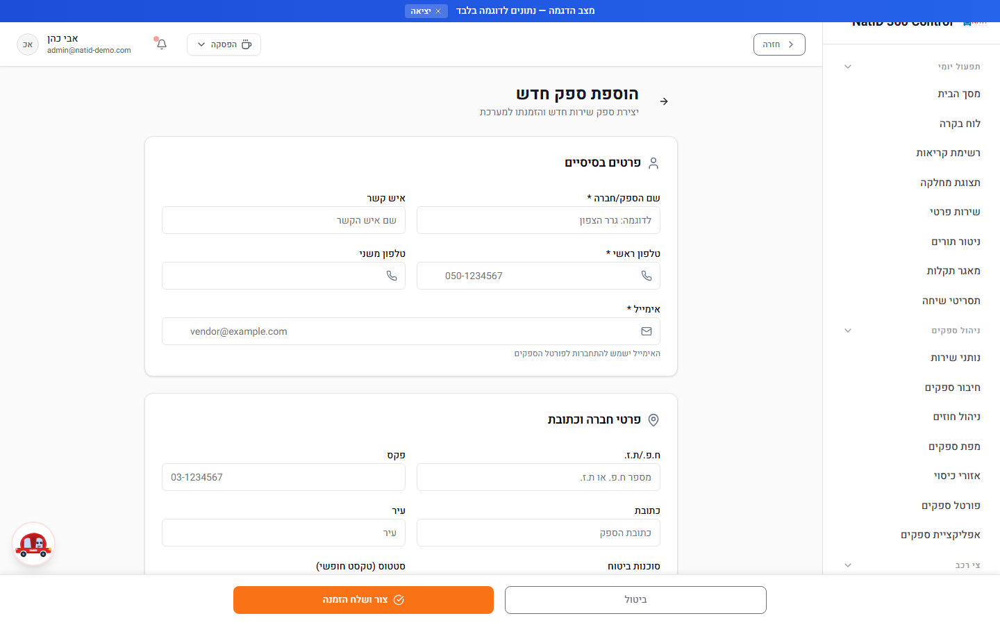

### שלבי עבודה

1. במסך "נותני שירות" לחצו **"הוסף ספק חדש"**.
2. מלאו את פרטי הספק: **שם הספק, איש קשר, טלפון, ח.פ**.
3. הזינו את **האימייל** של הספק.
   > **קריטי:** האימייל שמוזן כאן חייב להיות **זהה בדיוק** לאימייל שאיתו הספק יתחבר למערכת. זהו האמצעי היחיד שבו המערכת מקשרת בין חשבון המשתמש לפרופיל הספק. טעות באות אחת — והספק יקבל "פרופיל ספק לא נמצא" בכניסה לפורטל.
4. בחרו **סוגי שירות** (גרר / מכונאי / רב-שירות) — קובע לאילו קריאות הספק מתאים.
5. הגדירו **אזורי כיסוי** — האזורים הגיאוגרפיים שבהם הספק פועל.
6. הזינו **תעריפים** וקשרו **חוזים מול מחלקות** במידת הצורך.
7. שמרו את הפרופיל.
8. המשיכו לשלב הבא: יצירת **חשבון משתמש** לספק עם תפקיד `vendor` בפלטפורמה, ושליחת קישור האפליקציה לספק — הספק נרשם בעצמו עם האימייל שהוגדר בפרופיל ויוצר סיסמה אישית (ראו פרק [חיבור ספקים](#חיבור-ספקים-onboarding--מנהל-בלבד)).

### טיפים

- אל תשאירו את סוגי השירות ריקים — ספק ללא סוג שירות לא ייכלל בשיבוץ האוטומטי.
- העתיקו את האימייל ישירות מהתכתובת עם הספק (העתק-הדבק) במקום להקליד ידנית.

---

## עריכת ספק ופרטי ספק

**מטרה:** צפייה מפורטת בספק קיים ועדכון פרטיו — פרטי קשר, שירותים, אזורים, תעריפים וזמינות.

- **נתיבים:** פרטי ספק — `/VendorDetails` · עריכת ספק — `/EditVendor`
- **הרשאות:** מנהל, מוקדן

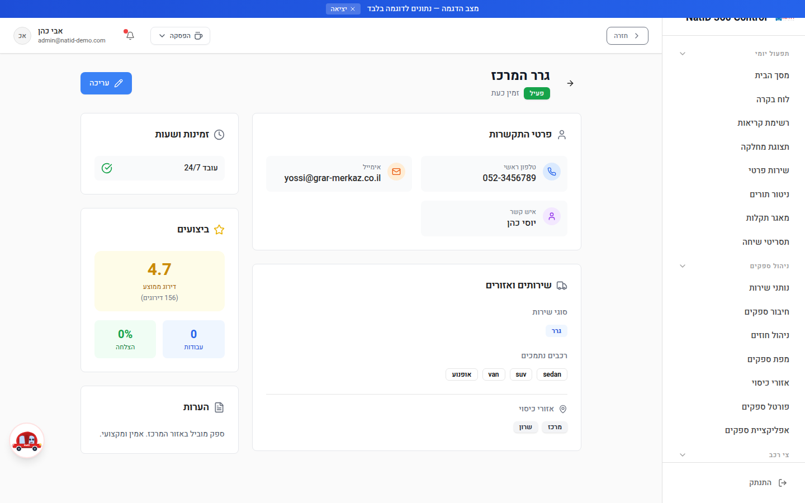

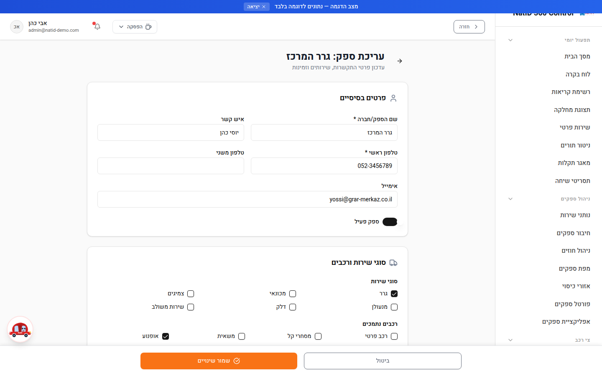

### שלבי עבודה

1. במסך "נותני שירות" לחצו על ספק כדי להיכנס ל**פרטי הספק** — צפייה מלאה בפרופיל: פרטי קשר, סוגי שירות, אזורי כיסוי, תעריפים וחוזים.
2. לעדכון — לחצו **עריכה** (מעביר למסך עריכת ספק).
3. עדכנו את השדות הנדרשים ושמרו.
4. שינויים בפרופיל נכנסים לתוקף מיידית ומשפיעים על שיבוצים עתידיים.

### טיפים

- לפני שינוי **אימייל** של ספק קיים — ודאו שגם חשבון המשתמש שלו מתעדכן בהתאם, אחרת הקישור בין החשבון לפרופיל יישבר.
- הספק עצמו יכול לעדכן חלק מפרטיו דרך "הפרופיל שלי" בפורטל הספקים (שעות פעילות, זמינות, אזורי כיסוי). מומלץ לתאם מי מעדכן מה, כדי למנוע דריסת שינויים.

---

## חיבור ספקים (Onboarding) — מנהל בלבד

**מטרה:** ניהול תהליך הצירוף של ספקים חדשים וקישור חשבון המשתמש לפרופיל הספק.

- **נתיב:** `/VendorOnboarding`
- **הרשאות:** **מנהל בלבד**

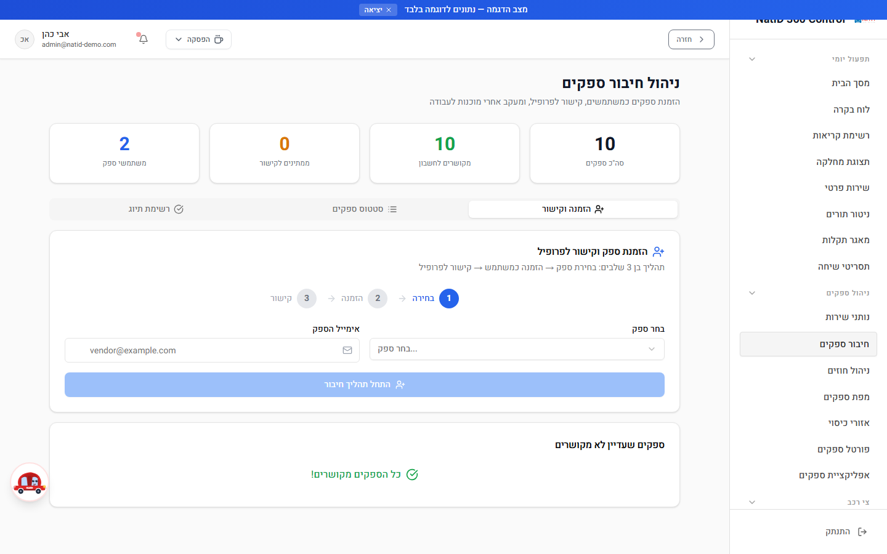

### שלבי עבודה

1. ודאו שקיים **פרופיל ספק** (נוצר במסך ספק חדש) ושקיים **חשבון משתמש** עם תפקיד ספק באותו אימייל.
2. היכנסו למסך **"חיבור ספקים"** — המסך מציג את מצב הצירוף של ספקים חדשים.
3. השתמשו בפעולת **קישור** כדי לחבר חשבון משתמש לפרופיל ספק (המערכת מבצעת את הקישור לפי אימייל).
4. לאחר הקישור — הנחו את הספק להתחבר לראשונה: המערכת תזהה אוטומטית את התפקיד ותפנה אותו ל**פורטל הספקים**.
5. בהתחברות הראשונה הספק מתבקש להשלים את הפרופיל דרך אשף ה-Onboarding בפורטל: פרטי קשר, שעות פעילות, סוגי שירות, אזורי כיסוי, אישור שיתוף GPS והתראות Push.
6. ודאו במסך זה שהספק סיים את התהליך ומסומן כפעיל — רק אז הוא נכנס למאגר השיבוצים.

### טיפים

- אם ספק מדווח "פרופיל ספק לא נמצא" בכניסה — זה כמעט תמיד אי-התאמת אימייל בין חשבון המשתמש לפרופיל. בדקו כאן ובעריכת הספק.
- מנהל יכול לצפות בפורטל של כל ספק (impersonation) לצורך תמיכה — כך אפשר לראות בדיוק מה הספק רואה.

---

## חוזים והסכמי תמחור

**מטרה:** ניהול ההתקשרות המסחרית עם הספקים — חוזים, הסכמי תמחור ותעריפי נתי.

- **נתיב:** `/VendorContracts`
- **הרשאות:** מנהל, מוקדן

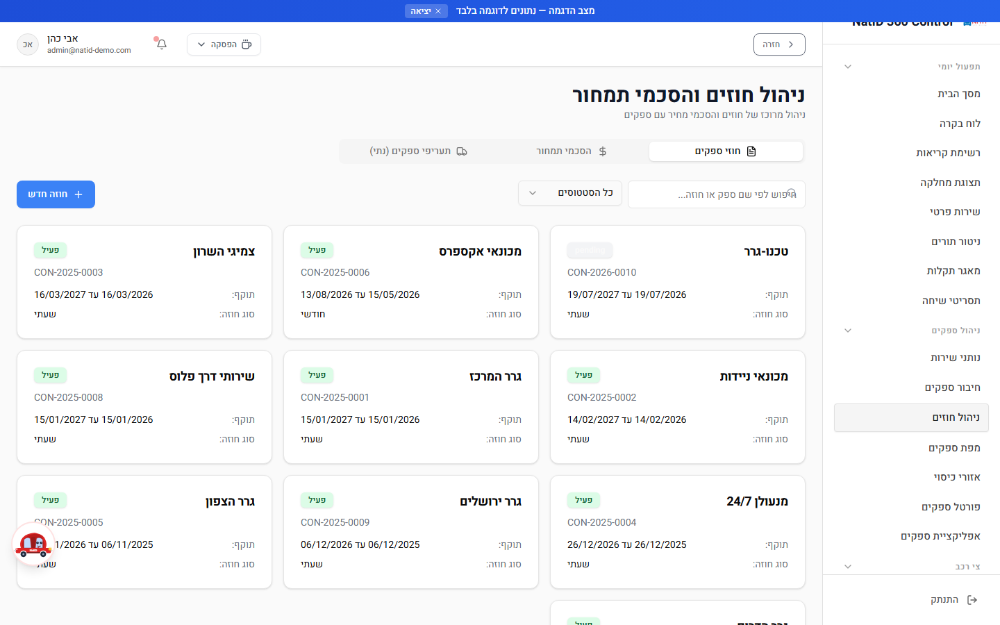

### שלבי עבודה

המסך מחולק ל**שלוש לשוניות**:

1. **חוזי ספקים** — ניהול החוזים מול הספקים: תקופות, תנאים ושיוך למחלקות.
2. **הסכמי תמחור** — הגדרת הסכמי תמחור פר ספק/שירות.
3. **תעריפי ספקים-נתי** — תצוגת **קריאה בלבד** של מחירון נתי, המסונכרן אוטומטית מהמערכת החיצונית. תעריפים אלה מנוהלים בנתי ואינם ניתנים לעריכה כאן.

### טיפים

- אם תעריף נתי נראה לא מעודכן — הבעיה היא בסנכרון מול נתי, לא במסך זה. פנו למנהל המערכת.
- שימו לב: ישויות החוזים והתשלומים משמשות לחישוב בלבד — המערכת אינה מחוברת למערכת תשלומים בפועל.

---

## מפת ספקים

**מטרה:** תצוגה גיאוגרפית של כל הספקים על מפה — לתמונת מצב מרחבית ולתמיכה בשיבוץ ידני.

- **נתיב:** `/AllVendorsMap`
- **הרשאות:** מנהל, מוקדן

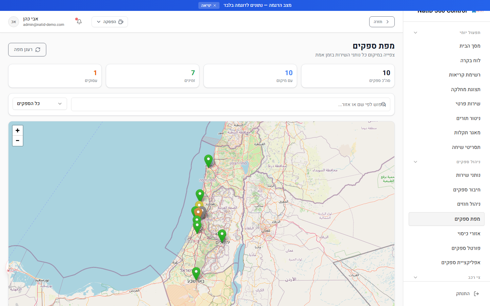

### שלבי עבודה

1. היכנסו למסך **"מפת ספקים"** — כל הספקים מוצגים על מפה אינטראקטיבית.
2. השתמשו ב**חיפוש** לאיתור ספק ספציפי על המפה.
3. סננו לפי **זמינות** כדי לראות רק ספקים פנויים.
4. לחצו על סמן ספק לקבלת פרטיו.

### טיפים

- המפה שימושית במיוחד כשקריאה "תקועה" בשיבוץ — אפשר לראות במבט מי הספקים הקרובים לאירוע ומה זמינותם.

---

## אזורי כיסוי

**מטרה:** הגדרה וניהול של האזורים הגיאוגרפיים שבהם כל ספק פועל.

- **נתיב:** `/CoverageAreas`
- **הרשאות:** מנהל, מוקדן

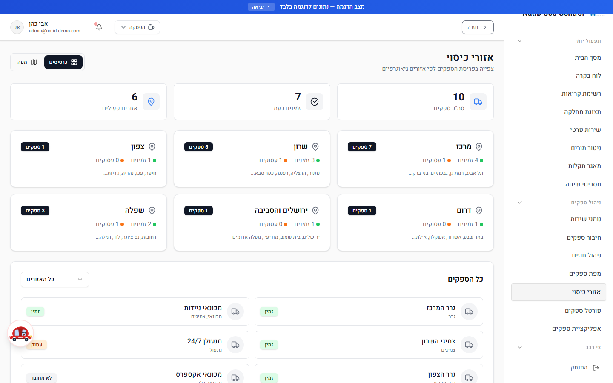

### שלבי עבודה

1. היכנסו למסך **"אזורי כיסוי"**.
2. צפו באזורי הכיסוי המוגדרים ובספקים המשויכים לכל אזור.
3. הוסיפו או עדכנו אזורי כיסוי לספקים לפי פריסת השטח שלהם.
4. ודאו שאין "חורים" — אזורי שירות ללא אף ספק מכסה.

### טיפים

- אזור הכיסוי משמש את השיבוץ האוטומטי כ**חלופה (fallback)** כשאין לספק מיקום GPS עדכני — לכן חשוב שיהיה מוגדר גם לספקים שמשתפים מיקום.
- ספק שמדווח שאינו מקבל קריאות באזור מסוים — בדקו קודם שהאזור מוגדר לו כאן.

---

## מעקב GPS

**מטרה:** מעקב מיקום חי אחר ספקים בקריאות פעילות.

- **נתיב:** `/VendorTracking`
- **הרשאות:** מנהל, מוקדן

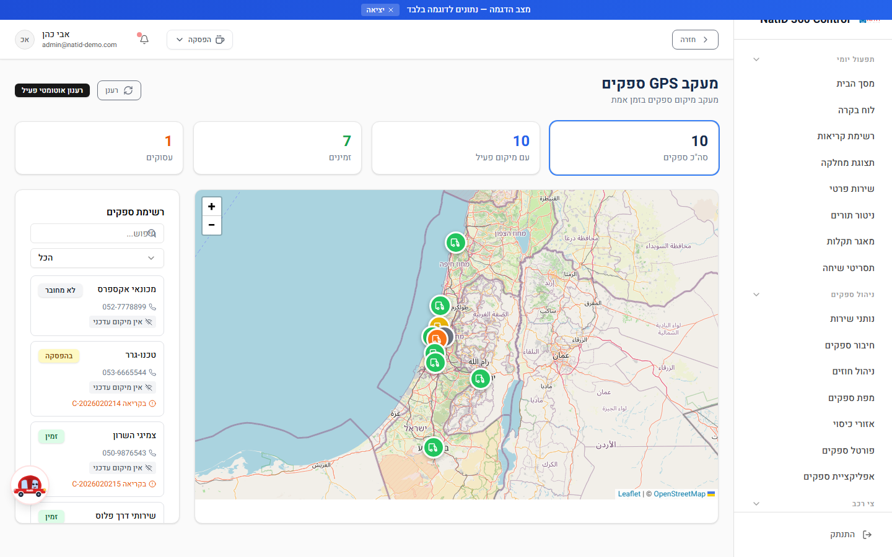

### שלבי עבודה

1. היכנסו למסך **"מעקב GPS"** — מוצגים הספקים שנמצאים כרגע בקריאות פעילות ומיקומם על המפה.
2. שימו לב ל**מדד טריות המיקום** לצד כל ספק — הוא מציין כמה זמן עבר מאז עדכון המיקום האחרון.
3. אם מיקום של ספק התיישן — המערכת שולחת לו אוטומטית התראת Push "נדרש עדכון מיקום". במקרה הצורך ניתן גם ליצור קשר טלפוני.

### טיפים

- שיתוף המיקום מותנה בכך שהספק הפעיל את מתג ה-GPS בפורטל שלו ואישר הרשאות מיקום במכשיר. ספק שלא מופיע במעקב — בדקו איתו את ההגדרה בפורטל.
- מיקום GPS עדכני משפר משמעותית את דיוק השיבוץ האוטומטי (רכיב המרחק הוא בעל המשקל הגבוה ביותר בניקוד).

---

## ניהול צי רכב — מנהל בלבד

**מטרה:** ניהול הגררים והניידות **הפנימיים** של הקבוצה (להבדיל מספקים חיצוניים).

- **נתיב:** `/FleetManagement`
- **הרשאות:** **מנהל בלבד**

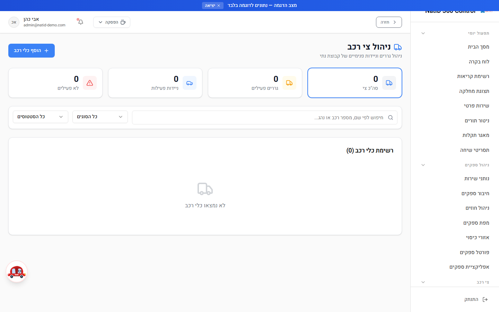

### שלבי עבודה

1. היכנסו למסך **"ניהול צי רכב"**.
2. נהלו את רשימת הגררים והניידות הפנימיים של הקבוצה: הוספה, עדכון פרטים ומעקב.
3. השתמשו במסך זה לתמונת מצב על הכלים הפנימיים הזמינים, במקביל למערך הספקים החיצוניים.

---

## שדות פרופיל הספק והשפעתם על השיבוץ האוטומטי

השיבוץ האוטומטי מדרג את כל הספקים המתאימים לקריאה לפי נוסחת ניקוד (עד כ-110 נקודות), ומציע את הקריאה לספק עם הניקוד הגבוה ביותר. אלה השדות בפרופיל הספק שמשפיעים ישירות:

| שדה בפרופיל | מה מזינים | השפעה על השיבוץ האוטומטי |
|---|---|---|
| **אימייל** | אימייל זהה לאימייל ההתחברות של הספק | לא משפיע על הניקוד — אבל בלעדיו הספק לא מזוהה בפורטל ולא יכול לקבל הצעות. **קריטי** |
| **סוגי שירות** | גרר / מכונאי / רב-שירות | תנאי סף + עד 20 נקודות על התאמת סוג השירות לקריאה. שדה ריק = הספק לא ייכנס לשיבוץ |
| **אזורי כיסוי** | האזורים הגיאוגרפיים שבהם הספק פועל | 25 נקודות על התאמת אזור — משמש כחלופה כשאין מיקום GPS עדכני |
| **מיקום GPS (זמינות שיתוף מיקום)** | הספק מפעיל שיתוף מיקום בפורטל | רכיב הניקוד הגדול ביותר — עד 40 נקודות לפי מרחק מהאירוע (עד 5 ק"מ = 40; מעל 50 ק"מ = 5) |
| **זמינות** | מתג זמין/לא זמין + הפסקות (בפורטל הספק) | ספק לא זמין לא מקבל הצעות כלל |
| **תעריפים / הסכמי תמחור** | תעריפי הספק והחוזים מול המחלקות | משמשים לחישוב עלות הקריאה והחיוב; מחירון נתי מסונכרן לקריאה בלבד |
| **סוגי רכב נתמכים** | סוגי הרכבים שהספק יודע לטפל בהם | 5 נקודות על תמיכה בסוג הרכב שבקריאה |
| **דירוג** (נצבר אוטומטית) | — מחושב מהמשובים | עד 20 נקודות (ממוצע מתוך 5 × 4) |
| **זמן תגובה ושיעור השלמה** (נצברים אוטומטית) | — מחושבים מההיסטוריה | עד 10 נקודות כל אחד |
| **עומס נוכחי** (אוטומטי) | — מספר קריאות פעילות | פחות מ-3 קריאות פעילות: ‎+5; מעל 10: ‎−5 |

**איך עובד מנגנון ההצעה:** הספק המוביל בניקוד מקבל SMS + התראה בפורטל עם ספירה לאחור. ההצעה תקפה **10 דקות** — קבלה מעבירה את הקריאה ל"ספק בדרך"; דחייה או פקיעה מעבירה את ההצעה אוטומטית לספק הבא בניקוד. לאחר 30 דקות ללא קבלה — הקריאה מוסלמת למוקד לשיבוץ ידני.

---

## תקלות נפוצות

| תופעה | סיבה שכיחה | פתרון |
|---|---|---|
| ספק לא מופיע בהצעות השיבוץ האוטומטי | שדה **סוג שירות** ריק בפרופיל, או שהספק מסומן **לא זמין** (מתג זמינות כבוי / בהפסקה) | עדכנו את סוגי השירות בעריכת הספק; בקשו מהספק להעביר את מתג הזמינות ל"זמין" בפורטל |
| הספק רואה "פרופיל ספק לא נמצא" בכניסה לפורטל | **אי-התאמת אימייל** בין חשבון המשתמש לבין האימייל בפרופיל הספק | השוו את שני האימיילים (עריכת ספק מול ניהול משתמשים) ותקנו לזהות מלאה, כולל אותיות גדולות/קטנות ורווחים |
| ספק לא מקבל הצעות באזור מסוים | **אזור הכיסוי** לא מוגדר לספק, ואין לו מיקום GPS עדכני | הוסיפו את האזור במסך אזורי כיסוי / בעריכת הספק |
| ספק לא מופיע במסך מעקב GPS | הספק לא הפעיל **שיתוף מיקום** בפורטל, או שלא אישר הרשאות מיקום במכשיר | הנחו את הספק להפעיל את מתג ה-GPS בפורטל הספקים ולאשר הרשאות מיקום |
| מיקום הספק על המפה מיושן | הספק לא שידר מיקום זמן רב (מדד הטריות אדום) | המערכת שולחת אוטומטית התראת "נדרש עדכון מיקום"; במקביל אפשר להתקשר לספק |
| הצעת קריאה "נתקעה" ואף ספק לא קיבל | כל הספקים דחו / ההצעות פקעו | לאחר 30 דקות המערכת מסלימה למוקד עם התראת "קריאה דורשת שיבוץ ידני" — שבצו ידנית בעזרת מפת הספקים |
| ספק חדש התחבר אך הופנה למסך לא צפוי | חשבון המשתמש נוצר **ללא תפקיד ספק** (vendor) | תקנו את התפקיד בניהול משתמשים; בכניסה הבאה הספק יופנה אוטומטית לפורטל הספקים |
| לא ניתן לערוך תעריף בלשונית "תעריפי ספקים-נתי" | זו תצוגת **קריאה בלבד** — המחירון מנוהל בנתי ומסונכרן אוטומטית | עדכון התעריף מתבצע במערכת נתי; במערכת יוצג לאחר הסנכרון הבא |

---

*מדריך זה הוא חלק מסדרת המדריכים למשתמש של NatID 360 Control. לתהליך העבודה של הספק עצמו בפורטל — ראו את "מדריך לספק" בתוך המערכת (`/VendorGuide`).*
