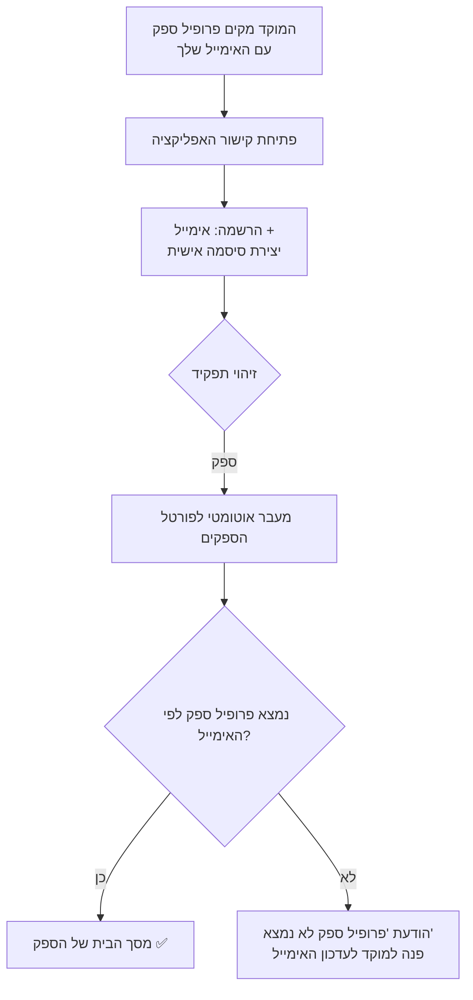
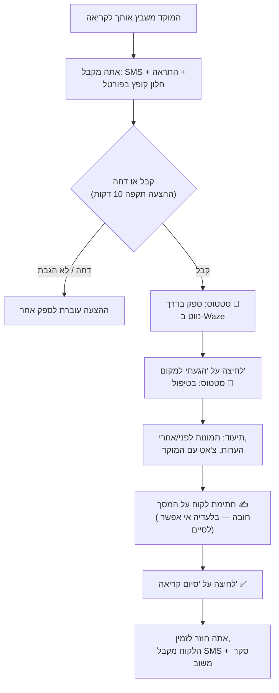
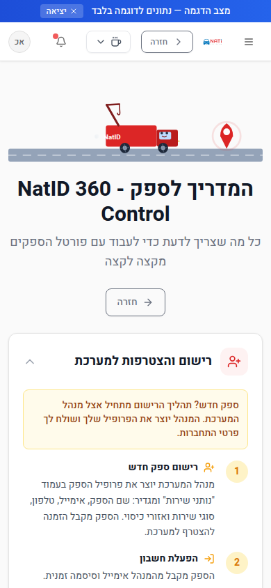

# מדריך למשתמש הקצה — פורטל הספקים (נותן שירות)

> **מיועד ל:** ספקים / נותני שירות (גרר, ניידת שירות, מכונאי ועוד) · **מותאם לשימוש בנייד** 📱
> **עודכן:** יולי 2026

---

## תוכן עניינים

1. [מה זה פורטל הספקים?](#מה-זה-פורטל-הספקים)
2. [התחברות למערכת מההתחלה — צעד אחר צעד](#התחברות-למערכת-מההתחלה--צעד-אחר-צעד)
3. [מסך הבית — פורטל הספקים](#מסך-הבית--פורטל-הספקים)
4. [מחזור קריאה מלא — מהצעה ועד סגירה](#מחזור-קריאה-מלא--מהצעה-ועד-סגירה)
5. [מסך ניהול הקריאה — כל הכלים](#מסך-ניהול-הקריאה--כל-הכלים)
6. [הפרופיל שלי](#הפרופיל-שלי)
7. [זמינות, הפסקות ושיתוף מיקום](#זמינות-הפסקות-ושיתוף-מיקום)
8. [תקלות נפוצות ופתרונות](#תקלות-נפוצות-ופתרונות)

---

## מה זה פורטל הספקים?

פורטל הספקים הוא סביבת העבודה האישית שלך במערכת NatID 360 Control. דרכו אתה:

- **מקבל הצעות לקריאות שירות חדשות** — עם התראה, SMS וספירה לאחור.
- **מקבל או דוחה** כל הצעה בלחיצת כפתור.
- **מנהל את הקריאה בשטח** — עדכון סטטוס, ניווט ב-Waze, תמונות, חתימת לקוח.
- **מתכתב עם המוקד בצ'אט** ישיר בתוך הקריאה.
- **מנהל את הפרופיל שלך** — פרטים, סוגי שירות, אזורי כיסוי, שעות פעילות.

הפורטל מותאם לשימוש מלא מהטלפון הנייד — כל העבודה בשטח מתבצעת ממנו.

---

## התחברות למערכת מההתחלה — צעד אחר צעד

### שלב 1 — קבלת גישה מהמוקד

1. מנהל המערכת מקים עבורך **פרופיל ספק** עם הפרטים שלך: שם, טלפון, **אימייל**, סוגי שירות ואזורי כיסוי.
2. המוקד שולח לך את **קישור האפליקציה**.

> ⚠️ **חשוב מאוד:** ההרשמה וההתחברות חייבות להתבצע עם **אותו אימייל בדיוק** שנמסר למוקד ורשום בפרופיל הספק שלך. אימייל שונה = המערכת לא תזהה אותך כספק ("פרופיל ספק לא נמצא").

### שלב 2 — הרשמה וכניסה ראשונה

הכניסה למערכת היא באמצעות **אימייל + סיסמה שאתה יוצר בעצמך**:

1. פתח את קישור האפליקציה שקיבלת מהמוקד (מומלץ מהנייד).
2. במסך הכניסה בחר **הרשמה (Sign Up)**.
3. הזן את **האימייל שנמסר למוקד** וצור **סיסמה אישית** (שמור אותה — איתה תיכנס מעכשיו).
4. אשר את האימייל אם נשלחה הודעת אימות לתיבה שלך.
5. התחבר עם האימייל והסיסמה שיצרת — המערכת מזהה אוטומטית שאתה **ספק** ומעבירה אותך ישירות ל**פורטל הספקים**. אין צורך לחפש שום דבר בתפריטים.

### שלב 3 — הגדרות ראשונות (פעם אחת)

מיד אחרי הכניסה הראשונה מומלץ:

1. היכנס ל**"הפרופיל שלי"** וודא שכל הפרטים נכונים: טלפון, סוגי שירות, אזורי כיסוי, שעות פעילות.
2. **אשר שיתוף מיקום (GPS)** כשהדפדפן/האפליקציה מבקשים — בלי זה המערכת לא תדע לשבץ אותך לפי קרבה.
3. **אשר קבלת התראות (Notifications)** — כדי לקבל התראה מיידית על כל הצעת קריאה.
4. העבר את **מתג הזמינות** למצב "זמין" כשאתה מוכן לקבל קריאות.

### שלב 4 — הוספת האפליקציה למסך הבית בנייד (מומלץ)

הפורטל עובד כאפליקציה לכל דבר (PWA):

- **אנדרואיד (Chrome):** תפריט ⋮ → **"הוספה למסך הבית"**.
- **אייפון (Safari):** כפתור שיתוף → **"הוסף למסך הבית"**.

מעכשיו נכנסים בלחיצה אחת, כמו כל אפליקציה.

### שכחת סיסמה?

במסך ההתחברות לחץ על **"שכחתי סיסמה"**, הזן את האימייל שלך ופעל לפי ההנחיות במייל שיישלח אליך. אם לא הגיע מייל — בדוק בתיקיית הספאם או פנה למוקד.

---

## מסך הבית — פורטל הספקים

הנתיב: `/VendorPortal` (נפתח אוטומטית עם ההתחברות).

מה יש במסך:

| אזור | מה עושים בו |
|---|---|
| **שלום, [השם שלך]** + כפתורי מדריך / פרופיל / רענון | גישה מהירה למדריך המלא ולפרופיל |
| **מתג זמינות** | זמין / לא זמין + הפסקות מהירות של 15/30/60 דקות |
| **מתג שיתוף מיקום (GPS)** | הפעלת שידור מיקום חי למוקד |
| **הצעות קריאה חדשות** | חלון קופץ עם פרטי הקריאה, ספירה לאחור וכפתורי **קבל / דחה** |
| **כרטיסי סטטיסטיקות** | סה"כ קריאות, הושלמו, דירוג ממוצע ועוד |
| **הקריאות הפעילות שלי** | רשימת הקריאות שבטיפולך + כפתורי פעולה מהירים (יצא לדרך, הגעתי, חייג, נווט ב-Waze) |
| **טבלת כל הקריאות** | סינון: הכל / פעילות / הושלמו |

📌 הרשימה מתעדכנת אוטומטית: קריאות כל 30 שניות, הצעות חדשות כל 10 שניות — אין צורך לרענן ידנית.

---

## מחזור קריאה מלא — מהצעה ועד סגירה

### שלב 1 — קבלת הצעה

כשהמוקד משבץ אותך לקריאה, תקבל **שלוש התראות במקביל**:

1. **SMS** לטלפון: "נתיד - קריאה חדשה #… היכנס לפורטל לאישור".
2. **התראת מערכת** בפעמון.
3. **חלון קופץ בפורטל** עם כל פרטי הקריאה (לקוח, כתובת, סוג שירות) ו**ספירה לאחור**.

> ⏱️ **יש לך 10 דקות להגיב.** ללא מענה — ההצעה עוברת אוטומטית לספק הבא.

### שלב 2 — קבלה או דחייה

- **"קבל קריאה"** → הקריאה עוברת לסטטוס **"ספק בדרך"**, אתה מסומן כעסוק, והמוקד מקבל עדכון.
- **"דחה"** → תתבקש לציין **סיבת דחייה**, וההצעה תעבור לספק הבא. דחייה לגיטימית עדיפה על אי-מענה.

### שלבים 3–5 — העבודה בשטח

מפורט בסעיף הבא — [מסך ניהול הקריאה](#מסך-ניהול-הקריאה--כל-הכלים).

---

## מסך ניהול הקריאה — כל הכלים

הנתיב: `/VendorCallManagement` (נפתח בלחיצה על קריאה מהפורטל).

### מבנה המסך

- **פס התקדמות** עליון — מראה בדיוק איפה אתה במסלול: שובץ → בדרך → הגיע → בטיפול → סגירה.
- **פרטי לקוח ורכב** — שם, טלפון (חיוג בלחיצה 📞), כתובת, מספר רכב ודגם.
- **כפתורי פעולה קבועים בתחתית המסך** — הפעולה הבאה תמיד זמינה באגודל.

### הפעולות, לפי הסדר

1. **ניווט** 🗺️ — לחיצה פותחת **Waze** ישירות לכתובת האירוע.
2. **"הגעתי למקום"** — מעדכן את הסטטוס ל"בטיפול" ושולח אוטומטית הודעה בצ'אט למוקד ("הספק הגיע למקום ומתחיל בטיפול"). זמן ההגעה נרשם אוטומטית.
3. **העלאת תמונות** 📷 — צלם והעלה בשתי קטגוריות: **"לפני טיפול"** ו-**"אחרי טיפול"**. המערכת יכולה לחלץ פרטים מהתמונה אוטומטית (זיהוי רכב/נזק ב-AI). אפשר להציג תצוגה מקדימה ולמחוק תמונה שגויה.
4. **הערות** 📝 — תיעוד חופשי של מה שבוצע.
5. **צ'אט עם המוקד** 💬 — הודעות ישירות למוקדן בזמן אמת. כל עדכוני הסטטוס שלך מתועדים שם אוטומטית.
6. **חתימת לקוח** ✍️ — בסיום הטיפול הלקוח חותם עם האצבע על מסך הטלפון שלך. **בלי חתימה — כפתור הסיום חסום.**
7. **"סיום קריאה"** ✅ — סוגר את הקריאה. אתה חוזר אוטומטית לזמין, והלקוח מקבל SMS סיום + בקשת משוב.

### מצבים מיוחדים

| מצב | מה לעשות | מה קורה |
|---|---|---|
| אי אפשר להשלים את הטיפול | לחץ **"לא ניתן להשלים"** + פרט סיבה | הקריאה נשארת אצלך בסטטוס מיוחד והמוקד מקבל התראה מיידית לטיפול |
| קיבלת קריאה בטעות / נתקעת | **"שחרור קריאה"** | הקריאה חוזרת לתור השיבוץ של המוקד |
| ניידת לא הצליחה וצריך גרר | סגור עם סטטוס הסגירה המתאים | המוקד פותח **קריאת המשך** מקושרת אוטומטית |

---

## הפרופיל שלי

הנתיב: `/MyVendorProfile` (כפתור "הפרופיל שלי" בפורטל).

מה מעדכנים כאן:

1. **פרטי קשר** — טלפון, כתובת בסיס.
2. **סוגי שירות** — גרירה, ניידת, מכונאי וכו'. ⚠️ סוג שירות חסר = לא תקבל קריאות מהסוג הזה.
3. **אזורי כיסוי** — האזורים שבהם אתה עובד. משפיע ישירות על השיבוץ האוטומטי.
4. **שעות פעילות** — מתי אתה זמין לקריאות.

📌 ככל שהפרופיל מדויק ומלא יותר — תקבל יותר קריאות שמתאימות לך. השיבוץ האוטומטי מדרג ספקים לפי קרבה, התאמת שירות, דירוג לקוחות, מהירות תגובה ושיעור השלמה.

💡 בפורטל זמין גם **מדריך מלא לספק** בעברית (`/VendorGuide`) עם שאלות ותשובות — כפתור "מדריך" במסך הבית.

---

## זמינות, הפסקות ושיתוף מיקום

### מתג זמינות

- **זמין** 🟢 — תקבל הצעות לקריאות חדשות.
- **לא זמין** 🔴 — לא תקבל הצעות (הקריאות הפעילות שלך נשארות אצלך).
- **הפסקה** ⏸️ — יציאה זמנית של 15 / 30 / 60 דקות; בסיום ההפסקה תחזור לזמין אוטומטית.

### שיתוף מיקום (GPS)

- הפעל את מתג **שיתוף המיקום** בפורטל ואשר את בקשת הדפדפן.
- המיקום משודר למוקד כל עוד יש לך קריאה פעילה — כך הלקוח והמוקד רואים צפי הגעה מדויק.
- אם המיקום מפסיק להתעדכן, תקבל התראת "נדרש עדכון מיקום" — פתח את הפורטל והמיקום יתחדש.

> 🔒 **פרטיות ואבטחה:** אתה רואה אך ורק את הקריאות שלך. הנתונים מסוננים בצד השרת לפי זהות המשתמש שלך.

---

## תקלות נפוצות ופתרונות

| תקלה | סיבה אפשרית | פתרון |
|---|---|---|
| "פרופיל ספק לא נמצא" אחרי התחברות | האימייל שהתחברת איתו שונה מהאימייל שבפרופיל הספק | פנה למוקד לעדכון האימייל בפרופיל — חייבת התאמה מלאה |
| לא מגיעות הצעות קריאה | מתג זמינות כבוי / סוגי שירות או אזורי כיסוי חסרים בפרופיל | ודא שאתה "זמין" ושהפרופיל מלא |
| לא קיבלת התראה על הצעה | התראות דפדפן לא אושרו | אשר Notifications בהגדרות הדפדפן/האפליקציה; ה-SMS מגיע בכל מקרה |
| כפתור "סיום קריאה" חסום | חסרה חתימת לקוח | החתם את הלקוח על המסך — ואז סיים |
| ההצעה נעלמה לפני שהספקת להגיב | חלפו 10 דקות וההצעה עברה לספק הבא | הגב מהר יותר; ודא שהתראות פעילות |
| המוקד לא רואה את המיקום שלך | שיתוף מיקום כבוי / הדפדפן חסם GPS | הפעל את המתג בפורטל ואשר הרשאת מיקום במכשיר |
| שכחת סיסמה | — | "שכחתי סיסמה" במסך ההתחברות, או פנה למוקד |

---

*מדריך זה הוא חלק מסדרת המדריכים למשתמש של NatID 360 Control — ראה [תוכן המדריכים](README.md).*
