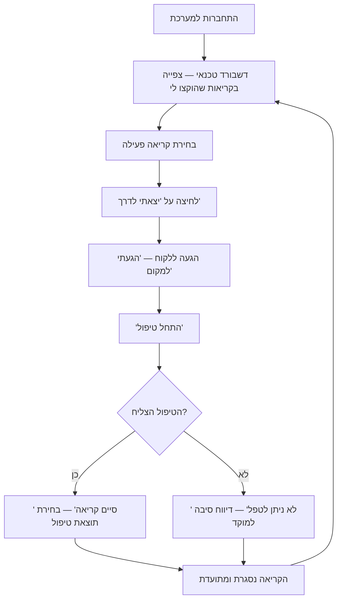
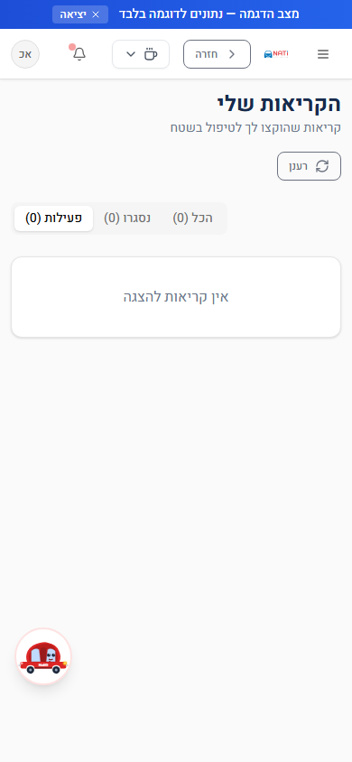
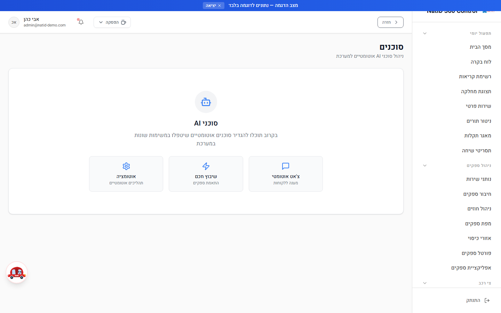

# מדריך למשתמש — אזור הטכנאי

**מיועד ל:** נציג שטח / טכנאי (תפקיד `agent`) · רלוונטי גם למנהלי מערכת
**עודכן: יולי 2026**

אזור הטכנאי ב-NatID 360 Control הוא סביבת עבודה ממוקדת ופשוטה לנציגי השטח: רואים רק את הקריאות שהוקצו לכם, מעדכנים סטטוס בלחיצת כפתור מהשטח, ומדווחים למוקד על בעיות — הכול מהטלפון הנייד. טכנאי שמתחבר למערכת מגיע אוטומטית לדשבורד הטכנאי, ורואה בתפריט רק את המסכים הרלוונטיים לו.

---

## תוכן עניינים

1. [יום עבודה של טכנאי — תרשים זרימה](#יום-עבודה-של-טכנאי--תרשים-זרימה)
2. [דשבורד טכנאי (`/AgentDashboard`)](#דשבורד-טכנאי)
3. [הקריאות שלי (`/AgentCallManagement`)](#הקריאות-שלי)
4. [כרטיס קריאה — עדכון סטטוס מהשטח](#כרטיס-קריאה--עדכון-סטטוס-מהשטח)
5. [מצב הפסקה](#מצב-הפסקה)
6. [עבודה מהנייד](#עבודה-מהנייד)
7. [למנהלים — מסך סוכנים וניהול טכנאים](#למנהלים--מסך-סוכנים-וניהול-טכנאים)
8. [תקלות נפוצות](#תקלות-נפוצות)

---

## יום עבודה של טכנאי — תרשים זרימה

---

## דשבורד טכנאי

**נתיב:** `/AgentDashboard` · **הרשאה:** טכנאי (וגם מנהל מערכת)

זהו דף הבית שלכם — תמונת מצב מיידית של כל הקריאות שהוקצו לכם, עם דגש על הקריאות הפעילות שמחכות לטיפול.

### מה יש במסך

- **כותרת "דשבורד טכנאי"** עם תת-כותרת "הקריאות שהוקצו לך".
- **4 כרטיסי מונים** בראש המסך:
  - **קריאות פעילות** (צהוב) — קריאות פתוחות שממתינות לטיפול שלכם.
  - **דחופות** (אדום) — קריאות פעילות בעדיפות דחופה או גבוהה.
  - **נסגרו** (ירוק) — קריאות שהושלמו או בוטלו.
  - **סה"כ** (כחול) — כל הקריאות שהוקצו לכם.
- **כפתור "כל הקריאות שלי"** — מעבר למסך הקריאות המלא עם לשוניות סינון.
- **כפתור "רענן"** — טעינה מחדש של רשימת הקריאות מהשרת.
- **אזור "קריאות פעילות"** — כרטיס לכל קריאה פעילה, עם כפתורי הפעולה (ראו [כרטיס קריאה](#כרטיס-קריאה--עדכון-סטטוס-מהשטח)).

### שלבי עבודה

1. התחברו למערכת — תועברו אוטומטית לדשבורד הטכנאי.
2. בדקו את כרטיס **"דחופות"**: אם המונה גדול מ-0, טפלו קודם בקריאות בעדיפות גבוהה (מסומנות בתגית עדיפות אדומה על הכרטיס).
3. עברו על רשימת **"קריאות פעילות"**: בכל כרטיס מופיעים מספר הקריאה, הסטטוס, שם הלקוח והטלפון, המיקום, סוג התקלה וזמן הפתיחה.
4. בחרו את הקריאה הבאה לטיפול ועדכנו סטטוס ישירות מהכרטיס.
5. אם המסך ריק ומופיע "אין כרגע קריאות פעילות שהוקצו לך" — אין לכם קריאות ממתינות. לחצו "רענן" מדי פעם לבדיקת שיבוצים חדשים.

### טיפים

- הרשימה לא מתרעננת לבד ברקע — אחרי כל עדכון סטטוס היא מתעדכנת אוטומטית, אבל אם אתם מחכים לשיבוץ חדש, לחצו על **"רענן"** (האייקון מסתובב בזמן הטעינה).
- אם מופיעה הודעת **"שגיאה בטעינת נתונים"** — בדקו חיבור אינטרנט ורעננו את הדף.

---

## הקריאות שלי

**נתיב:** `/AgentCallManagement` · **הרשאה:** טכנאי (וגם מנהל מערכת)

מסך הרשימה המלא של הקריאות שלכם — כולל היסטוריה של קריאות שנסגרו. שימושי בסוף יום לבדיקה שהכול תועד, או כשצריך לאתר קריאה ישנה.

### מה יש במסך

- **כותרת "הקריאות שלי"** עם תת-כותרת "קריאות שהוקצו לך לטיפול בשטח".
- **כפתור "רענן"**.
- **3 לשוניות** עם מונה בכל אחת:
  - **פעילות** — קריאות פתוחות בטיפול (ברירת המחדל).
  - **נסגרו** — קריאות שהושלמו או בוטלו.
  - **הכל** — כל הקריאות שהוקצו לכם אי פעם.
- **רשת כרטיסי קריאה** — אותם כרטיסים כמו בדשבורד; בקריאות פעילות מופיעים גם כפתורי עדכון הסטטוס.

### שלבי עבודה

1. מהדשבורד, לחצו על **"כל הקריאות שלי"** (או נווטו ל-`/AgentCallManagement` מהתפריט).
2. הלשונית **"פעילות"** נפתחת כברירת מחדל — כאן ממשיכים לעבוד בדיוק כמו בדשבורד.
3. למעקב אחר עבודה שהסתיימה, עברו ללשונית **"נסגרו"** — הכרטיסים שם לתצוגה בלבד (אין כפתורי פעולה על קריאה שנסגרה).
4. הלשונית **"הכל"** מציגה את התמונה המלאה — נוח להשוואה מול דוח יומי.
5. אם מופיע "אין קריאות להצגה" — אין קריאות בלשונית הנוכחית; נסו לשונית אחרת.

### טיפים

- המונים שבלשוניות (למשל "פעילות (3)") נותנים לכם ספירה מהירה בלי לגלול.
- הבחנה בין המסכים: הדשבורד ממוקד ב**מה שפעיל עכשיו** + מונים; "הקריאות שלי" נותן **היסטוריה מלאה** עם סינון בלשוניות.

---

## כרטיס קריאה — עדכון סטטוס מהשטח

כל קריאה מוצגת ככרטיס אחיד (בשני המסכים). הכרטיס בנוי כך שאפשר לתפעל אותו באגודל אחד מהנייד.

### מה מופיע בכרטיס

| רכיב | תיאור |
|---|---|
| מספר קריאה | בראש הכרטיס, מודגש |
| תגית סטטוס | הסטטוס הנוכחי של הקריאה |
| לקוח וטלפון | שם הלקוח + מספר טלפון |
| מיקום | כתובת/עיר האירוע (או "מיקום לא צוין") |
| סוג תקלה | סיווג התקלה בעברית |
| זמן פתיחה | כמה זמן עבר מאז שהקריאה נפתחה ("לפני X דקות") |
| תגית עדיפות | רגילה / גבוהה / דחופה (צבע לפי דחיפות) |

### כפתור ההתקדמות — צעד אחד בכל פעם

בתחתית הכרטיס מופיע **כפתור כחול אחד** שמציג תמיד את הצעד הבא הנכון לפי הסטטוס הנוכחי:

| הסטטוס הנוכחי | הכפתור שיופיע | מה קורה בלחיצה |
|---|---|---|
| ממתינה לשיבוץ / בשיבוץ / שובצה | **"יצאתי לדרך"** | הקריאה עוברת לסטטוס "בדרך" |
| בדרך | **"הגעתי למקום"** | הקריאה עוברת ל"הגיע למקום" |
| הגיע למקום | **"התחל טיפול"** | הקריאה עוברת ל"בטיפול" |
| בטיפול | **"סיים קריאה"** | נפתח חלון **"סגירת קריאה — בחר תוצאת טיפול"** |

**סגירת קריאה:** בלחיצה על "סיים קריאה" נפתח חלון בחירת תוצאת טיפול (סטטוס סגירה עסקי). בחרו את התוצאה המתאימה — הקריאה תיסגר במסלול הסגירה המלא של המערכת (כולל עדכון ללקוח, ובמקרים מסוימים פתיחת קריאת המשך אוטומטית — תופיע הודעה "הקריאה נסגרה ונפתחה קריאת המשך").

### "לא ניתן לטפל" — דיווח בעיה למוקד

כשאתם בסטטוס "הגיע למקום" או "בטיפול" מופיע גם כפתור אדום **"לא ניתן לטפל"**:

1. לחצו על הכפתור — ייפתח חלון "לא ניתן לטפל בקריאה".
2. **פרטו את הסיבה** בשדה הטקסט (חובה — הכפתור לא יופעל בלי טקסט). לדוגמה: "חניון תת-קרקעי נעול, נדרש ציוד מותאם".
3. לחצו **"שלח דיווח למוקד"** — הקריאה מסומנת כ"לא ניתן להשלים" והמוקד מקבל את הדיווח וממשיך את הטיפול.

### חשוב לדעת

- כל עדכון סטטוס נשלח לשרת ומאומת שם (הרשאה + בעלות על הקריאה). בהצלחה תופיע הודעת **"הסטטוס עודכן"**; בכישלון — "שגיאה בעדכון הסטטוס". אם נכשל, בדקו קליטה ונסו שוב.
- כפתורי הפעולה מופיעים רק אם הוקצתה לכם הרשאת עדכון סטטוס. אם אתם רואים את הקריאות אבל בלי כפתורים — פנו למנהל המערכת.
- עדכנו סטטוס **בזמן אמת** ולא בדיעבד — המוקד והלקוח רואים את ההתקדמות, וזמני השלבים נכנסים לדוחות.

---

## מצב הפסקה

בסרגל העליון של המערכת (בכל מסך) מופיע כפתור **"הפסקה"** עם אייקון ספל קפה:

1. לחצו על הכפתור — ייפתח חלון "יציאה להפסקה" עם הסבר.
2. לחצו **"יצא להפסקה"** — יופיע טיימר רץ בסרגל העליון.
3. **שימו לב:** קריאות שלא יטופלו תוך **20 דקות** מתחילת ההפסקה יועברו אוטומטית לבקר, ותישלח על כך התראה. הטיימר הופך אדום ומהבהב כשעברתם את הסף.
4. בסיום ההפסקה, לחצו על הטיימר ואז **"חזור לעבודה"** — תופיע הודעת "חזרת לעבודה!".

מצב ההפסקה נשמר גם אם רעננתם את הדף או סגרתם את הדפדפן בטעות — הטיימר ממשיך מאותה נקודה.

---

## עבודה מהנייד

אזור הטכנאי **מותאם במיוחד לעבודה מהטלפון הנייד** — צילומי המסך במדריך זה צולמו בתצוגת מובייל, כפי שרוב הטכנאים עובדים בפועל:

- הכרטיסים נערמים בעמודה אחת במסך צר, וכפתורי הפעולה גדולים ונוחים ללחיצה באצבע.
- המערכת היא **PWA (אפליקציית ווב מתקדמת)**: בדפדפן הנייד בחרו "הוסף למסך הבית" כדי לקבל אייקון שנפתח כמו אפליקציה.
- הממשק כולו בעברית ובכיווניות ימין-לשמאל (RTL).
- מספר הטלפון של הלקוח מופיע על הכרטיס — מהנייד אפשר לחייג ישירות מהמסך.
- נדרש חיבור אינטרנט פעיל לעדכוני סטטוס; אם אין קליטה, ההודעה "שגיאה בעדכון הסטטוס" תופיע — נסו שוב כשיש קליטה.

---

## למנהלים — מסך סוכנים וניהול טכנאים

**נתיב:** `/Agents` · **הרשאה:** מנהל מערכת ומוקדן בלבד (לא נגיש לטכנאים)

מסך **"סוכנים"** מרכז את ניהול הסוכנים האוטומטיים (סוכני AI) של המערכת. נכון לגרסה הנוכחית זהו מסך "בקרוב" (Coming Soon) המציג את היכולות המתוכננות: צ'אט אוטומטי למענה ללקוחות, שיבוץ חכם להתאמת ספקים, ואוטומציה של תהליכים.

**ניהול חשבונות הטכנאים עצמם** (משתמשים בתפקיד `agent`) מתבצע במסכים הייעודיים:

1. **ניהול משתמשים** (`/UserManagement`) — יצירת משתמש לטכנאי והקצאת תפקיד "נציג שטח / טכנאי". טכנאי עם תפקיד זה יקבל גישה לאזור הטכנאי בלבד.
2. **ניהול הרשאות** (`/RoleManagement`) — כאן מעניקים (או שוללים) לטכנאי את הרשאת **עדכון סטטוס קריאות**. בלי הרשאה זו הטכנאי רואה את הקריאות שלו לצפייה בלבד, ללא כפתורי פעולה.
3. **שיבוץ קריאה לטכנאי** נעשה ממסכי הקריאות של המוקד — הטכנאי רואה באזור שלו את הקריאות המשויכות לכתובת האימייל שלו.

---

## תקלות נפוצות

| תופעה | סיבה אפשרית | פתרון |
|---|---|---|
| התחברתי ואני לא רואה את המסכים הרגילים של המוקד | תפקיד "טכנאי" מוגבל בכוונה לאזור הטכנאי בלבד | זה תקין. אם אתם אמורים להיות מוקדנים — פנו למנהל לעדכון התפקיד |
| "אין כרגע קריאות פעילות שהוקצו לך" למרות ששובצתם | הרשימה טרם התרעננה, או שהשיבוץ בוצע לאימייל אחר | לחצו "רענן"; ודאו מול המוקד שהקריאה שובצה לכתובת האימייל שאיתה התחברתם |
| רואים את הקריאות אבל אין כפתורי "יצאתי לדרך" / "סיים קריאה" | לא הוקצתה לכם הרשאת עדכון סטטוס | בקשו ממנהל המערכת להפעיל את ההרשאה במסך ניהול הרשאות |
| הודעת "שגיאה בעדכון הסטטוס" בלחיצה על כפתור | בעיית קליטה/אינטרנט, או שהקריאה כבר לא בבעלותכם | בדקו חיבור, לחצו "רענן" ונסו שוב; אם נמשך — פנו למוקד |
| כפתור "שלח דיווח למוקד" אפור ולא לחיץ | שדה הסיבה ריק | חובה לפרט את הסיבה בטקסט לפני שליחת הדיווח |
| הקריאות שלי נעלמו באמצע היום | שהיתם בהפסקה מעל 20 דקות — הקריאות הועברו אוטומטית לבקר | לחצו "חזור לעבודה" ותאמו מול המוקד שיבוץ מחדש |
| הודעת "שגיאה בטעינת נתונים" בכניסה למסך | תקלת רשת או שרת זמנית | רעננו את הדף; אם נמשך — פנו לתמיכה |
| הקריאה נסגרה ונפתחה קריאה חדשה בלי שביקשתי | תוצאת הטיפול שנבחרה מייצרת קריאת המשך אוטומטית (התנהגות מכוונת) | זה תקין — הקריאה החדשה תטופל במסלול הרגיל של המוקד |
