# מדריך למשתמש — לקוחות, משובים ודוחות

**קהל יעד:** מנהל (Admin) ומוקדן (Operator). חלק מהמסכים מוגבלים למנהל בלבד — מצוין בכל סעיף.
**עודכן: יולי 2026**

מדריך זה מכסה את אזור "לקוחות, דוחות ונתונים" במערכת NatID 360 Control: ניהול לקוחות ופורטל הלקוח, מערך המשובים, מסכי הדוחות והניתוחים, ייבוא וייצוא נתונים, ניהול יעדים (KPI), חשבוניות, קטלוג מוצרים וחבילות סוכני ביטוח.

---

## תוכן עניינים

1. [מסע משוב הלקוח — תרשים זרימה](#מסע-משוב-הלקוח--תרשים-זרימה)
2. [ניהול לקוחות — Customers](#ניהול-לקוחות--customers)
3. [פרטי לקוח — CustomerDetails](#פרטי-לקוח--customerdetails)
4. [עריכת לקוח — EditCustomer](#עריכת-לקוח--editcustomer)
5. [פורטל לקוח — מעקב קריאה — CustomerPortal](#פורטל-לקוח--מעקב-קריאה--customerportal)
6. [ניהול משובי לקוחות — FeedbackManagement](#ניהול-משובי-לקוחות--feedbackmanagement)
7. [טופס משוב לקוח — CustomerFeedback](#טופס-משוב-לקוח--customerfeedback)
8. [דוחות — דוח שנתי — Reports](#דוחות--דוח-שנתי--reports)
9. [דוח שימושים — CallUsageReport](#דוח-שימושים--callusagereport)
10. [ניתוח נתונים היסטוריים — HistoricalDataAnalysis](#ניתוח-נתונים-היסטוריים--historicaldataanalysis)
11. [ייבוא נתונים היסטוריים — ImportHistoricalData](#ייבוא-נתונים-היסטוריים--importhistoricaldata)
12. [ייצוא מתקדם — AdvancedExport](#ייצוא-מתקדם--advancedexport)
13. [ניהול יעדים (KPI) — KPIManagement](#ניהול-יעדים-kpi--kpimanagement)
14. [חשבוניות — Invoices](#חשבוניות--invoices)
15. [קטלוג מוצרים — ProductCatalog](#קטלוג-מוצרים--productcatalog)
16. [חבילות סוכני ביטוח — InsuranceAgentPackages](#חבילות-סוכני-ביטוח--insuranceagentpackages)
17. [תקלות נפוצות](#תקלות-נפוצות)

---

## מסע משוב הלקוח — תרשים זרימה

התרשים הבא מתאר את מחזור החיים המלא של משוב לקוח — מסגירת הקריאה ועד השפעת הדירוג על שיבוץ הספקים הבא:

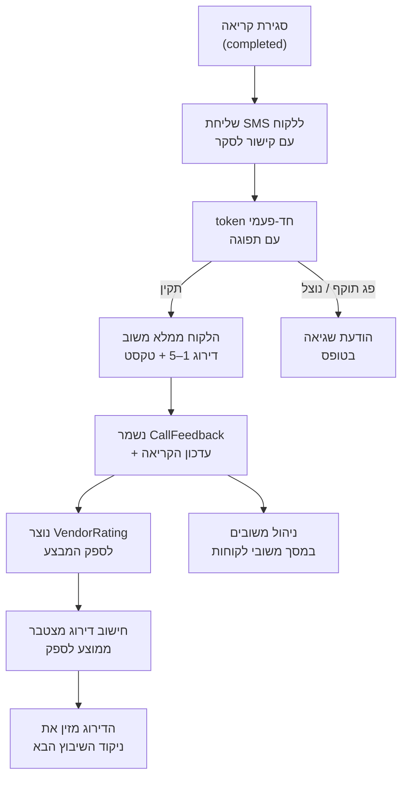

**נקודות מפתח:**
- כל משוב יוצר שלוש רשומות: רשומת משוב (CallFeedback), עדכון הדירוג בקריאה עצמה, ורשומת דירוג ספק (VendorRating).
- הדירוג הממוצע של הספק מתעדכן אוטומטית ומשפיע ישירות על נוסחת השיבוץ האוטומטי (עד 20 נקודות מתוך הניקוד הכולל).
- הקישור שנשלח ללקוח הוא חד-פעמי ובעל תפוגה — לא ניתן למלא משוב פעמיים על אותה קריאה.

---

## ניהול לקוחות — `/Customers`

**מטרה:** רשימת כל הלקוחות במערכת — כולל מנויים המסונכרנים ממערכת נתי — עם חיפוש, סינון ופעולות מהירות.
**תפקידים:** מנהל, מוקדן.
**נתיב:** תפריט ראשי ← לקוחות.

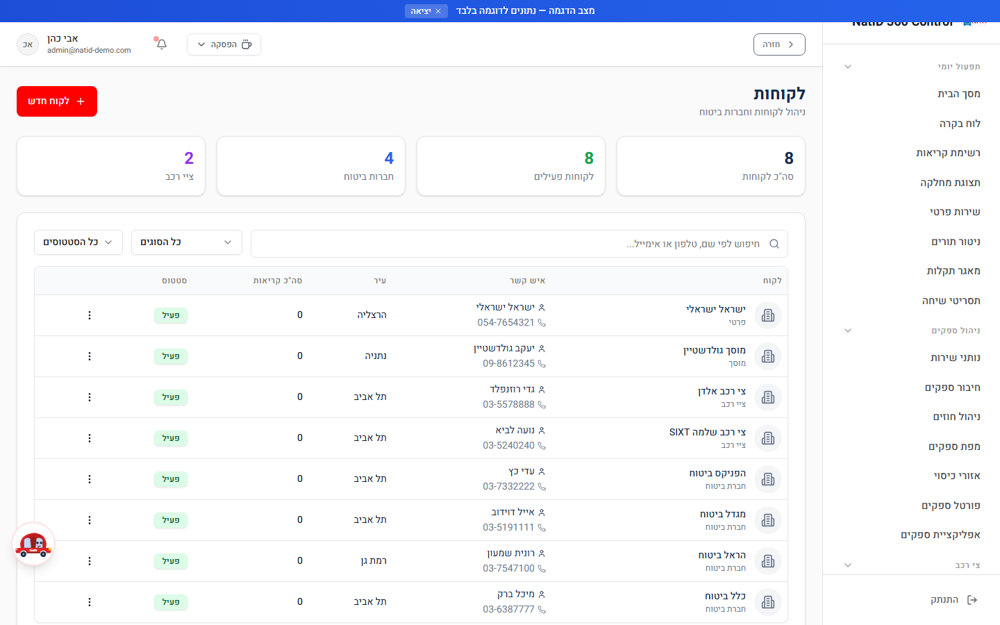

### סוגי לקוחות

| סוג | תיאור |
|---|---|
| חברת ביטוח | לקוח מוסדי — חברת ביטוח |
| ציי רכב | חברות עם צי רכב |
| פרטי | לקוח פרטי בודד |
| מוסך | מוסך שירות |
| אחר | כל סוג אחר |

### סטטוסים

| סטטוס | צבע | משמעות |
|---|---|---|
| פעיל | ירוק | לקוח פעיל — ניתן לפתוח עבורו קריאות |
| לא פעיל | אפור | לקוח שאינו פעיל |
| מושהה | אדום | לקוח מושהה |

### שלבי עבודה

1. היכנסו למסך **לקוחות** מהתפריט הראשי.
2. השתמשו בשדה החיפוש — **חיפוש לפי שם, טלפון או אימייל**.
3. סננו לפי **סוג לקוח** ו/או **סטטוס** באמצעות הרשימות הנפתחות.
4. לחיצה על שורת לקוח פותחת את מסך **פרטי לקוח**.
5. ליצירת לקוח חדש לחצו על הכפתור האדום בראש המסך.

**טיפים:**
- לקוחות המסונכרנים מנתי מזוהים ברשימה — אין לערוך אותם ידנית אלא אם נדרש; מקור האמת הוא נתי.
- כל לקוח יכול לשאת SLA אישי (תגובה והגעה) — ראו סעיף עריכת לקוח.

---

## פרטי לקוח — `/CustomerDetails`

**מטרה:** תצוגה מלאה של כרטיס הלקוח: פרטים כלליים, פרטי קשר, היסטוריית קריאות ואינטראקציות.
**תפקידים:** מנהל, מוקדן.
**נתיב:** לקוחות ← לחיצה על לקוח.

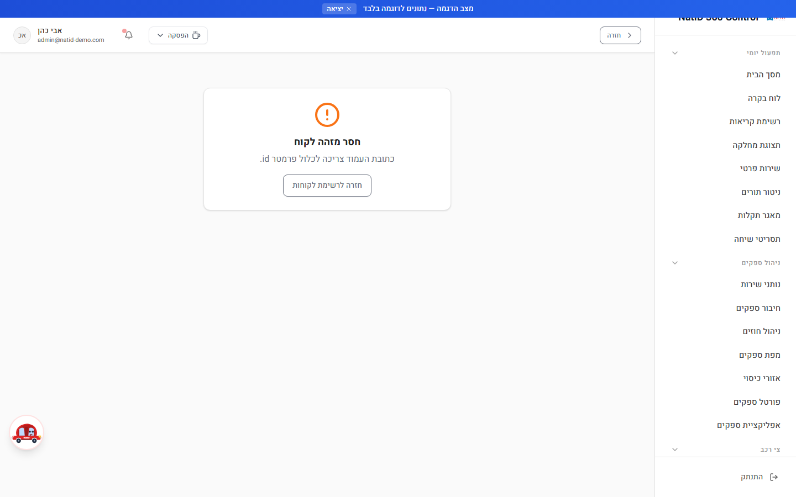

### שלבי עבודה

1. פתחו לקוח מרשימת הלקוחות.
2. בראש המסך מוצג שם הלקוח, סוגו וסטטוסו.
3. גללו בין הכרטיסיות: פרטי קשר, נתוני SLA, היסטוריית קריאות ואינטראקציות עם הלקוח.
4. לעריכת הפרטים לחצו על כפתור העריכה — ייפתח מסך **עריכת לקוח**.

**טיפ:** היסטוריית הקריאות בכרטיס הלקוח היא הדרך המהירה ביותר לזהות לקוח "חוזר" עם תקלות חוזרות — שווה לבדוק לפני פתיחת קריאה חדשה.

---

## עריכת לקוח — `/EditCustomer`

**מטרה:** עדכון פרטי לקוח קיים — פרטים כלליים, פרטי קשר, SLA ותקציב.
**תפקידים:** מנהל, מוקדן.
**נתיב:** פרטי לקוח ← עריכה.

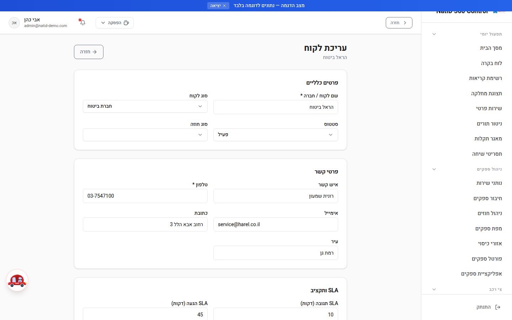

### שלבי עבודה

1. **פרטים כלליים:** עדכנו שם לקוח/חברה (חובה), סוג לקוח, סטטוס וסוג חוזה.
2. **פרטי קשר:** איש קשר, טלפון (חובה), אימייל, כתובת ועיר.
3. **SLA ותקציב:**
   - **SLA תגובה (דקות)** — ברירת מחדל מערכתית: 30 דקות.
   - **SLA הגעה (דקות)** — ברירת מחדל מערכתית: 60 דקות.
   - **תקציב חודשי** — לצורכי מעקב.
4. **הערות:** טקסט חופשי להערות פנימיות.
5. שמרו את השינויים.

**חשוב:** ערכי ה-SLA שהוגדרו ללקוח מחושבים אוטומטית בכל קריאה חדשה שנפתחת עבורו — מועדי היעד לתגובה ולהגעה נגזרים ישירות מהגדרות אלו. הגדרה שגויה תגרום להתראות SLA מוקדמות או מאוחרות מדי.

---

## פורטל לקוח — מעקב קריאה — `/CustomerPortal`

**מטרה:** דף מעקב ציבורי המאפשר ללקוח הקצה לעקוב אחרי קריאת השירות שלו בזמן אמת — ללא סיסמה וללא חשבון.
**תפקידים:** נגיש לכל המשתמשים; הלקוח מזדהה באמצעות טלפון + מספר קריאה בלבד.
**נתיב:** קישור שנשלח ללקוח / `/CustomerPortal`.

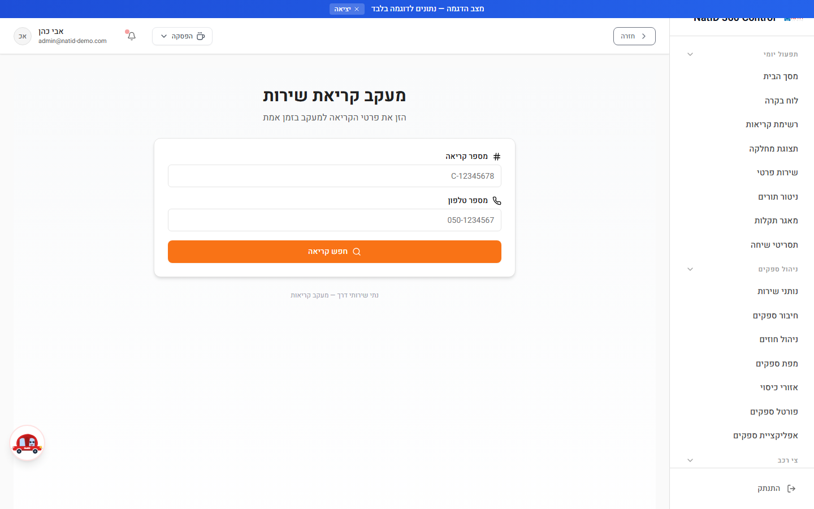

### שלבי עבודה (מנקודת מבט הלקוח)

1. הלקוח נכנס לדף **מעקב קריאת שירות**.
2. מזין **מספר קריאה** (למשל C-12345678) ואת **מספר הטלפון** שאיתו נפתחה הקריאה.
3. לאחר אימות ההתאמה (ללא סיסמה), מוצגים: פרטי הקריאה, סטטוס חי, ופס **התקדמות הטיפול**.
4. הלקוח יכול לחזור אחורה ולבדוק קריאה נוספת.

**טיפים למוקדן:**
- כשלקוח מתקשר ושואל "איפה הגרר?", אפשר להפנות אותו לפורטל במקום לעדכן טלפונית.
- אם הלקוח לא מצליח להזדהות — ודאו שהטלפון שהוא מזין זהה לטלפון הרשום בקריאה (כולל קידומת).

---

## ניהול משובי לקוחות — `/FeedbackManagement`

**מטרה:** צפייה מרוכזת בכל המשובים שהתקבלו מלקוחות, כולל ייצוא לדוח.
**תפקידים:** מנהל, מוקדן.
**נתיב:** תפריט ← משובי לקוחות.

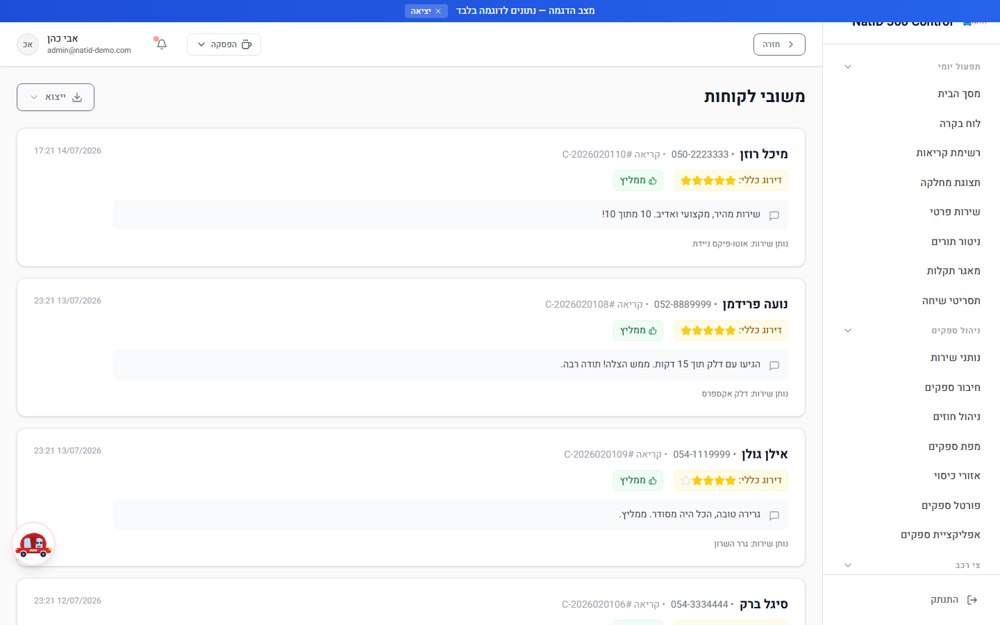

### מה מוצג בכל כרטיס משוב

- שם הלקוח, טלפון ומספר הקריאה.
- **דירוג כללי** (1–5 כוכבים).
- אינדיקציית **ממליץ / לא ממליץ**.
- המשוב המילולי (טקסט חופשי) אם הוזן.
- שם נותן השירות (הספק) ותאריך ושעת המשוב.

### שלבי עבודה

1. היכנסו למסך **משובי לקוחות** — מוצגים המשובים האחרונים (עד 50 האחרונים), והרשימה מתרעננת אוטומטית.
2. עברו על משובים עם דירוג נמוך או "לא ממליץ" — אלו מועמדים לשיחת בירור עם הספק או הלקוח.
3. לייצוא הרשימה לחצו על תפריט **הייצוא** — הדוח כולל: לקוח, טלפון, קריאה, דירוג, ממליץ?, משוב מילולי, ספק ותאריך.

**טיפ:** הדירוגים שמופיעים כאן הם אלו שמזינים את הדירוג המצטבר של כל ספק — ספק עם ממוצע נמוך יקבל פחות שיבוצים אוטומטיים.

---

## טופס משוב לקוח — `/CustomerFeedback`

**מטרה:** הטופס שהלקוח ממלא בפועל, דרך קישור ה-SMS שנשלח אליו לאחר סגירת הקריאה.
**תפקידים:** ממולא על ידי הלקוח (הקישור נגיש למנהל ומוקדן לצורכי בדיקה).
**נתיב:** קישור SMS עם token חד-פעמי.

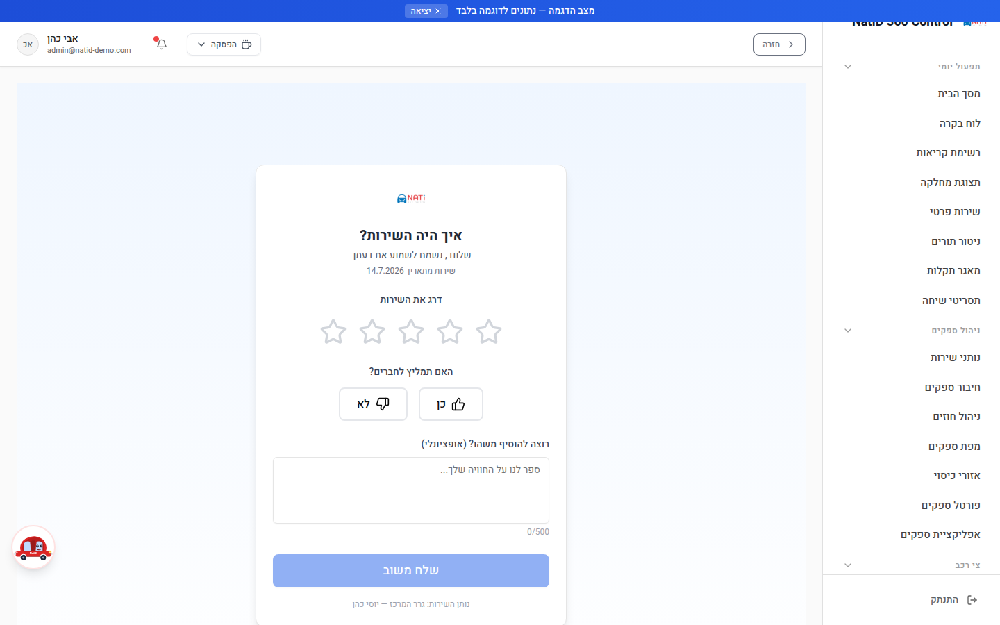

### איך זה עובד

1. עם סגירת הקריאה נשלח ללקוח SMS ובו קישור לטופס "**איך היה השירות?**".
2. הקישור מכיל **token חד-פעמי עם תפוגה** — המערכת מאמתת את התוקף לפני הצגת הטופס.
3. הלקוח מדרג את השירות (1–5 כוכבים — חובה) ויכול להוסיף משוב מילולי חופשי ("ספר לנו על החוויה שלך...").
4. עם השליחה נשמר המשוב, הקריאה מתעדכנת, ונוצרת רשומת דירוג לספק.
5. אם המשוב כבר מולא בעבר — הטופס יציג את הדירוג הקיים ולא יאפשר מילוי חוזר.

### הדירוגים הנאספים במערך המשוב

| שדה | תיאור |
|---|---|
| דירוג כללי | 1–5 כוכבים — **חובה** |
| איכות השירות | 1–5 כוכבים |
| זמן תגובה | 1–5 כוכבים |
| מקצועיות | 1–5 כוכבים |
| האם ימליץ? | כן / לא |
| משוב מילולי | טקסט חופשי |

**הערה:** בנוסף למשוב הלקוח מהקישור, נפתח למוקדן טופס משוב פנימי אוטומטית כאשר קריאה מגיעה לסטטוס "הושלם" — כך שניתן לתעד משוב גם משיחה טלפונית.

---

## דוחות — דוח שנתי — `/Reports`

**מטרה:** דוח שנתי מקיף לפעילות גרירה ושירותי דרך — KPI, מגמות, פילוחים ומטריצות.
**תפקידים:** מנהל, מוקדן. **דוחות פיננסיים** (חשבוניות, מחירוני ספקים, סיכום פיננסי) — **מנהל בלבד**.
**נתיב:** תפריט ← דוחות.

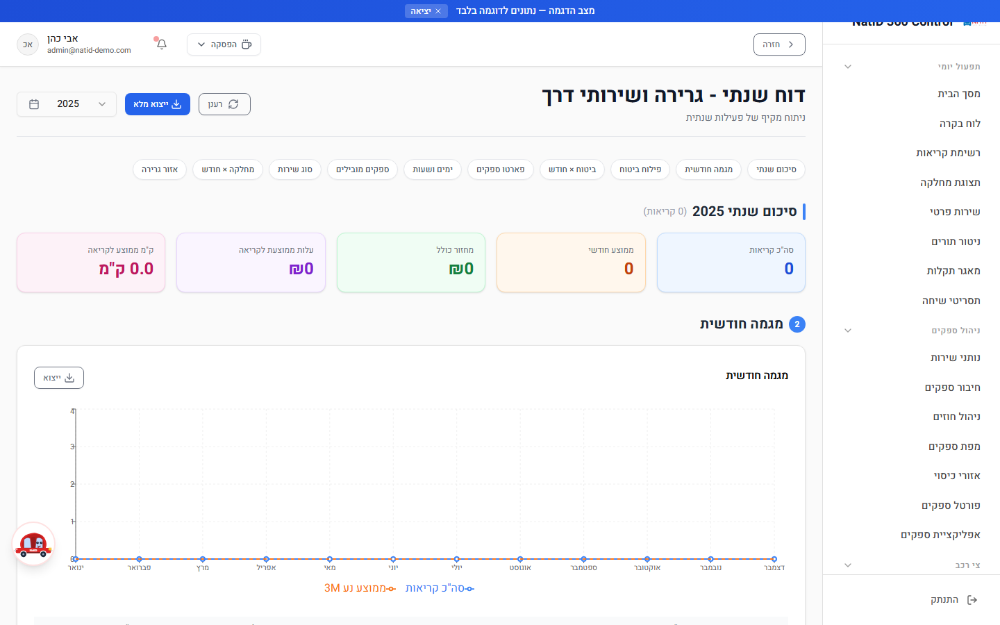

### מבנה הדוח — 10 מקטעים

| # | מקטע | תוכן |
|---|---|---|
| 1 | סיכום שנתי | כרטיסי KPI מרכזיים לשנה הנבחרת |
| 2 | מגמה חודשית | גרף מגמת קריאות לאורך חודשי השנה |
| 3 | פילוח ביטוח | פילוח קריאות לפי חברת ביטוח |
| 4 | ביטוח × חודש | מטריצת חברת ביטוח מול חודש |
| 5 | פארטו ספקים | ספקים מובילים — Top 20 (ניתוח פארטו) |
| 6 | ימים ושעות | התפלגות הקריאות לפי יום בשבוע ושעה |
| 7 | ספקים מובילים | פירוט מלא — Top 15 |
| 8 | סוג שירות | פילוח לפי סוג שירות |
| 9 | מחלקה × חודש | מטריצת מחלקה מול חודש |
| 10 | אזור גרירה | פילוח לפי אזור גרירה |

### מסננים וייצוא

- **מסנן שנה:** בחירת שנה (השנה הנוכחית ועד 3 שנים אחורה) או "**כל הזמנים**". תאריך הקריאה נקבע לפי תאריך הביצוע בפועל (סיום/הגעה) ולא לפי תאריך הייבוא.
- **ניווט מהיר:** כפתורי קפיצה לכל אחד מ-10 המקטעים בראש הדוח.
- **ייצוא מלא** בשלושה פורמטים: **Excel (.xlsx)**, **HTML מעוצב**, **PDF / הדפסה**. הייצוא כולל שורה לכל קריאה עם: מספר קריאה, שם לקוח, סוג שירות, מחלקה, חברת ביטוח, אזור גרירה, ספק, סטטוס, מחיר, עלות, ק"מ, חודש, שנה ותאריך.
- **רענון:** כפתור רענון ידני; הנתונים נשמרים במטמון למספר דקות.

### הרשאות דוחות (לפי הגדרת המערכת)

| דוח | הרשאה |
|---|---|
| דוח חשבוניות, מחירוני ספקים, סיכום פיננסי | מנהל בלבד |
| דוח עיכובים, דוח דירוגים, דוח ביצועים, עיכובי ספקים | מנהל + מוקדן |

---

## דוח שימושים — `/CallUsageReport`

**מטרה:** דוח תפעולי טבלאי — **שורה אחת לכל קריאה** (גם כשטופלה על ידי כמה ספקים) — בטווח תאריכים נבחר.
**תפקידים:** מנהל, מוקדן.
**נתיב:** תפריט ← דוח שימושים.

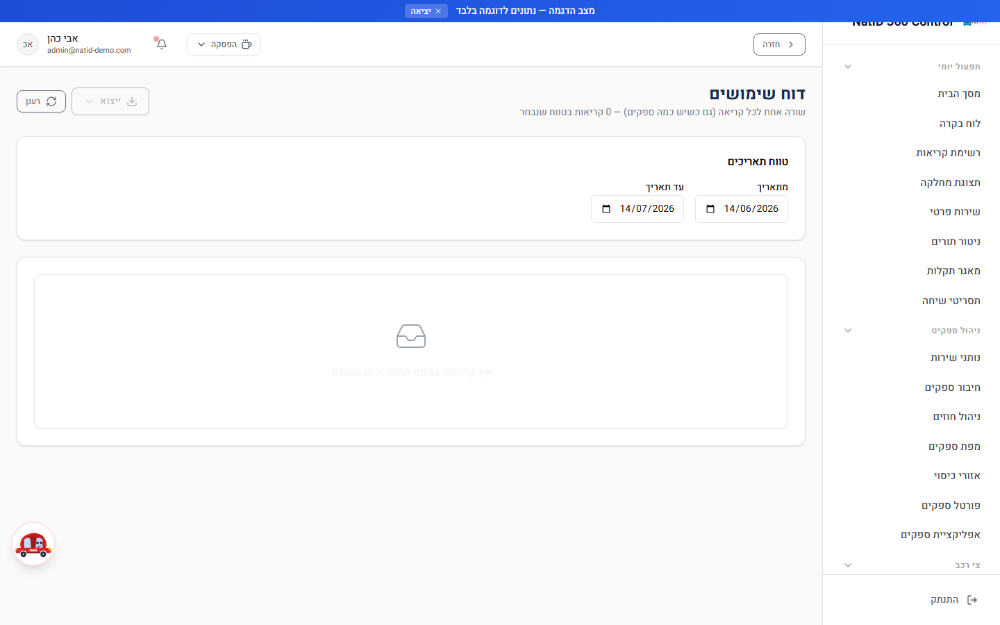

### שלבי עבודה

1. בחרו **טווח תאריכים** (מתאריך / עד תאריך). ברירת המחדל: 30 הימים האחרונים.
2. הטבלה נטענת אוטומטית ומציגה את מספר הקריאות בטווח.
3. השתמשו בעימוד הטבלה (50 שורות בעמוד) לדפדוף.
4. לחצו על תפריט הייצוא לייצוא הדוח המלא.

### עמודות הדוח

מספר קריאה, שם לקוח פונה, טלפון לקוח, שם מקבל הקריאה, סטטוס, תאריך ושעת דיווח, מספר ספקים שטיפלו, תקלה מדווחת, סוג שירות, זמן הגעה ללקוח, משך זמן הגעה (דקות), שעת הגעה ליעד פריקה, מספר רכב, שם חברה, מספר פוליסה, מקור, יעד, ק"מ בקריאה, אינדיקציית אחסנת לילה ו**שביעות רצון לקוח**.

**טיפ:** עמודת "שביעות רצון לקוח" מוצגת עם תגית צבעונית — דרך מהירה לאתר קריאות עם לקוח לא מרוצה בטווח התאריכים.

---

## ניתוח נתונים היסטוריים — `/HistoricalDataAnalysis`

**מטרה:** חיפוש וניתוח במאגר הנתונים ההיסטוריים שיובאו למערכת, כולל ניתוח דפוסים באמצעות AI.
**תפקידים:** מנהל, מוקדן.
**נתיב:** תפריט ← ניתוח נתונים היסטוריים.

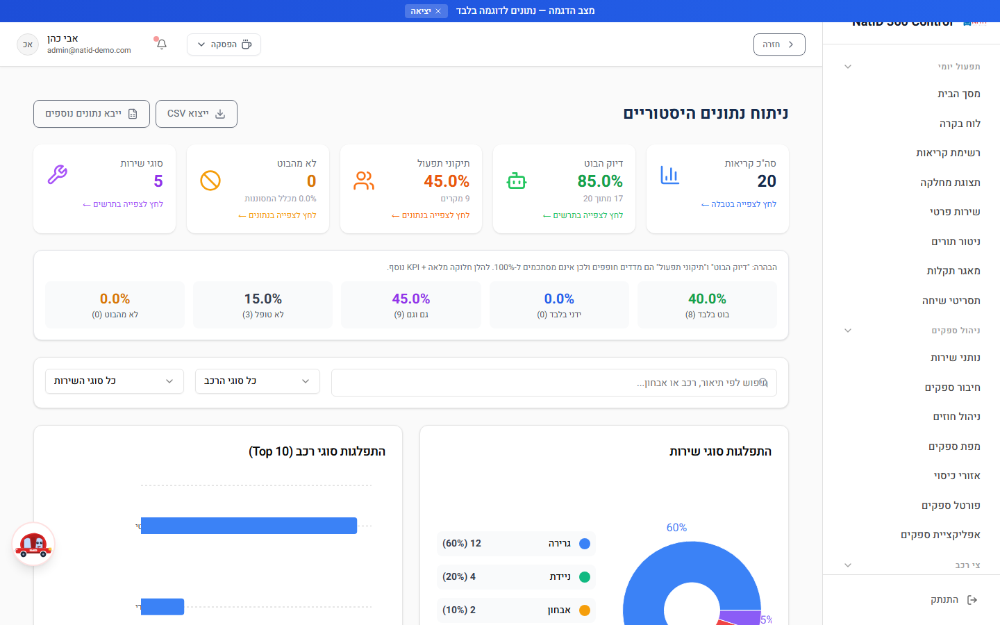

### מה יש במסך

- **חיפוש חופשי** — לפי תיאור, רכב או אבחון.
- **מסננים:** סוג רכב, סוג שירות.
- **גרפים:** התפלגות סוגי שירות, התפלגות סוגי רכב (Top 10), ודיוק הבוט לפי סוג שירות.
- **ניתוח דפוסים ב-AI** — הפעלת ניתוח אוטומטי על הדאטה ההיסטורי לזיהוי דפוסים.
- **ייצוא CSV** של התוצאות המסוננות.
- **קיצור לייבוא** — כפתור "ייבא נתונים" מוביל למסך ייבוא נתונים היסטוריים.

### שלבי עבודה

1. הזינו מונח חיפוש או בחרו מסננים (סוג רכב / סוג שירות).
2. עיינו בגרפי ההתפלגות המתעדכנים לפי הסינון.
3. לייצוא התוצאות לחצו **ייצוא CSV** — תוצג הודעה עם מספר הרשומות שיוצאו.
4. אם המאגר ריק — לחצו **ייבא נתונים** לביצוע ייבוא ראשוני (מנהל בלבד).

---

## ייבוא נתונים היסטוריים — `/ImportHistoricalData`

**מטרה:** ייבוא נתונים היסטוריים למערכת מקובצי CSV או Excel — ספקים, לקוחות, קריאות ועוד.
**תפקידים:** **מנהל בלבד**.
**נתיב:** תפריט ← ייבוא נתונים.

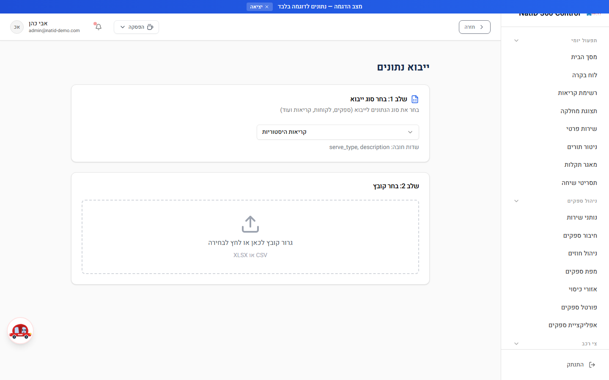

### תהליך הייבוא — שלב אחר שלב

1. **שלב 1 — בחר סוג ייבוא:** בחרו את סוג הנתונים לייבוא (ספקים, לקוחות, קריאות ועוד) מהרשימה הנפתחת.
2. **שלב 2 — בחר קובץ:** העלו קובץ **CSV או XLSX** בלבד. המערכת מעבדת את הקובץ ומציגה הודעת התקדמות.
3. **שלב 3 — בחר גיליון:** אם קובץ ה-Excel מכיל כמה גיליונות, בחרו את הגיליון הרלוונטי.
4. **תצוגה מקדימה:** עיינו בנתונים כפי שימופו לשדות המערכת לפני האישור.
5. אשרו את הייבוא — בסיום תוצג הודעה עם מספר הרשומות שיובאו בהצלחה.

**חשוב:**
- ודאו שהגיליון הנבחר אינו ריק — המערכת תחסום ייבוא של גיליון ללא נתונים.
- מומלץ לבצע ייבוא בקובץ קטן תחילה (מדגם) ולוודא שהמיפוי נכון, לפני ייבוא המאגר המלא.
- ייבוא הוא פעולה שיוצרת רשומות בפועל — אין "ביטול" אוטומטי. פעולות ניקוי מבוקרות זמינות למנהל במסך "ניקוי וסנכרון נתונים".

---

## ייצוא מתקדם — `/AdvancedExport`

**מטרה:** ייצוא נתונים גמיש עם בחירת שדות מדויקת — לקריאות וללקוחות.
**תפקידים:** מנהל, מוקדן.
**נתיב:** תפריט ← ייצוא מתקדם.

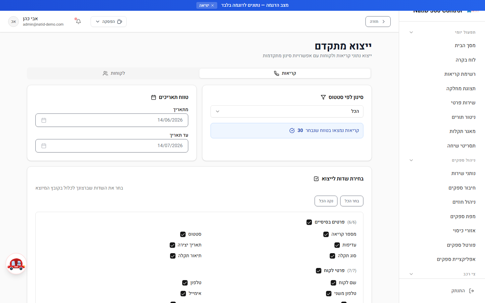

### מה ניתן לייצא

המסך מחולק לשתי לשוניות:

**ייצוא קריאות** — קבוצות שדות: פרטים בסיסיים, פרטי לקוח, פרטי רכב, מיקום, ספק, כספי, זמנים. סינון לפי:
- טווח תאריכים.
- סטטוס קריאה: הכל / ממתין לטיפול / ממתין לשיבוץ / ספק שובץ / נותן השירות בדרך ללקוח / בטיפול / ממתין לשיחת סגירה / סגור / בוטל.

**ייצוא לקוחות** — קבוצות שדות: פרטים בסיסיים, פרטי קשר, חוזה, סטטיסטיקות. סינון לפי:
- טווח תאריכים.
- סטטוס לקוח: הכל / פעיל / לא פעיל / מושהה.

### שלבי עבודה

1. בחרו לשונית — קריאות או לקוחות.
2. הגדירו טווח תאריכים וסטטוס.
3. סמנו את השדות לייצוא — ניתן לסמן/לבטל **קבוצת שדות שלמה** בלחיצה אחת, או להשתמש ב"בחר הכל" / "נקה הכל".
4. בחרו פורמט ייצוא: **CSV**, **Excel**, **HTML מעוצב** או **הדפסה**.
5. הקובץ יורד למחשב.

**טיפ:** ככל שתבחרו פחות שדות, הקובץ יהיה נקי וקריא יותר — בחרו רק את מה שנחוץ לדוח הספציפי.

---

## ניהול יעדים (KPI) — `/KPIManagement`

**מטרה:** הגדרת יעדים כמותיים לביצועי המוקד ומעקב עמידה בהם.
**תפקידים:** **מנהל בלבד**.
**נתיב:** תפריט ← ניהול יעדים.

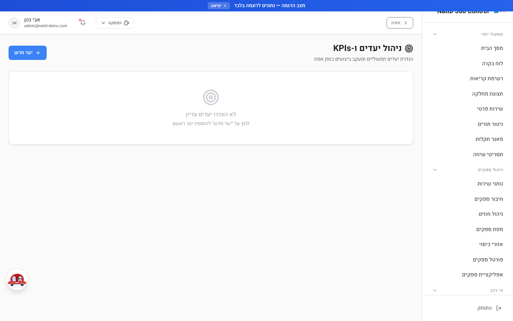

### מדדים זמינים להגדרת יעד

| מדד | דוגמת יעד |
|---|---|
| עמידה ב-SLA (%) | 90% |
| זמן תגובה ממוצע (דקות) | 30 |
| קריאות ליום | לפי צפי |
| שביעות רצון לקוחות | 4.5 |
| אחוז דחיית ספקים (%) | נמוך ככל האפשר |
| פתרון בקריאה ראשונה (%) | 68% |
| זמן השלמה ממוצע (דקות) | לפי סוג שירות |
| קריאות פתוחות | תקרה רצויה |

### שלבי עבודה

1. לחצו **הגדרת יעד חדש**.
2. בחרו **מדד** מהרשימה; ניתן לתת **שם מותאם** (אופציונלי).
3. הזינו **ערך יעד** (חובה) ו**סף אזהרה** (אופציונלי) — למשל יעד 90 וסף אזהרה 80.
4. בחרו **תקופה** למדידה.
5. שמרו — הכרטיס יציג את הערך בפועל מול היעד עם סטטוס: **עומד ביעד** (ירוק), **קרוב ליעד** (אזהרה), **חריגה** (אדום), או "אין נתונים".
6. לעדכון או מחיקה — פתחו את היעד הקיים ובחרו עריכה/מחיקה.

**טיפ:** במדדים שבהם "נמוך = טוב" (למשל זמן תגובה), המערכת יודעת להפוך את כיוון ההשוואה — עומדים ביעד כשהערך בפועל **נמוך** מהיעד.

---

## חשבוניות — `/Invoices`

**מטרה:** גישה למערכת החשבוניות של הארגון מתוך ה-CRM — באמצעות הטמעת מערכת CRM חשבוניות חיצונית (iframe).
**תפקידים:** **מנהל בלבד**.
**נתיב:** תפריט ← חשבוניות.

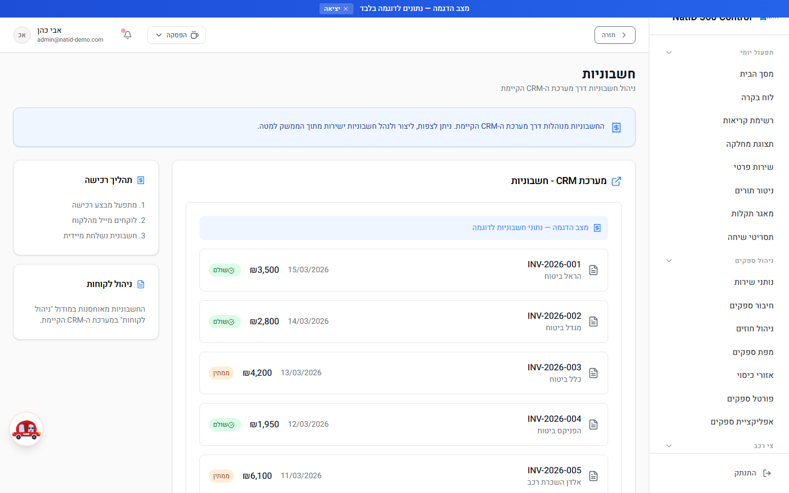

### שלבי עבודה

1. בכניסה ראשונה יש להגדיר את **כתובת ה-CRM החיצוני**: הזינו כתובת URL מלאה המתחילה ב-`https://` (למשל `https://crm.example.com/invoices`) ושמרו.
2. לאחר השמירה, מערכת החשבוניות החיצונית נטענת ומוצגת בתוך המסך.
3. עבודה על החשבוניות עצמן (הפקה, צפייה) מתבצעת בתוך המערכת המוטמעת, לפי הכללים של אותה מערכת.

**חשוב:**
- כתובת שאינה מתחילה ב-`https://` תידחה.
- המערכת אינה מחשבת או מפיקה חשבוניות בעצמה — היא שער גישה בלבד למערכת החיצונית. ישויות חוזים ותשלומים במערכת הן לחישוב בלבד, ללא חיבור למערכת תשלומים.

---

## קטלוג מוצרים — `/ProductCatalog`

**מטרה:** ניהול קטלוג המוצרים הנמכרים במסגרת קריאות שירות — מק"ט, מחירים ומלאי.
**תפקידים:** מנהל, מוקדן.
**נתיב:** תפריט ← קטלוג מוצרים.

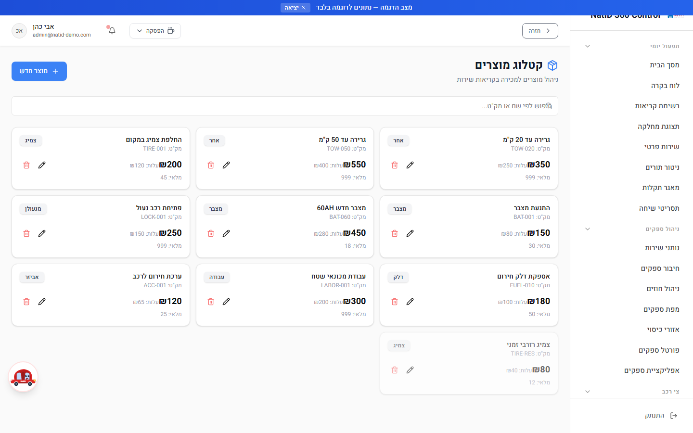

### שלבי עבודה

1. לחיפוש מוצר השתמשו בשדה **חיפוש לפי שם או מק"ט**.
2. להוספת מוצר לחצו **מוצר חדש** ומלאו:
   - **שם מוצר** ו**מחיר מכירה (₪)** — שדות חובה.
   - מק"ט, קטגוריה, כמות במלאי, מחיר עלות (₪), ספק.
   - מתגים: **פעיל** ו**כולל מע"מ**.
3. שמרו — המוצר יהיה זמין לבחירה בקריאות שירות.
4. לעריכה/מחיקה — פתחו מוצר קיים ובחרו את הפעולה.

**טיפ:** מוצר שאינו רלוונטי זמנית — עדיף לכבות את המתג "פעיל" במקום למחוק, כדי לשמור על היסטוריית המכירות.

---

## חבילות סוכני ביטוח — `/InsuranceAgentPackages`

**מטרה:** הגדרת חבילות שירות משולבות לסוכני ביטוח ולחברות ביטוח — תמחור, שירותים כלולים ומגבלות.
**תפקידים:** מנהל, מוקדן (בהתאם למדיניות הארגון).
**נתיב:** תפריט ← חבילות סוכני ביטוח.

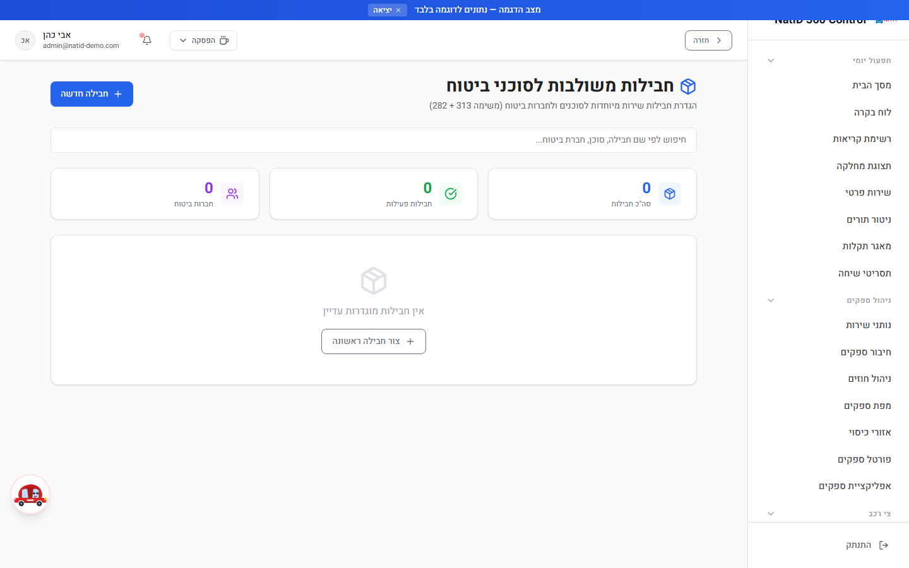

### שלבי עבודה

1. לחיפוש חבילה קיימת — **חיפוש לפי שם חבילה, סוכן או חברת ביטוח**.
2. ליצירת חבילה לחצו **חבילה חדשה** ומלאו:
   - **שם החבילה** (חובה) — למשל "חבילת פרימיום - מגדל".
   - **חברת ביטוח** ו**שם הסוכן** + טלפון סוכן.
   - **תקופת חבילה**.
   - **שירותים כלולים בחבילה** — סימון השירותים הרלוונטיים.
   - תמחור: **מחיר חבילה (₪)**, **מחיר לקריאה (₪)**, **הנחה (%)**.
   - **מקסימום קריאות** — או השאירו ריק ל"ללא הגבלה".
   - תיאור החבילה והערות.
3. ודאו שהמתג **חבילה פעילה** דלוק ושמרו.
4. לעריכת חבילה קיימת — פתחו אותה מהרשימה.

---

## תקלות נפוצות

| תופעה | סיבה אפשרית | פתרון |
|---|---|---|
| לקוח לא מצליח להזדהות בפורטל הלקוח | הטלפון שהוזן אינו זהה לטלפון הרשום בקריאה, או מספר קריאה שגוי | ודאו מול הקריאה את הטלפון המדויק ומספר הקריאה המלא (למשל C-12345678) |
| הלקוח מדווח שקישור המשוב "לא עובד" | ה-token החד-פעמי פג תוקף או שהמשוב כבר מולא | אם המשוב כבר מולא — הטופס יציג את הדירוג הקיים; אחרת ניתן לתעד את המשוב טלפונית דרך טופס המשוב הפנימי |
| דירוג ספק לא התעדכן אחרי משוב | חישוב הממוצע מתבסס על כלל רשומות הדירוג של הספק | ודאו שהמשוב נקלט במסך משובי לקוחות; משוב בודד משנה מעט ממוצע מצטבר |
| הדוח השנתי מציג קריאות "בשנה הלא נכונה" | תאריך הקריאה נקבע לפי תאריך הביצוע בפועל (סיום/הגעה), לא לפי תאריך הייבוא | זו התנהגות מכוונת — בחרו את שנת הביצוע, או "כל הזמנים" |
| דוח שימושים ריק | טווח התאריכים שנבחר אינו כולל קריאות | הרחיבו את טווח התאריכים; ברירת המחדל היא 30 הימים האחרונים |
| ייבוא נתונים נכשל מיד | פורמט קובץ לא נתמך | יש להעלות **CSV או XLSX** בלבד |
| "הגיליון הנבחר ריק" בייבוא | נבחר גיליון Excel ללא נתונים | בשלב 3 בחרו גיליון אחר בקובץ |
| מוצר חדש לא נשמר | חסרים שדות חובה | יש למלא **שם מוצר** ו**מחיר מכירה** |
| יעד KPI לא נשמר | לא הוזן ערך יעד | שדה **ערך יעד** הוא חובה |
| מסך חשבוניות לא נטען | לא הוגדרה כתובת CRM, או כתובת שאינה https | הזינו כתובת URL מלאה המתחילה ב-`https://` ושמרו |
| מסך ייבוא/יעדים/חשבוניות לא מופיע בתפריט | הרשאה חסרה — מסכים אלו למנהל בלבד | פנו למנהל המערכת; ההרשאות מנוהלות במסך ניהול הרשאות |
| ייצוא מתקדם מוריד קובץ ריק | הסינון (תאריכים/סטטוס) לא תואם אף רשומה, או שלא נבחרו שדות | הרחיבו את הסינון וודאו שנבחרו שדות לייצוא |

---

*מדריך זה הוא חלק מסדרת המדריכים למשתמש של NatID 360 Control — ראה [תוכן המדריכים](README.md).*
