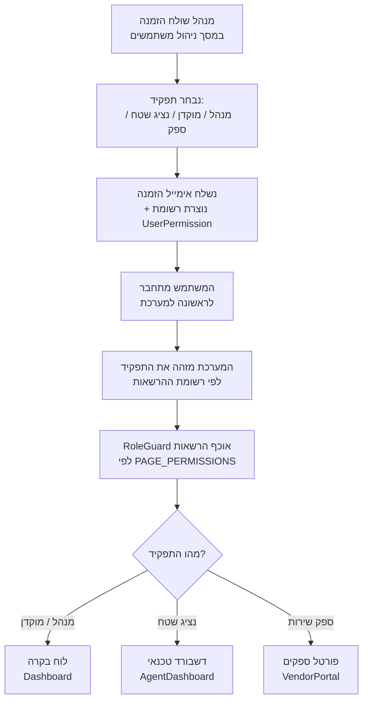
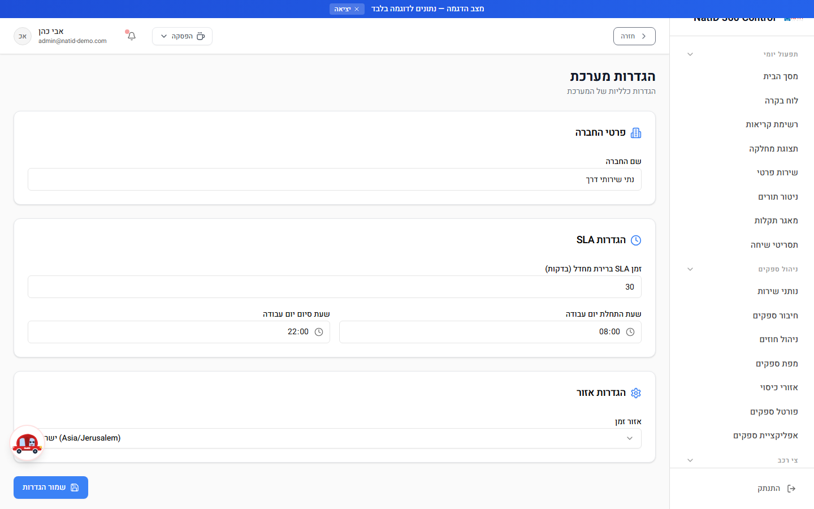
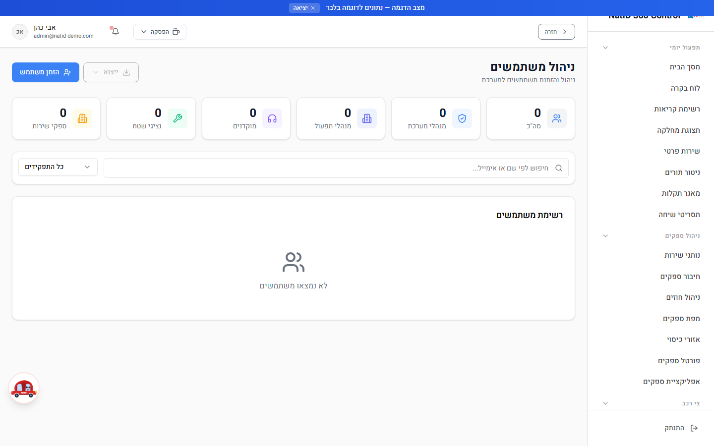
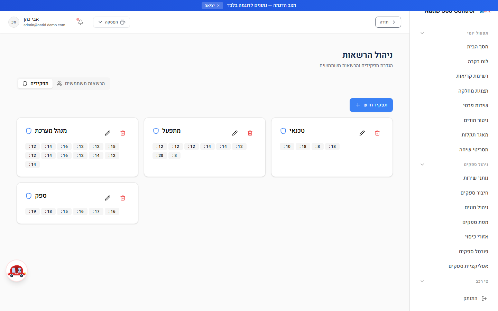
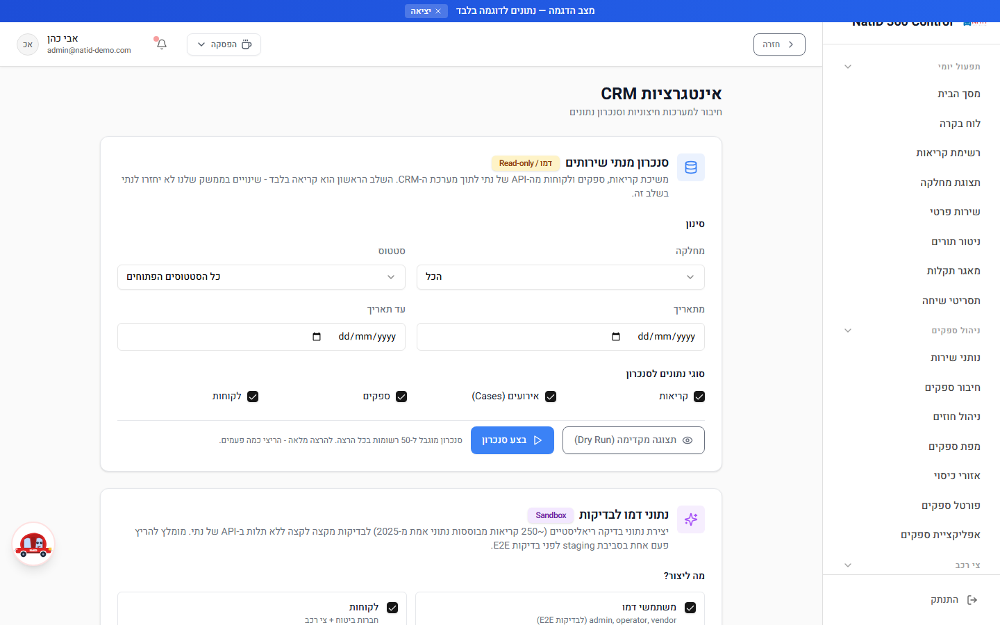
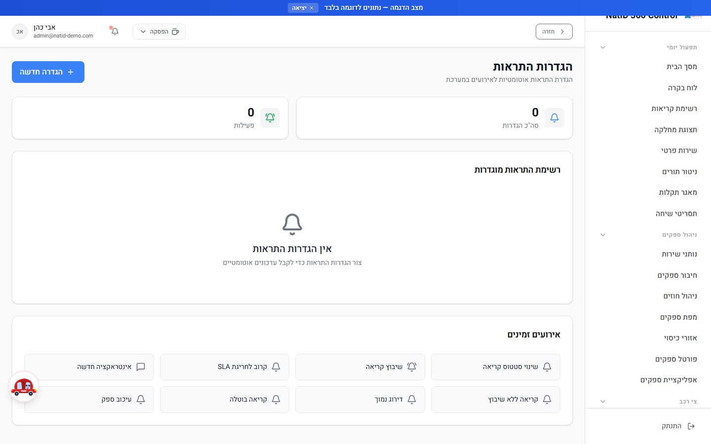
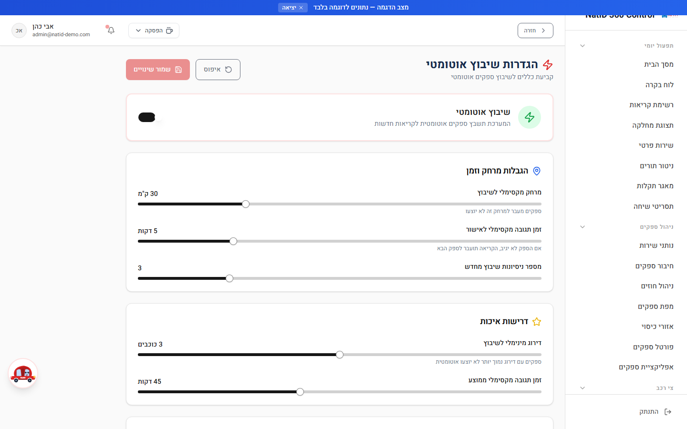
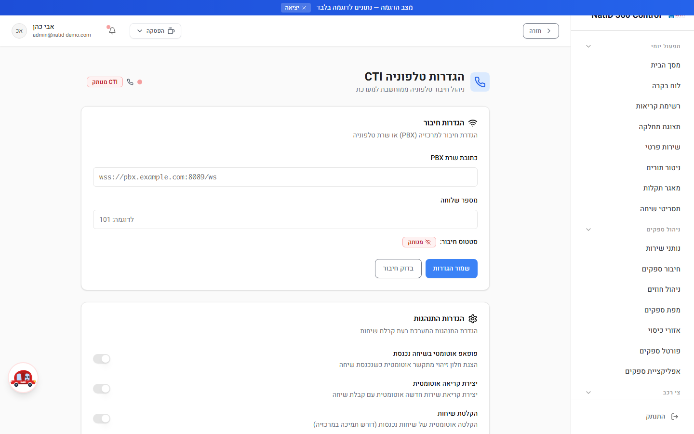
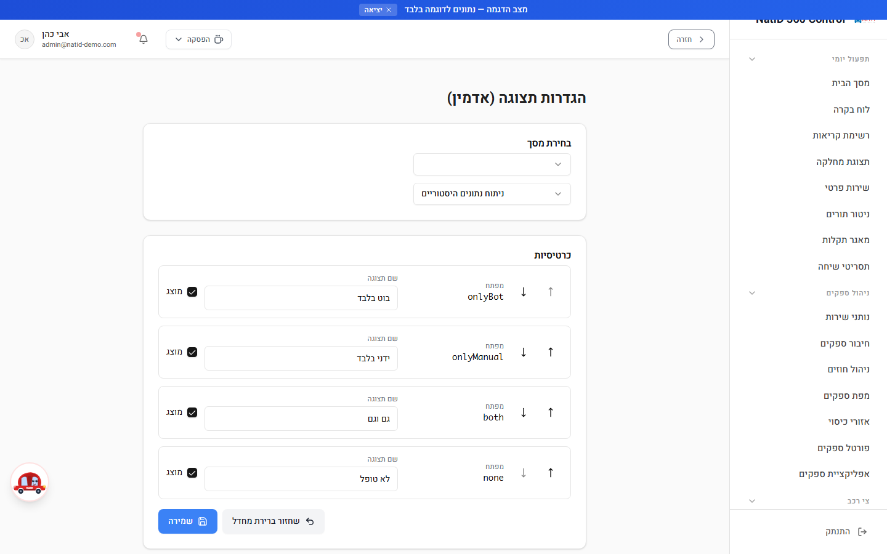
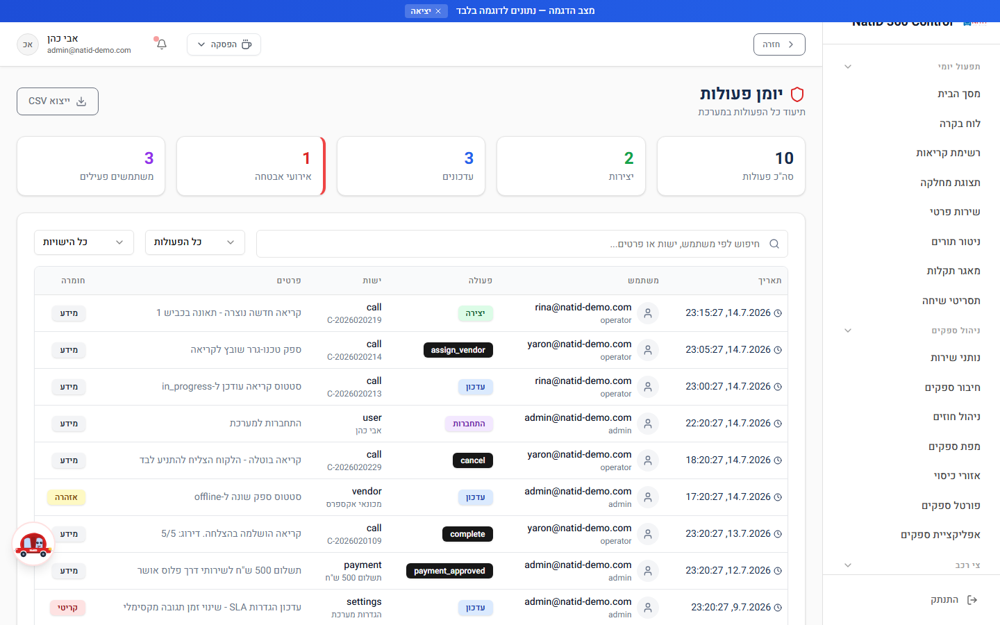

# מדריך למנהל מערכת — הגדרות וניהול

**קהל יעד:** מנהל מערכת (Admin) בלבד
**עודכן: יולי 2026**

מדריך זה מרכז את כל מסכי הניהול וההגדרות של NatID 360 Control. כל המסכים המתוארים כאן מוגבלים לתפקיד **מנהל מערכת בלבד** (מוגדר ב-`PAGE_PERMISSIONS`), ואינם נגישים למוקדנים, טכנאים או ספקים. הגישה נאכפת בשלוש שכבות: תפריט הניווט (פריטים חסומים לא מוצגים), שכבת הניתוב (RoleGuard), ובצד השרת.

---

## תוכן עניינים

1. [תהליך הוספת משתמש חדש — תרשים זרימה](#תהליך-הוספת-משתמש-חדש--תרשים-זרימה)
2. [הגדרות מערכת כלליות (Settings)](#הגדרות-מערכת-כלליות)
3. [ניהול משתמשים (UserManagement)](#ניהול-משתמשים)
4. [ניהול תפקידים והרשאות (RoleManagement)](#ניהול-תפקידים-והרשאות)
5. [ארבעת התפקידים במערכת — איך זה עובד](#ארבעת-התפקידים-במערכת--איך-זה-עובד)
6. [אינטגרציות CRM (IntegrationSettings)](#אינטגרציות-crm)
7. [הגדרות התראות (NotificationSettings)](#הגדרות-התראות)
8. [הגדרות שיבוץ אוטומטי (AutomationSettings)](#הגדרות-שיבוץ-אוטומטי)
9. [הגדרות טלפוניה CTI (CTISettings)](#הגדרות-טלפוניה-cti)
10. [ניקוי וסנכרון נתונים (AdminDataCleanup)](#ניקוי-וסנכרון-נתונים)
11. [הגדרות תצוגה למשתמשים (AdminDisplaySettings)](#הגדרות-תצוגה-למשתמשים)
12. [יומן פעולות (AuditLog)](#יומן-פעולות)
13. [תקלות נפוצות](#תקלות-נפוצות)

---

## תהליך הוספת משתמש חדש — תרשים זרימה

התהליך המלא מרגע ההזמנה ועד שהמשתמש נוחת בדף הבית המתאים לתפקידו:

> **חשוב לספקים:** זיהוי ספק ↔ משתמש נעשה **לפי כתובת אימייל** (`vendor.email === user.email`). בעת הזמנת ספק חדש, ודאו שהאימייל בהזמנה זהה בדיוק לאימייל שהוזן בכרטיס הספק.

---

## הגדרות מערכת כלליות (Settings)

**מטרה:** הגדרת פרמטרים בסיסיים של המערכת — פרטי חברה, SLA ושעות פעילות.

**נתיב:** `/Settings`

### שלבי עבודה

1. **פרטי החברה** — עדכנו את שם החברה המוצג במערכת.
2. **הגדרות SLA** — קבעו את זמן ה-SLA ברירת המחדל בדקות (ברירת מחדל: 30 דקות).
3. **שעות עבודה** — הגדירו שעת התחלה ושעת סיום של יום העבודה (ברירת מחדל: 08:00–22:00).
4. **אזור זמן** — בחרו אזור זמן: ישראל (Asia/Jerusalem) או UTC.
5. לחצו **"שמור הגדרות"** — תוצג הודעת אישור.

### נתוני דמו

בתחתית המסך קיים אזור **"נתוני דמו"** — כפתור "טען נתוני דמו" יוצר משתמשים, לקוחות, ספקים, קריאות, דירוגים והתראות לדוגמה, ומציג חלון אישור לפני הביצוע.

⚠️ **אזהרה:** יצירת נתוני דמו מיועדת **לסביבת בדיקות בלבד**. אין להריץ אותה בסביבת ייצור עם נתונים אמיתיים.

💡 **טיפ:** ההגדרות במסך זה נשמרות ברמת הדפדפן המקומי. אם עברתם למחשב אחר או ניקיתם את נתוני הדפדפן — בדקו שההגדרות עדיין תקפות.

---

## ניהול משתמשים (UserManagement)

**מטרה:** הזמנת משתמשים חדשים, עריכת פרטים ותפקידים, וקבלת תמונת מצב של כל המשתמשים במערכת.

**נתיב:** `/UserManagement`

### מה רואים במסך

- **כרטיסי סטטיסטיקה** — סה"כ משתמשים, מנהלי מערכת, מנהלי תפעול, מוקדנים, נציגי שטח וספקי שירות.
- **חיפוש וסינון** — לפי שם או אימייל, וסינון לפי תפקיד.
- **רשימת משתמשים** — שם, אימייל, תג תפקיד, וכפתורי "ערוך" ו"הרשאות" (מעבר למסך ניהול הרשאות).
- **ייצוא** — ייצוא רשימת המשתמשים (שם מלא, אימייל, תפקיד, תאריך הצטרפות).

### הזמנת משתמש חדש

1. לחצו **"הזמן משתמש"** בראש המסך.
2. הזינו **כתובת אימייל** (המערכת מנקה רווחים וממירה לאותיות קטנות אוטומטית).
3. בחרו **תפקיד**: מנהל מערכת / מנהל תפעול / מוקדן / נציג שטח / ספק שירות.
4. לחצו **"שלח הזמנה"** — נשלח אימייל הזמנה, ובמקביל נוצרת רשומת הרשאות (UserPermission) עם התפקיד שנבחר.
5. הפעולה מתועדת אוטומטית ביומן הפעולות.

### עריכת משתמש קיים

1. לחצו **"ערוך"** בשורת המשתמש.
2. עדכנו שם מלא ו/או תפקיד (האימייל אינו ניתן לשינוי).
3. לחצו **"שמור שינויים"** — רשומת ההרשאות מתעדכנת בהתאם.

💡 **טיפ:** ברמת הפלטפורמה קיימים רק שני תפקידי בסיס — "מנהל" ו"משתמש". התפקיד היישומי (מוקדן, נציג שטח, ספק וכו') נקבע דרך רשומת ההרשאות, ולכן במסך ניהול ההרשאות תראו לכל משתמש גם "תפקיד בסיסי" וגם "תפקיד הרשאות".

---

## ניהול תפקידים והרשאות (RoleManagement)

**מטרה:** יצירה ועריכה של תפקידים מותאמים אישית, והקצאת תפקיד הרשאות לכל משתמש.

**נתיב:** `/RoleManagement`

המסך מחולק לשתי לשוניות:

### לשונית "תפקידים"

1. לחצו **"תפקיד חדש"** (או על אייקון העיפרון לעריכת תפקיד קיים).
2. הזינו **שם מזהה באנגלית** (למשל `manager`), **שם תצוגה** בעברית (למשל "מנהל תפעול") ו**תיאור**.
3. הפעילו/כבו הרשאות לפי **שש קטגוריות**:
   - **קריאות** — צפייה, יצירה, עריכה, מחיקה, שיבוץ, עדכון סטטוס קריאה
   - **ספקים** — צפייה, יצירה, עריכה, מחיקה, ניהול חוזים
   - **לקוחות** — צפייה, יצירה, עריכה, מחיקה
   - **דוחות** — צפייה, ייצוא, דוחות כספיים, דוחות ביצועים, ניתוח היסטורי
   - **מערכת** — ניהול משתמשים, ניהול תפקידים, הגדרות, אוטומציות, אינטגרציות, יומן פעולות
   - **ניטור** — מפה חיה, מעקב GPS, ניטור תורים
4. לחצו **"שמור"** — התפקיד נשמר ומתועד ביומן הפעולות.

⚠️ **אזהרה:** תפקידים המסומנים כ"תפקיד מערכת" (is_system) אינם ניתנים למחיקה, ושם המזהה שלהם נעול. מחיקת תפקיד מותאם אפשרית דרך אייקון הפח — ודאו שאין משתמשים המשויכים אליו לפני המחיקה.

### לשונית "הרשאות משתמשים"

1. אתרו את המשתמש בטבלה (משתמש, אימייל, תפקיד בסיסי, תפקיד הרשאות).
2. לחצו **"הגדר הרשאות"**.
3. בחרו תפקיד מהרשימה — המשתמש יקבל את **כל** ההרשאות של התפקיד שנבחר. בחירת "ברירת מחדל" מחזירה את המשתמש להרשאות מוקדן.
4. לחצו **"שמור"** — שינוי ההרשאות מתועד ביומן הפעולות.

---

## ארבעת התפקידים במערכת — איך זה עובד

המערכת מבוססת על ארבעה תפקידי יסוד (מוגדרים ב-`src/config/permissions.js`):

| תפקיד | קוד | דף בית | היקף גישה |
|---|---|---|---|
| מנהל מערכת | `admin` | לוח בקרה (Dashboard) | הכל — עוקף RoleGuard תמיד |
| מוקדן | `operator` | לוח בקרה (Dashboard) | כל התפעול היומי; חסום ממסכי "מערכת", צי רכב, חשבוניות, KPI וחיבור ספקים |
| נציג שטח / טכנאי | `agent` | דשבורד טכנאי (AgentDashboard) | אזור טכנאי בלבד |
| ספק שירות | `vendor` | פורטל ספקים (VendorPortal) | פורטל ספק בלבד + בידוד נתונים — רואה רק את הקריאות שלו |

### שכבות האכיפה

1. **תפריט (UI)** — פריטי ניווט מסוננים לפי הרשאות; קטגוריה ריקה נעלמת לגמרי.
2. **ניתוב (Route)** — כל דף עטוף ב-RoleGuard לפי `PAGE_PERMISSIONS`; ניסיון גישה לדף חסום מוביל לניתוב אוטומטי לדף מותר.
3. **שרת (Server)** — כל פונקציית backend בודקת את התפקיד ואת הבעלות (ספק רואה רק את הקריאות שלו — הסינון מבוצע בצד השרת).
4. **RLS** — הרשאות ברמת הרשומה מוחלות על ישויות רגישות (קריאות, הודעות, התראות, יומן פעולות ועוד).

בנוסף לארבעת תפקידי היסוד, מסך ניהול ההרשאות מאפשר להגדיר **תפקידים מותאמים** (למשל "מנהל תפעול") המשלבים הרשאות מקטגוריות שונות. גם **הרשאות ברמת דוח** קיימות: דוחות כספיים (חשבוניות, תמחור ספקים, סיכום כספי) פתוחים למנהל מערכת בלבד, ואילו דוחות תפעוליים (עיכובים, דירוגים, ביצועים) פתוחים גם למוקדנים.

---

## אינטגרציות CRM (IntegrationSettings)

**מטרה:** חיבור המערכת למערכות חיצוניות, ניהול סנכרון הנתונים מול נתי, וניהול מפתחות API.

**נתיב:** `/IntegrationSettings`

### שלבי עבודה

1. **פאנל סנכרון נתי** (בראש המסך, למנהל בלבד) — מציג את מצב הסנכרון הדו-כיווני מול מערכת נתי ומאפשר משיכת קריאות מנתי ודחיפת עדכונים חזרה אליה. (פירוט מלא — ראו [ניקוי וסנכרון נתונים](#ניקוי-וסנכרון-נתונים).)
2. **פאנל נתוני דמו** — יצירת נתוני דמו לסביבת בדיקות.
3. **רשימת אינטגרציות זמינות** — Salesforce, HubSpot, Zapier, Google Sheets, WhatsApp Business ו-SMS Gateway:
   - הפעילו את המתג של האינטגרציה הרצויה.
   - הזינו את **מפתח ה-API** בשדה שנפתח ולחצו "שמור".
   - תג "מחובר"/"לא מחובר" מציג את מצב האינטגרציה.

⚠️ **אבטחה:** הסודות והמפתחות בפועל נשמרים **בצד השרת בלבד** (משתני סביבה בהגדרות האפליקציה). אין להדביק מפתחות API במקומות אחרים במערכת או לשתפם בצ'אטים.

💡 **טיפ:** לקבלת מפתחות API ותמיכה בחיבור אינטגרציות — פנו לצוות התמיכה דרך כרטיס "צריך עזרה?" בתחתית המסך.

---

## הגדרות התראות (NotificationSettings)

**מטרה:** הגדרת כללי "אירוע ← התראה" — אילו אירועים במערכת מייצרים התראה ובאילו ערוצים.

**נתיב:** `/NotificationSettings`

### אירועים זמינים

שינוי סטטוס קריאה · שיבוץ קריאה · קרוב לחריגת SLA · אינטראקציה חדשה · קריאה ללא שיבוץ · דירוג נמוך · קריאה בוטלה · עיכוב ספק.

### יצירת הגדרת התראה

1. לחצו **"הגדרה חדשה"**.
2. הזינו **שם להגדרה** (למשל: "התראה על קריאה חדשה").
3. בחרו **אירוע** מרשימת האירועים הזמינים.
4. הפעילו את **ערוצי השליחה** הרצויים: באפליקציה / אימייל / SMS.
5. לחצו **"צור הגדרה"**.

### ניהול שוטף

- **הפעלה/השבתה** — מתג בכל שורת הגדרה; כרטיסי הסיכום למעלה מציגים כמה הגדרות פעילות מתוך הסך הכולל.
- **מחיקה** — אייקון פח בשורת ההגדרה.

💡 **טיפ:** מסך זה מגדיר את הכללים **המערכתיים**. כל משתמש (כולל ספק וטכנאי) יכול בנוסף לקבוע העדפות אישיות במסך "העדפות התראות" (`/MyNotificationSettings`).

---

## הגדרות שיבוץ אוטומטי (AutomationSettings)

**מטרה:** קביעת הכללים שלפיהם המערכת משבצת ספקים לקריאות חדשות באופן אוטומטי.

**נתיב:** `/AutomationSettings`

### שלבי עבודה

1. **מתג ראשי "שיבוץ אוטומטי"** — הפעלה/כיבוי של כל המנגנון. בכיבוי — שיבוץ ידני בלבד.
2. **הגבלות מרחק וזמן:**
   - **מרחק מקסימלי לשיבוץ** (5–100 ק"מ) — ספקים מעבר למרחק זה לא יוצעו.
   - **זמן תגובה מקסימלי לאישור** (2–15 דקות) — אם הספק לא הגיב בזמן, הקריאה עוברת לספק הבא.
   - **מספר ניסיונות שיבוץ מחדש** (1–10).
3. **דרישות איכות:**
   - **דירוג מינימלי לשיבוץ** (1–5 כוכבים) — ספקים מתחת לסף לא יוצעו אוטומטית.
   - **זמן תגובה מקסימלי ממוצע** (15–90 דקות).
4. **משקולות ניקוד** — החשיבות היחסית של כל קריטריון בבחירת הספק: מרחק גאוגרפי, התאמת סוג שירות, דירוג ממוצע, זמן תגובה ממוצע, אחוז השלמה.
5. **אפשרויות נוספות:**
   - הסלמה אוטומטית בחריגת SLA (התראה למנהל).
   - התראה למנהל כשאין ספקים זמינים.
   - העדפה לספקים שמשתפים מיקום GPS בזמן אמת.
6. לחצו **"שמור שינויים"**. כפתור **"איפוס"** מחזיר את כל הערכים לברירת המחדל.

⚠️ **חשוב:** סכום משקולות הניקוד חייב להיות **100%**. אם הסכום שונה — המסך יציג התרעה אדומה; תקנו את המשקולות לפני שמירה כדי שהניקוד יחושב נכון.

---

## הגדרות טלפוניה CTI (CTISettings)

**מטרה:** חיבור המערכת למרכזיה (PBX) לזיהוי לקוח אוטומטי לפי מספר טלפון נכנס.

**נתיב:** `/CTISettings`

### שלבי עבודה

1. **הגדרות חיבור:**
   - הזינו **כתובת שרת PBX** (למשל: `wss://pbx.example.com:8089/ws`) ו**מספר שלוחה**.
   - לחצו **"שמור הגדרות"** ואז **"בדוק חיבור"** — סטטוס החיבור מוצג בתג: מחובר / מתחבר / מנותק.
2. **הגדרות התנהגות:**
   - **פופאפ אוטומטי בשיחה נכנסת** — חלון זיהוי מתקשר נפתח אוטומטית.
   - **יצירת קריאה אוטומטית** — פתיחת קריאת שירות חדשה עם קבלת שיחה.
   - **הקלטת שיחות** — דורש תמיכה במרכזיה.
3. **בדיקת סימולציה:**
   - "סימולציה — לקוח מוכר" מציגה חלון זיהוי עם פרטי לקוח, קריאות פתוחות ותאריך פנייה אחרונה.
   - "סימולציה — מספר לא מוכר" מדגימה שיחה ממתקשר חדש.
4. **Webhook למרכזיה חיצונית:**
   - העתיקו את כתובת ה-Webhook המוצגת והגדירו אותה במרכזיה לשליחת אירועי שיחה נכנסת (POST עם JSON: `event`, `caller_id`, `extension`).

⚠️ **אבטחה:** ה-Webhook מוגן בסוד משותף. חובה להגדיר במרכזיה כותרת (Header) בשם `x-webhook-secret` עם הערך שהוגדר במשתנה הסביבה `CTI_WEBHOOK_SECRET` בהגדרות האפליקציה — **ללא הסוד, בקשות יידחו**.

💡 **טיפ:** הגדרות החיבור וההתנהגות נשמרות ברמת הדפדפן של העמדה. בעמדת מוקדן חדשה יש להגדיר אותן מחדש.

---

## ניקוי וסנכרון נתונים (AdminDataCleanup)

**מטרה:** ניהול סנכרון הנתונים מול מערכת נתי, סגירת "קריאות רפאים", ומחיקות מבוקרות של נתונים.

**נתיב:** `/AdminDataCleanup`

המסך מחולק לשלושה אזורים, מהבטוח למסוכן:

### 1. סנכרון נתונים מנתי (אזור כחול)

הסנכרון מעדכן קריאות, יוצר ספקים ולקוחות חדשים ומקשר ביניהם אוטומטית. כברירת מחדל נמשכות קריאות מחלקת הגרירה בלבד, ומ-15/07/2026 ואילך (משתני הסביבה `NATI_SYNC_DEPARTMENT_IDS` ו-`NATI_SYNC_MIN_DATE_ADDED`). לצד המשיכה פועלת אוטומציית דחיפה לנתי (`pushNatiUpdates`) שמעדכנת חזרה בנתי סגירות, שיבוצי ספק, זמני הגעה וסיום, הערות מוקד ואישורי בקרת איכות — בסטטוס קדימה-בלבד ובמילוי שדות ריקים בלבד, כך שבחירות של מוקדנית נתי לעולם לא נדרסות.

1. בדקו את **באנר מצב הסנכרון**: מתי רץ הסנכרון האחרון, האם הצליח, כמה רשומות נוצרו/עודכנו, וכמה קריאות נותרו בצבר.
2. לחצו **"בדיקה (Dry Run)"** — הרצה ללא שינוי נתונים המציגה כמה קריאות, ספקים ולקוחות ימתינו לסנכרון.
3. לחצו **"סנכרון מלא"** — ביצוע בפועל. יומן הפעולות במסך מציג את ההתקדמות והתוצאות.

💡 אם מוצג באנר "החיבור לנתי מושהה זמנית" — מנגנון הגנה (Circuit Breaker) עצר את הסנכרון עקב תקלה בצד נתי. המתינו את הזמן המוצג ונסו שוב.

### 2. סגירת קריאות רפאים (אזור כתום)

מסמן כ"סגור" קריאות שמופיעות במערכת כפתוחות אך כבר אינן ברשימת הפתוחות של נתי.

1. הריצו תחילה **"בדיקה (Dry Run)"** — תוצג כמות הקריאות הפתוחות בנתי וכמות קריאות הרפאים שאותרו.
2. רק לאחר בדיקת התוצאות לחצו **"סגור קריאות רפאים"**.
3. הסגירה רצה ב-batches של 20, עם מנגנון בטיחות: אם נתי מחזיר פחות מ-10 קריאות פתוחות (חשד לתקלה) — לא נסגר דבר.

### 3. מחיקת כל הנתונים (אזור אדום)

⚠️ **אזהרה חמורה — פעולה בלתי הפיכה!** אזור זה מוחק את **כל** הקריאות (Cases) ואת **כל** הלקוחות (Customers) מהמערכת.

- המחיקה דורשת **אישור כפול**: לחיצה על "אני מבין, אני רוצה למחוק" ואז על "אישור סופי — מחק הכל!".
- המחיקה רצה ב-batches של 10 עם השהיה ביניהם; ניתן ללחוץ **"עצור"** באמצע.
- כל שלב מתועד ביומן המחיקה שבתחתית המסך.
- **לפני מחיקה:** ודאו שיש גיבוי/ייצוא של הנתונים, ושאתם אכן בסביבה הנכונה (לא בייצור בטעות).

---

## הגדרות תצוגה למשתמשים (AdminDisplaySettings)

**מטרה:** קביעת ברירות המחדל של כרטיסי תצוגה — אילו כרטיסים מוצגים, באיזה סדר ובאיזה שם — עבור משתמשים ספציפיים.

**נתיב:** `/AdminDisplaySettings`

### שלבי עבודה

1. בחרו **משתמש** מהרשימה (ברירת המחדל — המשתמש הנוכחי).
2. בחרו **מסך** — כיום נתמך מסך "ניתוח נתונים היסטוריים" (כרטיסי: בוט בלבד, ידני בלבד, גם וגם, לא טופל).
3. לכל כרטיס ניתן:
   - **לשנות סדר** — חצי מעלה/מטה.
   - **לשנות שם תצוגה** — עריכת התווית המוצגת.
   - **להציג/להסתיר** — תיבת סימון "מוצג".
4. לחצו **"שמירה"**. כפתור **"שחזור ברירת מחדל"** מחזיר את הגדרות המסך המקוריות.

💡 **טיפ:** ההעדפות נשמרות פר-משתמש ופר-מסך (ישות UserDisplayPreference), כך שניתן להתאים תצוגה שונה לכל מוקדן.

---

## יומן פעולות (AuditLog)

**מטרה:** תיעוד ובקרה של כל הפעולות במערכת — מי עשה מה, מתי, ובאיזו רמת חומרה. כלי מרכזי לחקירת אירועי אבטחה ותקלות.

**נתיב:** `/AuditLog`

### מה מתועד

סוגי פעולות: יצירה, עדכון, מחיקה, צפייה, התחברות/התנתקות, שיבוץ, שינוי סטטוס, ייצוא, **שינוי הרשאות**, **שינוי תפקיד**, **גישה נדחתה** ו**גישה למידע רגיש**. כל רשומה כוללת: תאריך ושעה, משתמש ותפקידו, סוג הפעולה, הישות המושפעת, פרטים ורמת חומרה (מידע / אזהרה / קריטי).

### שלבי עבודה

1. עיינו ב**כרטיסי הסיכום**: סה"כ פעולות, יצירות, עדכונים, **אירועי אבטחה** (פעולות קריטיות + נסיונות גישה שנדחו) ומשתמשים פעילים.
2. **חיפוש** — לפי משתמש, ישות או תוכן הפרטים.
3. **סינון** — לפי סוג פעולה ולפי סוג ישות.
4. **ייצוא CSV** — לחצו "ייצוא CSV" לקבלת קובץ עם הרשומות המסוננות (כולל תמיכה מלאה בעברית).

💡 **טיפים:**
- המסך טוען את **500 הרשומות האחרונות**. לחקירות היסטוריות עמוקות — ייצאו CSV באופן תקופתי.
- ישות ה-AuditLog מוגנת ב-RLS ברמת admin-only — משתמשים אחרים אינם יכולים לקרוא או לשנות את היומן.
- מומלץ לסקור את היומן אחת לשבוע ולשים לב במיוחד לפעולות "גישה נדחתה" ו"שינוי הרשאות".

---

## תקלות נפוצות

| תקלה | סיבה אפשרית | פתרון |
|---|---|---|
| משתמש שהוזמן לא מקבל אימייל | כתובת אימייל שגויה או שההזמנה נכשלה | ודאו את הכתובת (המערכת דוחה פורמט לא תקין), שלחו הזמנה מחדש ובדקו בתיקיית הספאם |
| ספק מתחבר אך לא רואה את פורטל הספקים / הקריאות שלו | האימייל של חשבון המשתמש שונה מהאימייל בכרטיס הספק | השוו את האימייל במסך ניהול משתמשים לאימייל בכרטיס הספק — הזיהוי הוא לפי התאמת אימייל מדויקת |
| משתמש נוחת בדף לא נכון או חסום ממסכים שהוא צריך | לא שויך לו תפקיד הרשאות, או ששויך תפקיד שגוי | במסך ניהול הרשאות ← לשונית "הרשאות משתמשים" ← "הגדר הרשאות" ובחרו את התפקיד הנכון |
| השיבוץ האוטומטי לא משבץ ספקים | המתג הראשי כבוי, משקולות הניקוד אינן מסתכמות ב-100%, או שהסינון (מרחק/דירוג) מחמיר מדי | בדקו את המתג הראשי, תקנו את המשקולות ל-100%, והרחיבו מרחק מקסימלי / הורידו דירוג מינימלי |
| בקשות מהמרכזיה ל-Webhook של ה-CTI נדחות | חסרה כותרת `x-webhook-secret` או שהערך אינו תואם | הגדירו במרכזיה את הכותרת עם הערך של `CTI_WEBHOOK_SECRET` מהגדרות האפליקציה |
| סנכרון נתי נכשל או מושהה | מנגנון ההגנה (Circuit Breaker) הופעל, או שנתי חסמו את הכתובת | המתינו את הזמן המוצג בבאנר; אם הסיבה "host_blocked" — נדרש FLUSH HOSTS בצד נתי |
| הגדרות (Settings / CTI) "נעלמו" בעמדה אחרת | הגדרות אלה נשמרות ברמת הדפדפן המקומי | הגדירו מחדש בעמדה החדשה; הימנעו מניקוי נתוני דפדפן בעמדות המוקד |
| התראות לא נשלחות למרות שהוגדרו | ההגדרה כבויה, או שערוץ השליחה לא הופעל | ודאו שהמתג בשורת ההגדרה פעיל ושסומן לפחות ערוץ שליחה אחד (באפליקציה/אימייל/SMS) |
| ביומן הפעולות לא נמצאת פעולה ישנה | המסך טוען את 500 הרשומות האחרונות בלבד | סננו לפי פעולה/ישות לצמצום, וייצאו CSV באופן תקופתי לשמירת היסטוריה |
| לא מצליחים למחוק תפקיד במסך ניהול הרשאות | מדובר בתפקיד מערכת (is_system) | תפקידי מערכת אינם ניתנים למחיקה — ניתן למחוק רק תפקידים מותאמים |

---

*מדריך זה הוא חלק מסדרת המדריכים של NatID 360 Control. לשאלות נוספות — ראו את מרכז הידע במערכת (`/UserGuide`) או פנו לצוות התמיכה.*
