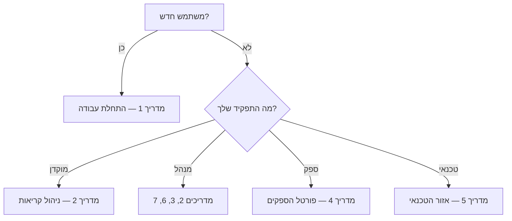

# מדריכי המשתמש — NatID 360 Control

> סדרת מדריכים מקצועיים למשתמשי הקצה של המערכת, לפי קטגוריות. כל מדריך כולל תרשימי זרימה, צילומי מסך מכל מסך, הוראות צעד-אחר-צעד וטבלת פתרון תקלות.
> **עודכן:** יולי 2026

## סרטוני הדגמה 🎬

| סרטון | קובץ | משך |
|---|---|---|
| הדגמת המערכת המלאה — כל ה-flows | [docs/videos/natid-system-demo.webm](../videos/natid-system-demo.webm) | ~2:06 |
| פורטל הספקים — ניהול קריאה מצד הספק | [docs/videos/natid-vendor-portal-demo.webm](../videos/natid-vendor-portal-demo.webm) | ~1:00 |

*הסרטונים בפורמט WebM — נפתחים בכל דפדפן (Chrome / Edge / Firefox) בלחיצה כפולה.*

## המדריכים 📚

| # | מדריך | קהל יעד | מה בפנים |
|---|---|---|---|
| 1 | [התחלת עבודה במערכת](01-getting-started.md) | כל המשתמשים | **התחברות מההתחלה** (הרשמה עם אימייל + סיסמה), תפקידים והרשאות, ניווט, PWA בנייד, מצב הדגמה |
| 2 | [ניהול קריאות שירות](02-call-management.md) | מוקדן, מנהל | מחזור חיי קריאה מלא: קליטה, שיבוץ ספק (אוטומטי/AI/ידני), סטטוסים, תורים, יומן, סגירה ומשוב |
| 3 | [ניהול נותני שירות](03-vendor-management.md) | מנהל, מוקדן | קליטת ספק חדש, פרופיל, חוזים, מפה, אזורי כיסוי, מעקב GPS |
| 4 | [פורטל הספקים — מדריך לספק](04-vendor-portal.md) | **ספק (משתמש קצה)** | התחברות ראשונה, קבלת/דחיית קריאה, עבודה בשטח, תמונות, חתימת לקוח, צ'אט, פרופיל |
| 5 | [אזור הטכנאי](05-agent-portal.md) | טכנאי | דשבורד טכנאי, הקריאות שלי, עדכון סטטוס מהנייד |
| 6 | [לקוחות, משובים ודוחות](06-customers-and-reports.md) | מנהל, מוקדן | לקוחות, פורטל לקוח, משובים, דוחות, KPI, חשבוניות, ייבוא/ייצוא |
| 7 | [הגדרות וניהול מערכת](07-admin-settings.md) | מנהל בלבד | משתמשים, תפקידים, אינטגרציות, אוטומציות, CTI, יומן ביקורת |

## מפת התמצאות מהירה

## מסמכים משלימים

- [SYSTEM_SPECIFICATION_v4.md](../../SYSTEM_SPECIFICATION_v4.md) — מסמך האפיון המלא
- [DEMO_WALKTHROUGH.md](../DEMO_WALKTHROUGH.md) — תסריט הדגמה חיה (מצב דמו)
- [VENDOR_PORTAL_GUIDE.md](../VENDOR_PORTAL_GUIDE.md) — תיעוד טכני של פורטל הספקים
- [צילומי המסך](../screenshots/) — צילום עדכני של כל מסך במערכת
